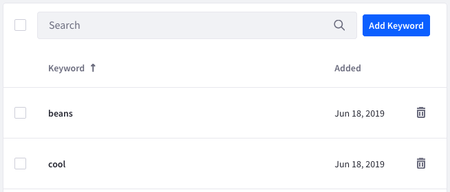

# Managing Interest Topics

Analytics Cloud's [Recommendation API](../touchpoints/content-recommendation-api.md) suggests topics of interest based on user interactions with content in Liferay DXP. Administrators can exclude certain keywords from the recommendation API, therefore preventing Analytics Cloud from suggesting content based on those keywords. This is useful for further curating suggested content.

## Adding Keywords to the Block List

Follow these steps to add a keyword to the block list:

1. In Analytics Cloud, select Settings → Interest Topics. A table lists any existing keywords in the block list.

1. Click Add Keyword and enter one or more keywords in a comma-delimited list.

1. Click Send when you're finished. Your keywords then appear in the table.

To delete a keyword from the block list, click that keyword's trash icon (). To delete multiple keywords at once, select the checkbox for each and click the trash icon that appears at the top of the table. You can select all keywords via the checkbox at the top of the table.

## Additional Information

* [Interests](../individuals-and-segments/interests.md)
