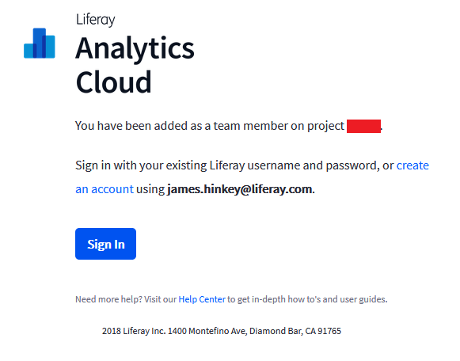

# Managing Users

If you are the project Owner or have been assigned the Admin permission, you can invite and manage users. Here’s how to bring up the User Management page:

1. Click on Settings in the navigation panel. The default Settings page appears.

1. Click on User Management in the navigation area. The User Management page appears, listing all the project’s users.

From the User Management page, an Admin user (or Owner) can invite users, edit their permissions, and delete them.

If your project is new, you’ll want to invite your teammates to the project.

## Inviting Users

To invite new users to your Analytics Cloud project, perform these steps:

1. In the User Management page, click on the Invite Users button. The Invite Users dialog appears.

1. Enter the email addresses (separated by a space or comma) of the people to invite to the project.

1. Click the Send button. The invitation is sent to your lucky teammates.

You can set the user’s permissions when their invitation acceptance is pending.

## Managing Permissions

Analytics Cloud projects have the following Roles:

**Owner:** Can do all things, but cannot be deleted.

**Admin:** Can do all things, including manage other Admin users. Admin users can be deleted.

**Member:** Can view all profiles and analytics, but cannot edit anything under Settings. They cannot manage users, or add or remove data sources.

### Changing a User's Role

Here’s how to change a user’s permission Role:

1. Click the Edit button in the user’s list entry.

1. In the Permission column, select the user’s current permission. A permission Role selector appears.

1. Select the permission Role for the user.

The user is assigned the selected Role.

## Additional Information

* [Accessing Your Analytics Cloud Workspace](../getting-started/quick-tour/accessing-your-workspace.md)
