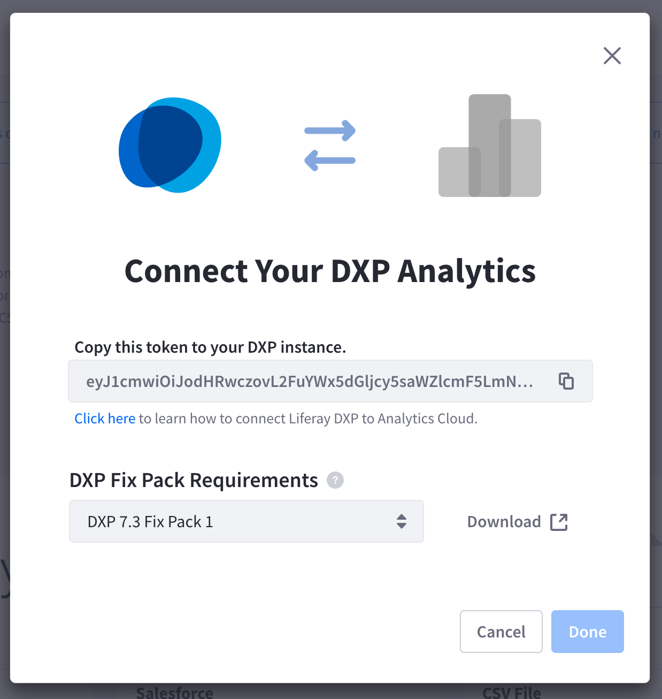
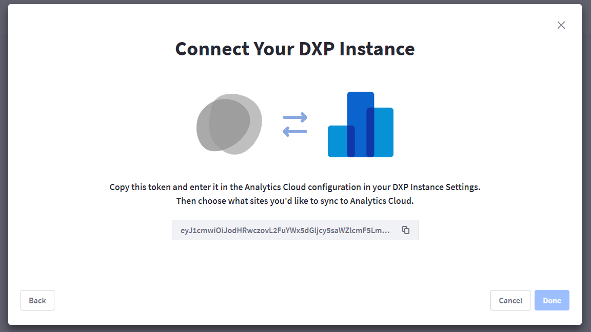
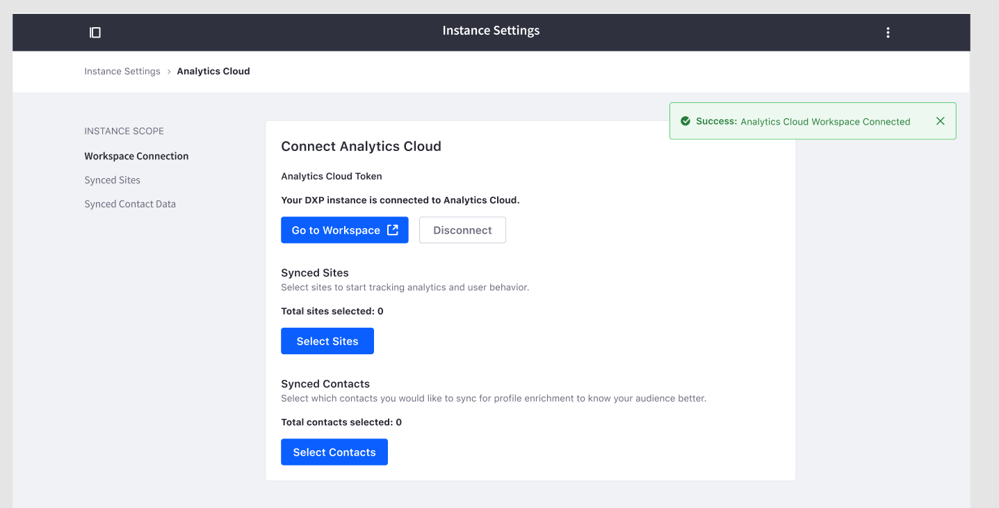

# Connecting Liferay DXP to Analytics Cloud

Your Liferay DXP instances are rich with web analytics data and visitor data. In order to monitor and collect website visitor information you need to setup a connection between your Liferay DXP site with Analytics Cloud by adding a Data Source.

Analytics Cloud connects with Liferay DXP with the use of an Access Token. Your Liferay DXP installation must meet the following fix pack minimum requirements:

* 7.4+
* 7.3 Fix Pack 1
* 7.2 Fix Pack 11
* 7.1 Fix Pack 22
* 7.0 Fix Pack 98

## Adding a Data Source

1. Create a data source by navigating to *Setting* > *Data Sources* > *Add Data Source*. You must have the Admin role to perform this action.

1. Select Liferay DXP as your data source type. You will see a screen that provides the token to copy.

      

1. Copy the token and navigate to the Liferay DXP instance. In the *Control Panel* under *Configuration* > *Instance Setting* and, under the *Platform* section, click *Analytics Cloud*. Paste the Access Token in the Analytics Cloud Token field as shown in the image below, then press *Connect*.

      

```{note}
For Liferay DXP 7.0, Analytics Cloud Admin is under *Configuration* > *Analytics Cloud*.
```

When the connection is successful, the message, `Your DXP instance is connected to Analytics Cloud.` is shown.

```{note}
See [Do Not Track Feature](../workspace-data/data-control-and-privacy.md#do-not-track-feature) to learn more about suppressing analytics data.
```



Congratulation, your DXP is now connected to your AC workspace!

Note - Whenever a new data source is added, a property is automatically created with the same name. In case of duplicates, an incremental suffix will be appended (e.g. Liferay DXP (1)). Both the name of the data source and property can always be renamed afterwards.

## Next Steps

* [Scoping Sites and Individuals with Properties](./scoping-sites-and-individuals-using-properties.md)
