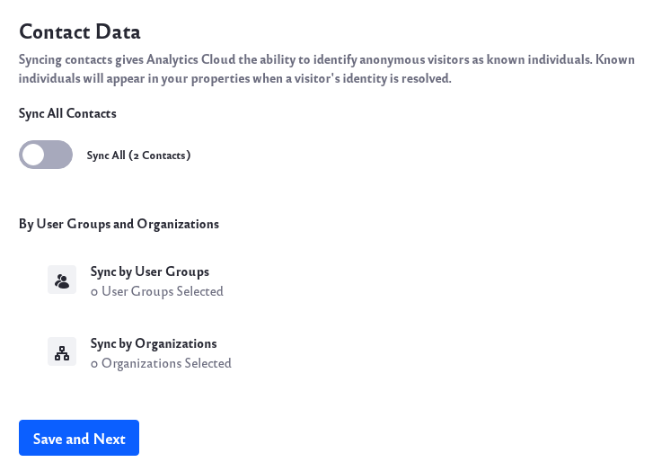
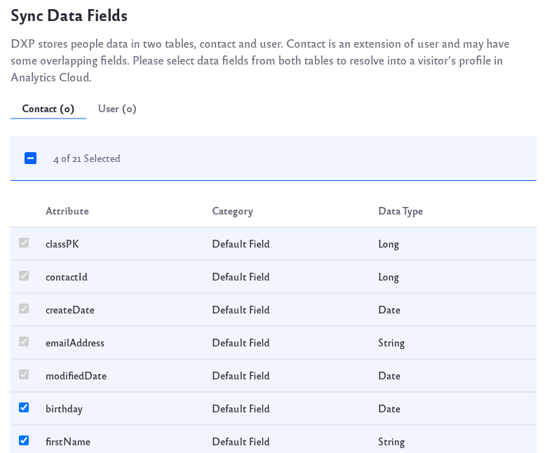
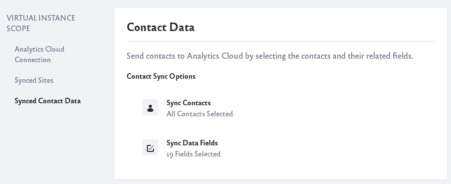

# Syncing Contact Data from DXP

After connecting your [Liferay DXP instance to Analytics Cloud](connecting-liferay-dxp-to-analytics-cloud.md), you can begin syncing contact data. The latest releases of Liferay DXP gives you fine grained control over what fields to sync from your contact data into Analytics Cloud.

```{note}
Selecting contact fields to sync is available in the following releases or higher:
* Liferay 7.4+
* Liferay 7.3 Fix Pack 1
* Liferay 7.2 Fix Pack 9
* Liferay 7.1 Fix Pack 20
* Liferay 7.0 Fix Pack 97
```

## Initial Sync of Contact Data

1. In your Liferay DXP instance, navigate to *Control Panel* &rarr; *Instance Setting* &rarr; *Analytics Cloud*. 

1. Click *Select Contacts*.

1. Click on *Sync Contacts*.

1. Use the switch to enable _Sync All_. Alternatively click on Sync by User Groups or Sync by Organization if you prefer to sync a subset of your contacts.

      

      Click the *Save and Next* button.

1. Liferay DXP stores contact data in two separate tables (Contact and User). Switch between the Contact tab and User tab to select the fields to sync. Analytics Cloud requires some fields to be synced; those are grayed out.

      

      Note that any custom field created for users is available to sync. Learn more about [adding custom fields to users](https://learn.liferay.com/dxp/latest/en/users-and-permissions/users/adding-custom-fields-to-users.html).

      Click the *Save* button at the bottom of the page after making your selections.

## Modifying Sync of Contact Data Fields

1. Navigate to *Control Panel* &rarr; *Instance Setting* &rarr; *Analytics Cloud* &rarr; *Synced Contact Data* in your Liferay DXP instance. 

      

1. Click on _Sync Data Fields_.

1. Make your modifications and click the *Save* button.
