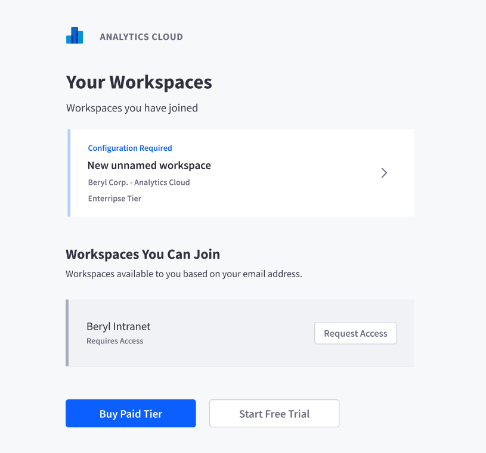

# Accessing Your Workspace

After setting up your [multi-factor authentication](./multi-factor-authentication.md), a list of workspaces that you belong to, or can request access to appears. If you do not see a workspace, please make sure the workspace administrator already added you to a workspace, or you can [sign up for a new workspace](./signing-up-for-a-new-workspace.md).

Workspaces that have the **Configuration Required** label require the *Workspace Owner* to click through and fill out the appropriate configurations in order for the workspace to function and be accessible.

Additional workspaces may be accessible if your login email address maps to a workspaces **Allowed Email Domains**. These workspaces will be listed at the bottom section. Clicking on the *Request Access* button sends a request to the *Workspace Admin*. Once approved by the *Workspace Admin*, you can start using the workspace as well.

Click on any workspace that you have access to will directly take you to the home of your Analytics Cloud workspace.
