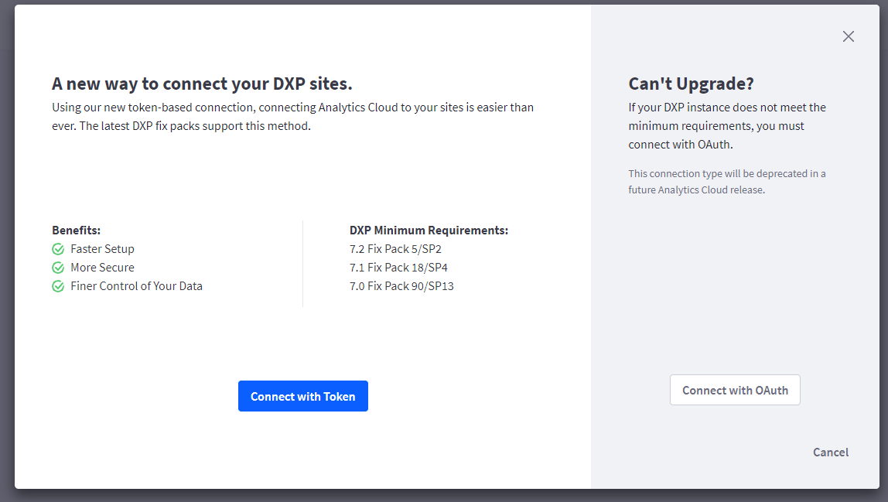
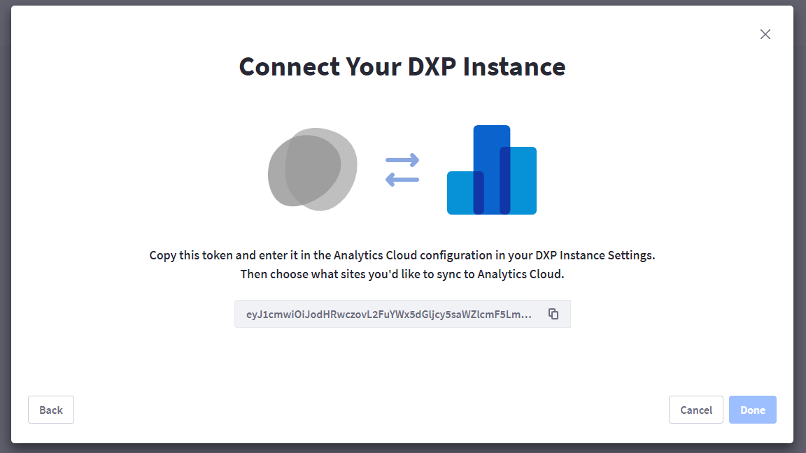
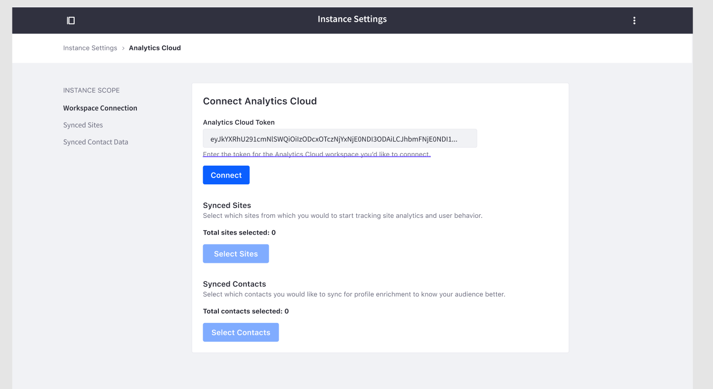
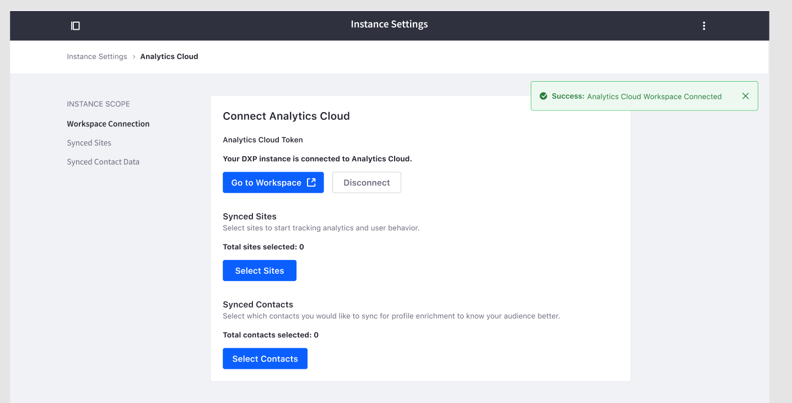

# Connecting Liferay DXP to Analytics Cloud

Your Liferay DXP instances are rich with web analytics data and visitor data from Users and. In order to monitor and collect website visitor information, you need to setup a connection between your Liferay DXP site with Analytics Cloud by adding a Data Source.

There are two ways to connect:

* Connect using the Access Token (recommended)
* Connect using OAuth

## Using an Access Token

To connect using an Access Token, your Liferay DXP installation must meet the following fixpack requirements:

* 7.2 Fix Pack 5/SP2
* 7.1 Fix Pack 18/SP4
* 7.0 Fix Pack 90/SP13

If you do not meet the requirements and are not able to upgrade to the minimum fixpack requirement, you can [connect using OAuth](./connecting-liferay-dxp-using-oauth.md) instead.



### Adding a Data Source

1. Create a data source by navigating to *Setting* > *Data Sources* > *Add Data Source*. You must have the Admin role to perform this action.

1. Select Liferay DXP as your data source type. You will see a screen that provides the token to copy.

      

1. Copy the token and navigate to the Liferay DXP instance. In the *Control Panel* under *Configuration* > *Instance Setting* > *Analytics Cloud*. Paste the Access Token in the Analytics Cloud Token field as shown in the image below, then press Connect.

      

```note::
   For Liferay DXP 7.0, Analytics Cloud Admin is under *Configuration* > *Analytics Cloud*.
```

When the connection is successful, the message, `Your DXP instance is connected to Analytics Cloud.` is shown.



Congratulation, your DXP is now connected to your AC workspace!

## Next Steps

* [Tracking Sites and Individuals with Properties](./tracking-sites-and-individuals-using-properties.md)
* [Connecting Liferay DXP Using OAuth](./connecting-liferay-dxp-using-oauth.md)
