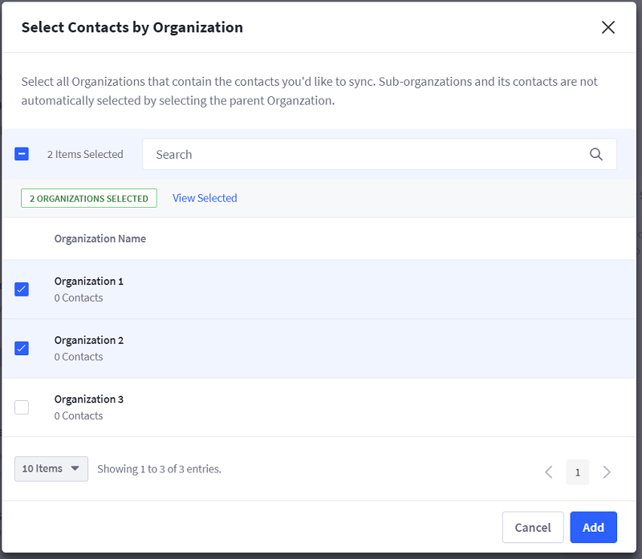

# Connecting Liferay DXP Using OAuth

```warning::
   The OAuth connection method described here will be deprecated in the near future. If you are setting up a new data source for the first time, please use the `token connection <./connecting-liferay-dxp-to-analytics-cloud.md#using-the-access-token>`_ if possible. If you already are using OAuth to connect a data source, please see instructions on `upgrading from an OAuth based connection <./upgrading-a-data-source-connection-from-oauth-to-token-based.md>`_ to the token based connection.
```

Follow these steps to connect your workspace to your Liferay DXP instance using OAuth.

## Liferay DXP Data Source Prerequisites

### Install Required Liferay DXP Fix Packs

Liferay DXP 7.2: N/A

Liferay DXP 7.1: [Download](https://customer.liferay.com/downloads) and [install](https://help.liferay.com/hc/articles/360018176571-Installing-Patches-) Fix Pack 12.

Liferay DXP 7.0: [Download](https://customer.liferay.com/downloads%20target=) and [install](https://help.liferay.com/hc/articles/360017896272-Using-the-Patching-Tool-#installing-patches) Fix Pack 79.

## Register Analytics Cloud with your Liferay DXP Instance

> Liferay DXP 7.2 and DXP 7.1

1. Download the [Liferay Plugin for OAuth 2.0](https://web.liferay.com/marketplace/-/mp/application/109571986) version 1.1.0 (or newer) and [install](https://learn.liferay.com/dxp/7.x/en/system-administration/installing-and-managing-apps/installing-apps/installing-apps.html) it.

1. The plugin comes with Analytics Cloud pre-registered. Copy the Client ID and Client Secret for connecting DXP with Analytics Cloud, as described in the next section.

> Liferay DXP 7.0

1. Download the [Liferay Connector to OAuth 1.0a](https://web.liferay.com/marketplace/-/mp/application/45261909) and [install](https://help.liferay.com/hc/articles/360017877192-Installing-Apps-Manually-) it.

1. [Register](https://help.liferay.com/hc/en-us/articles/360018175331-OAuth-) Analytics Cloud as an OAuth application with the Write access level.

1. Copy the Consumer ID and Consumer Secret for connecting DXP with Analytics Cloud, as described in the next section.

Congratulations on authorizing Analytics Cloud to connect to your Liferay DXP instance! You can now add your Liferay DXP instance as a data source.

```tip::
   If you have problems connecting to your DXP data source, refer to `Troubleshooting Liferay DXP <../../troubleshooting/connecting-data-sources.md>`_ Data Sources.
```

## Adding the DXP Data Source

Adding a Liferay DXP data source connects your Analytics Cloud project with a Liferay DXP instance.

1. Select *Settings* → *Data Sources*. A listing of your data sources appears.

1. Click *Add Data Source*. The Add Data Source page appears.

1. Select the Liferay DXP icon. The *Configure Liferay DXP* page appears.

The Authorization tab is selected by default.

### DXP Data Source Authorization

To authorize your DXP instance as a data source, follow these steps:

1. Fill in the data source and client credentials fields:

    * *Description*

         * **Name:** A name for your data source.
         * **URL:** The Liferay DXP instance URL.

    * *Client Credentials*

         * **Consumer Key/Client ID:** Key/ID for Analytics Cloud to access your Liferay DXP instance.
         * **Consumer Secret/Client Secret:** Secret for Analytics Cloud to access your Liferay DXP instance.

    In Liferay DXP 7.1, the Client ID and Secret are found at *Control Panel* → *Configuration* → *OAuth 2 Admin*.

    In Liferay DXP 7.0, the Consumer Key and Secret are found at *Control Panel* → *OAuth Admin*.

1. Click *Authorize*. A window appears and prompts you to sign in to the DXP instance.

1. Sign in by entering your DXP admin (user that has the Admin role) credentials and clicking *Authorize*.

1. Click Save to save the authorization options. Analytics Cloud advances you to the Configure Data Source tab's Data Configuration page. The data source's Current Status is **AUTHENTICATED**.

There are the Configure Data Source options:

**Configure Analytics:** Configures the assets and touchpoints only.

**Configure Contacts:** Configures the contact data only.

Start with configuring Analytics.

### CONFIGURING ANALYTICS

Configuring analytics enables your website to send visitor browsing events to Analytics Cloud. The events are sent via the client browser with the `analytics.js`.

1. Click *Configure* for *Configure Analytics*. The Liferay DXP site analytics registration page appears.

1. Select the Liferay DXP Sites to register for analytics and click *Configure*.

1. Click the Done button.

The selected sites are now synced to Analytics Cloud.

### Implementing "Do Not Track"

According to GDPR and many data privacy laws, businesses are required to ask consent before collecting analytics data when visitors are browsing a website.

To suppress analytics data from being sent by a particular browser, set the following window variable with javascript on your site.

```
window['ac_client_disable_tracking'] = true
```

```important::
   You must implement your own logic to persist user consent either by using a cookie or by saving and loading from your database. Please make sure that the window variable described above is set before the client page is fully loaded.
```

### Configuring Contacts

Configuring contacts imports DXP user data. To sync contacts from your Liferay DXP instance to Analytics Cloud, perform the following steps:

1. Select the *Configure* button for *Configure Contacts*. The Contacts configuration options appear.

1. Select contacts to sync from the Liferay DXP instance. Select all users or select by User Group or Organization. Contacts belonging to multiple User Groups and Organizations are only counted once.

    **Sync All Contacts:** Selects all Liferay DXP instance contacts and disables options for selecting specific User Groups and Organizations.

    **Sync By User Groups:** Selects contacts by User Group.

    **Sync By Organizations:** Selects contacts by Organization.

    

1. Click *Save* and *Continue* to import the selected contacts. Analytics Cloud imports the contact data and maps it to your Analytics Cloud contact data model. The initial contact data import can take 5 1/2 minutes per 1,000 contacts.

1. Follow instructions for [Mapping Contact Data](../../individuals-and-segments/individual-profiles/mapping-contact-data.md) to map contact data from your Liferay DXP instance to your Analytics Cloud contact data model. Once you've mapped the data, click *Save*.

1. The *Data Configuration* page appears again; the button for Configure Contacts is labeled Edit.

You've configured Analytics Cloud to use your Liferay DXP contacts.

The Contacts data will start syncing into Analytics Cloud. After the initial sync, changes are synced periodically.

## Next Steps

* [Mapping Contact Data](../../individuals-and-segments/individual-profiles/mapping-contact-data.md)
* [Adding a CSV Data Source](../../individuals-and-segments/individual-profiles/adding-a-csv-data-source.md)
* [Adding a Salesforce Data Source](../../individuals-and-segments/individual-profiles/adding-a-salesforce-data-source.md)
