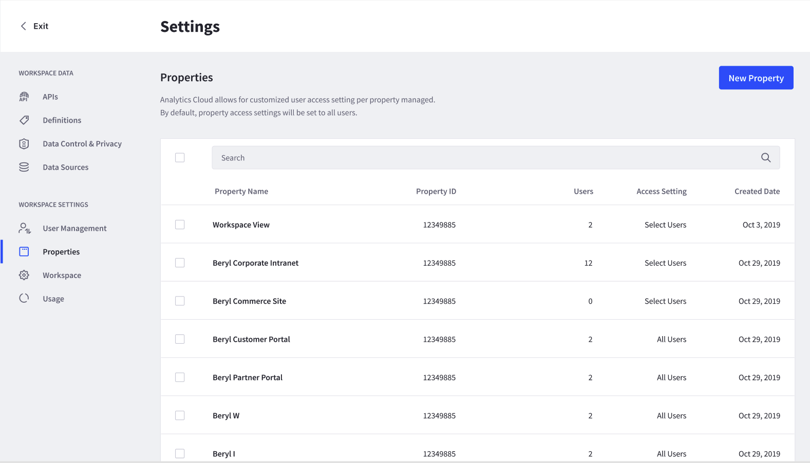
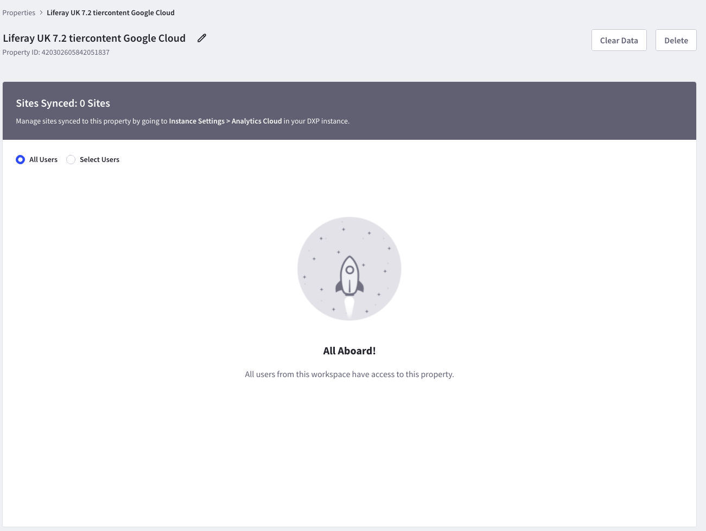
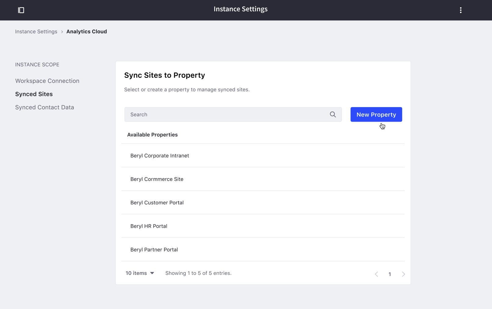
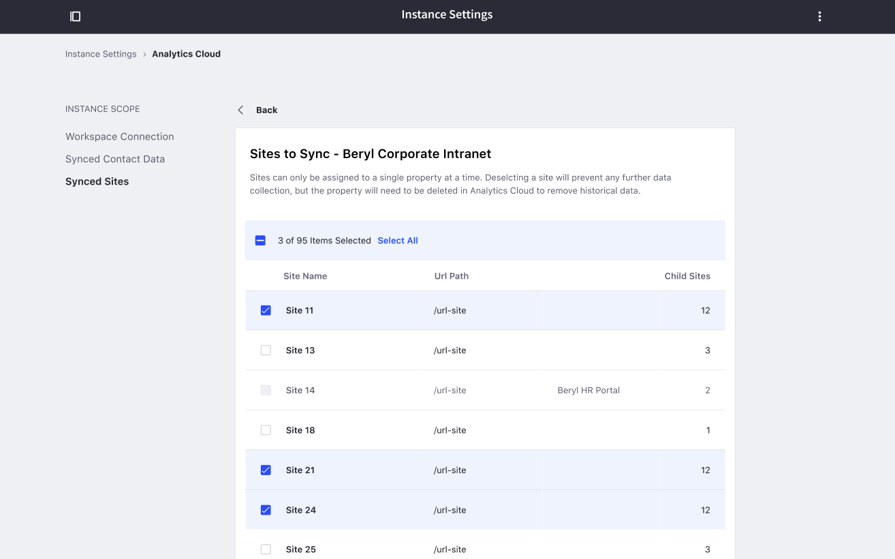
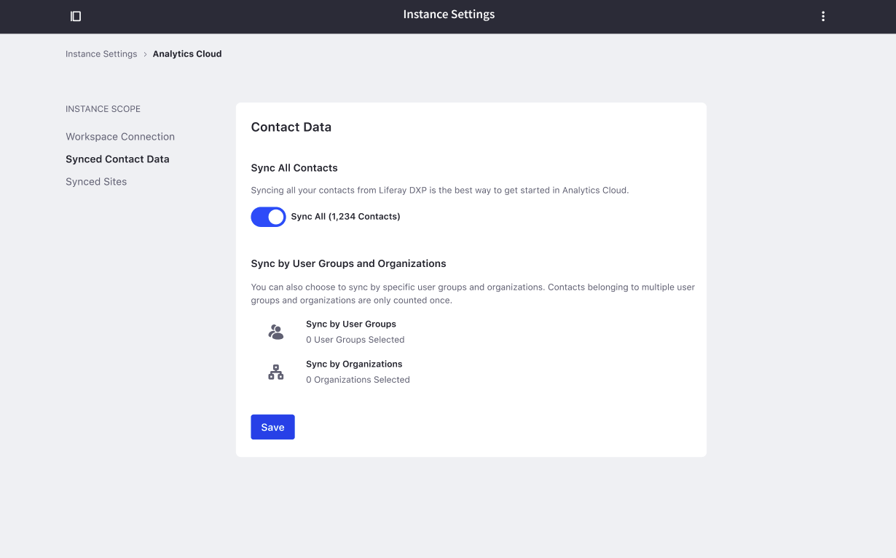
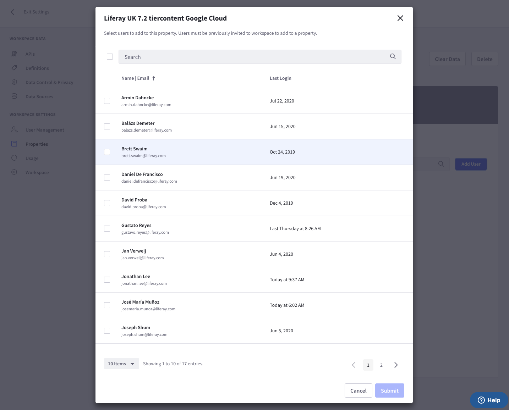
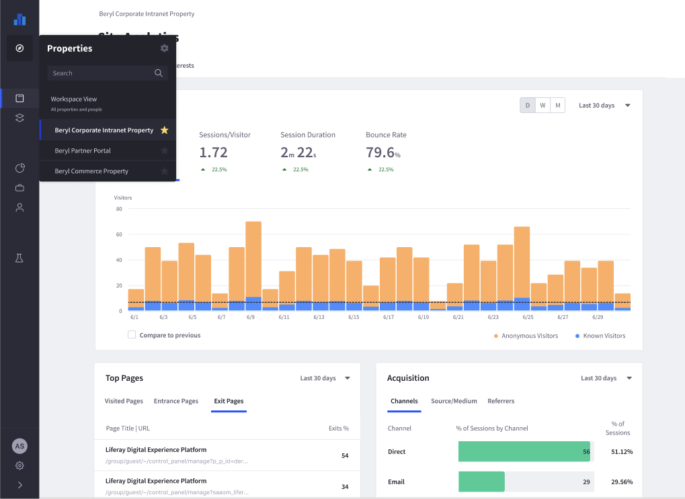

# Tracking Sites and Individuals Using Properties

A Property allows you to define and associate a label to a single or multiple sites. This allows you to aggregate the analytics data for all associated sites with the Property on a single dashboard. This is particularly useful if you have multiple sites in your DXP instance and would like to analyze them as a single site.

For example, imagine a corporate intranet with multiple sub-sites for each department. Each of the sub-sites can be associated with a user defined property called *Intranet*. All of the analytics data will then be aggregated on Analytics Cloud as a single site.

Properties can also be used to achieve the converse. Users can create a distinct property for each Site in a Liferay DXP instance, allowing Analytics Cloud users fine grain analytics data scoped by site. Administrators can also assign permissions to Analytics Cloud users that are scoped to different properties.

## Creating a Property

In each Analytics Cloud workspace, you can create and track multiple properties. When starting out, a default property will always be created when you connect a new DXP data source. The name of the data source will be the same as your DXP instance name.

To create a new property, go to your Analytics Cloud Workspace. Then go to *Settings* -> *Properties*, and click *New Property* in the top right corner.



Give a name to the property and click *Save*. Next, you will see the setting page for the property you just created. Initially, no sites are associated with property. Learn how to add sites to this property next.



## Syncing Sites to a Property

You have to sync sites to a property in order to see their data on Analytics Cloud. To do that, you will need to go to the Control Panel of your Liferay DXP instance.

1. Verify that your Liferay DXP instance is syncing with Analytics Cloud by viewing *Instance Settings* -> *Analytics Cloud* in your Liferay DXP instance. The message `Your DXP instance is connected to Analytics Cloud` confirms that your Liferay DXP instance is correctly connected to Analytics Cloud.

    ```important::
      If you do not see the message ``Your DXP instance is connected to Analytics Cloud.``, please review `Connecting Liferay DXP Sites to Analytics Cloud <./connecting-liferay-dxp-to-analytics-cloud.md>`_.
    ```

1. In your Analytics Cloud workspace, click on *Synced Sites*. A list of available properties that you created on Analytics Cloud appears. Create a new property here for the sites you would like to track.

    

1. Select the property you created. A list of sites on your Liferay DXP instance appears. Select the sites you wish to sync to this property and click *Save*. Your sites are now synced to Analytics Cloud using the selected property.

    

    ```important::
       You cannot sync a DXP site with multiple properties. If one of your sites is already synced to another property. It will be greyed out here, and not selectable.
    ```

## Syncing Contacts to a Property

To sync contacts to a property:

1. In your Analytics Cloud Workspace settings, click on *Select Contacts*.

    

    You can sync all of your users in your DXP, or sync only by user groups or organization

1. Select the users or groups you want to sync and click *Save*.

DXP is now sending contact data to Analytics Cloud.

## Managing Permissions for a Property

Administrators have permissions to see all properties in a workspace. You can assign members of a workspace permissions to view data for any particular property.

To assign property permissions, do the following:

1. In your Analytics Cloud workspace, go to *Settings* -> *Properties*, and select the property you wish to manage permissions for.

    ```note::
       By default, properties are accessible to all users of a workspace in Analytics Cloud. You can change that by clicking on the *Select Users* radio button.
    ```

1. Add users to a property by clicking *Add User*.

Users who are added now have access to the property.



## Navigating Between Different Properties

To alternate between viewing different properties on your Analytics Cloud workspace, click on the property name on the top left corner in the navigation bar. A list of properties that you have permission to view will display in a menu. Click on a derided property to switch.



When viewing a property. **All** the analytics data is scoped to this property. For example:

* Visitor, Session, and Page View metrics are calculated based on sessions in the sites for each property only.
* Individuals will display visitors who visited the sites in each property. This means if you have 5000 individuals in your DXP instance, but only 100 of them have a session to your site. Only 100 of them will show up on the individual list. Data for all 5000 individuals is synced, but only individuals who visit the property tracked site are displayed.
* Segments created are scoped to each property.
* AB Tests are scoped to each property only.
