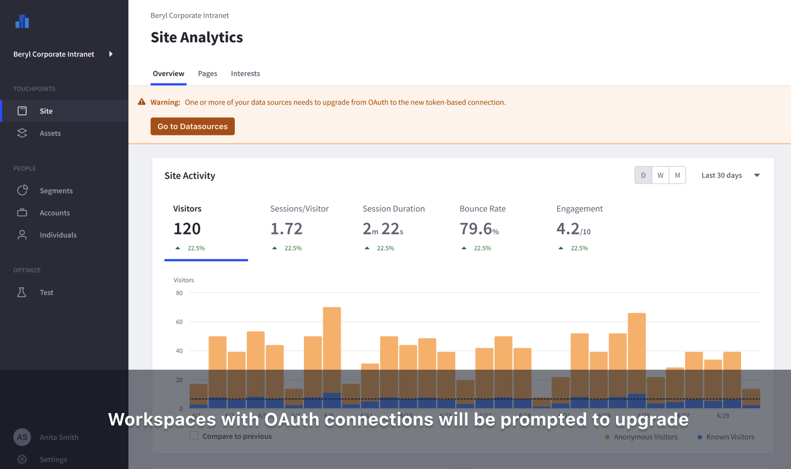
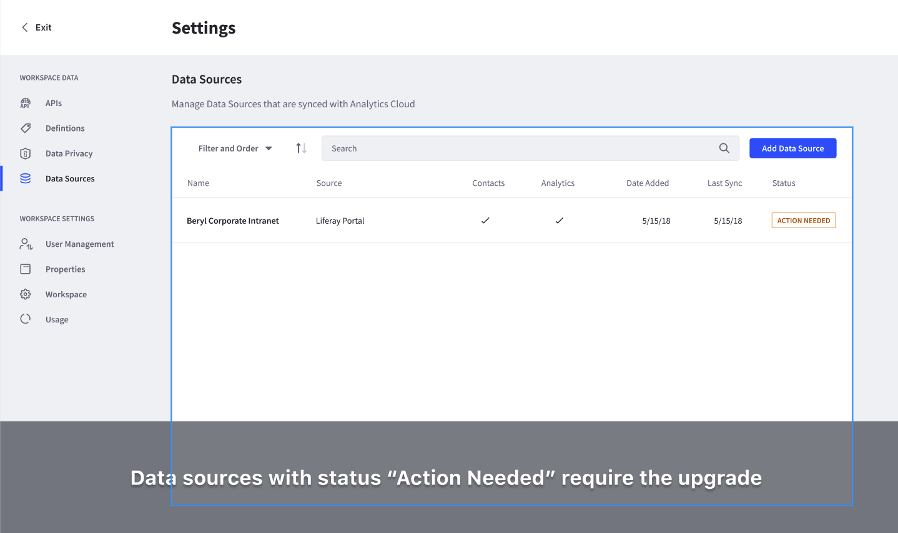
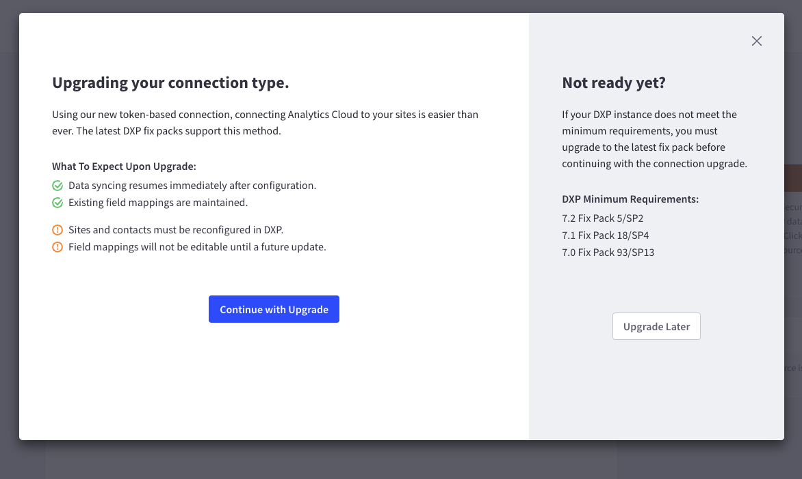
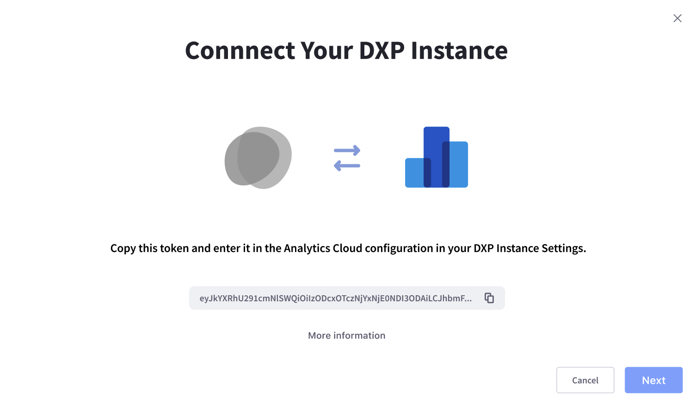
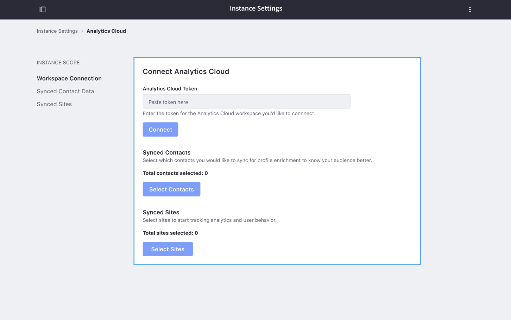

# Upgrading a Data Source Connection from OAuth to Token-Based

```warning::
   The OAuth connection method will be deprecated in the near future. If you are setting up a new data source for the first time, please use the `token connection <./connecting-liferay-dxp-to-analytics-cloud.md#using-the-access-token>`_ if possible.
```

## Beginning the Upgrade on Analytics Cloud

For users who have implemented a data source connection using OAuth, it is strongly recommended that they upgrade from to a Token-based connection method. Administrators of workspaces using an OAuth connection are presented with a message on the workspace dashboard.



1. Click on the warning message, or go to *Settings* -> *Data Sources*, to see all of the data sources that require connection upgrades, indicated by the *Action Needed* label.

      

1. Click on a data source with the *Action Needed* label.

1. Click on the upgrade walk through button on the right of your data source setting page. You are prompted with the benefits and requirements of upgrading to the Token connection.

      

      ```important::
         Make sure that you have these required fixpacks installed for your LIferay DXP installed prior to moving to the next step. These fixpacks will install the proper Analytics Cloud Configuration Portlet in your DXP control panel.

         * Liferay DXP 7.1 Fix Pack 18/SP4
         * Liferay DXP 7.1 Fix Pack 18/SP4
         * Liferay DXP 7.0 Fix Pack 93/SP13
      ```

1. Click *Continue with Upgrade* will present you with a token string that you will need to copy and paste into your DXP Instance. This token string will contain the necessary security information to help you connect from DXP with your Analytics Cloud workspace to the correct endpoint.

      

1. Copy the token string to enter into your Liferay DXP instance.

## Configuring Liferay DXP

Once you copied the token string, on your Liferay DXP instance, perform these steps:

1. Navigate to *Control Panel* -> *Configuration* -> *Instance Settings* -> *Analytics Cloud* of your DXP instance. You need Administrator-level access to the instance to perform the following steps.

      

1. Paste the token string into the *Analytics Cloud Token* field

1. Click *Connect*. Make sure that your DXP server has outbound internet access to the Analytics Cloud server in order to connect successfully. If your DXP is behind a firewall, please review the [troubleshooting guide](../../troubleshooting/connecting-data-sources.md).

1. A success message is shown: *Analytics Cloud Workspace Connected*.

## Configure Sites and Contacts

To complete the upgrade process you must configure the sites and contacts that are synced to Analytics Cloud again.

### Syncing Sites

To sync sites, follow these steps:

1. Click on *Select Sites* in the Analytics Cloud configuration

1. In the next screen, a list of properties that that have been added to your Analytics Cloud workspace is shown. Select the [property](./tracking-sites-and-individuals-using-properties.md) with the same name as the data source you are upgrading.

      

1. Select the DXP sites that you want to sync to this property. You should select the same ones that you were syncing prior to the upgrade, but you could also add or remove some sites if you wish.

1. Click *Save*. Analytics Cloud begins tracking analytics for the selected DXP sites.  

      

### Syncing Contacts

To sync contacts, follow these steps:

1. Click on *Select Contacts*

   You can sync all of your users in your DXP, or sync only by user groups or organizations.

1. Select the users you want to sync and click save. DXP begins sending new contact data again to Analytics Cloud again.


## Validating the Upgraded Connection

To confirm that everything is upgraded properly, follow these steps:

1. Return to your Analytics Cloud workspace.

1. Go to the data source that you upgraded by navigating to *Settings* -> *Data Sources*

1. View the new data source setting screen. The connection status should say *Connected*.

```note::
   Sometimes the data will take time to sync. To troubleshoot and confirm that data is synced properly to Analytics Cloud, please follow the guide here.
```

Congratulations! You have successfully upgraded to the Token connection for your DXP data source.
