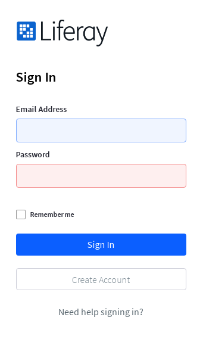
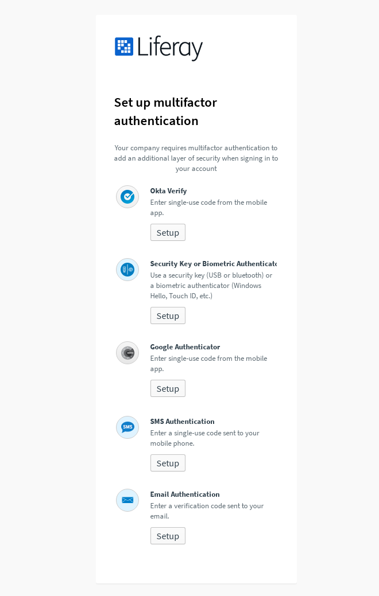
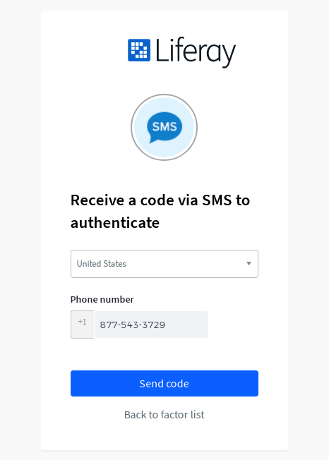
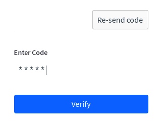
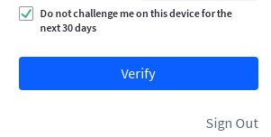
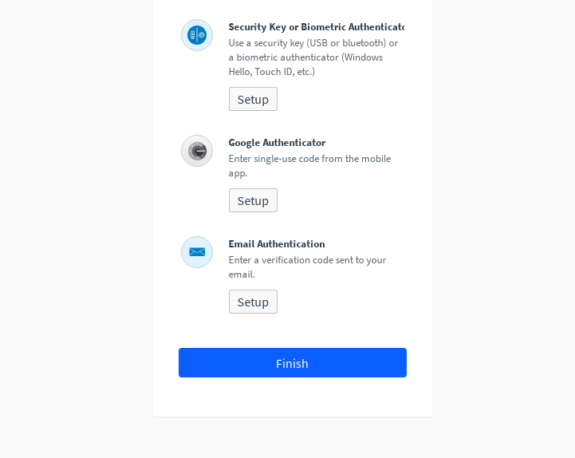

# Multi-Factor Authentication

Multi-factor authentication (MFA) is required for all Analytics Cloud users. This additional layer of security helps to protect users from cyberattacks such as phishing and man-in-the-middle (MITM) attacks.

## Setting up Multi-Factor Authentication

1. Login to [analytics.liferay.com](https://analytics.liferay.com) with your [liferay.com](https://www.liferay.com) account email address.

    

1. Choose from one of the five MFA options. For example, select *SMS Authentication* to receive a code by text message. 

    

   Note, if you choose to change to a different authentication type after setup, please [contact support](#help-with-mfa).

1. Click the *Send Code* button and wait to receive your code. Note, you may need to check your spam folder if using the *Email Authentication* option.

    

1. Input the verification code and click the *Verify* button. Click the *Re-send code* button if you fail to receive the verification code.

    

1. Check the box if you choose to prevent MFA from expiring for the next 30 days.

    

1. Click *Finish* to complete the authentication process.

    

1. Upon authentication, you are directed to the Analytics Cloud start page. From here, you can [access your workspace](./accessing-your-workspace.md).

## Help with MFA

Secure login is a critical feature to protect our users and customer data. If you encounter an issue with MFA, we're here to help. 

Contact support through [help.liferay.com](https://help.liferay.com/) or email us at [analytics-cloud@liferay.com](mailto:analytics-cloud%40liferay.com)
