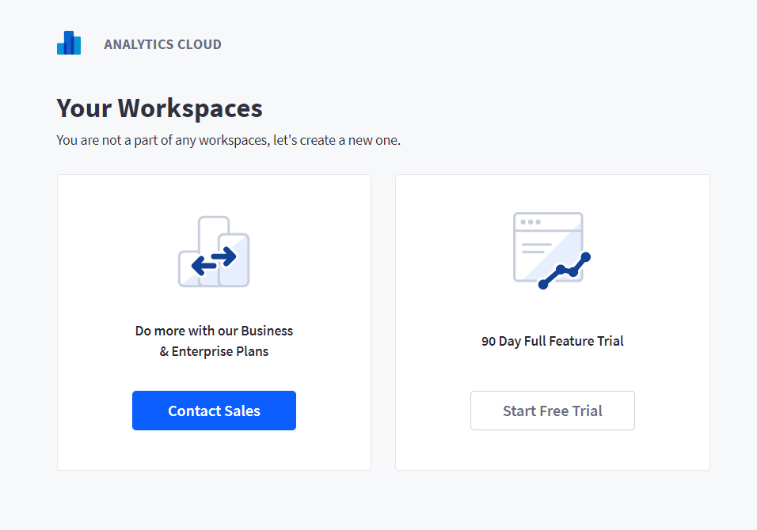
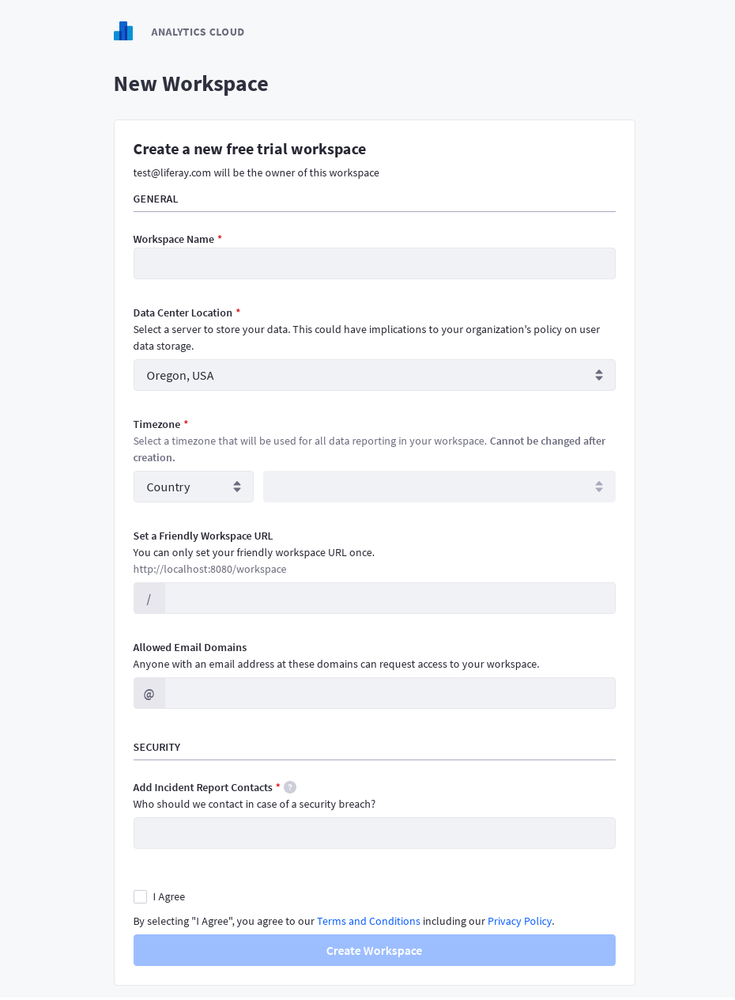
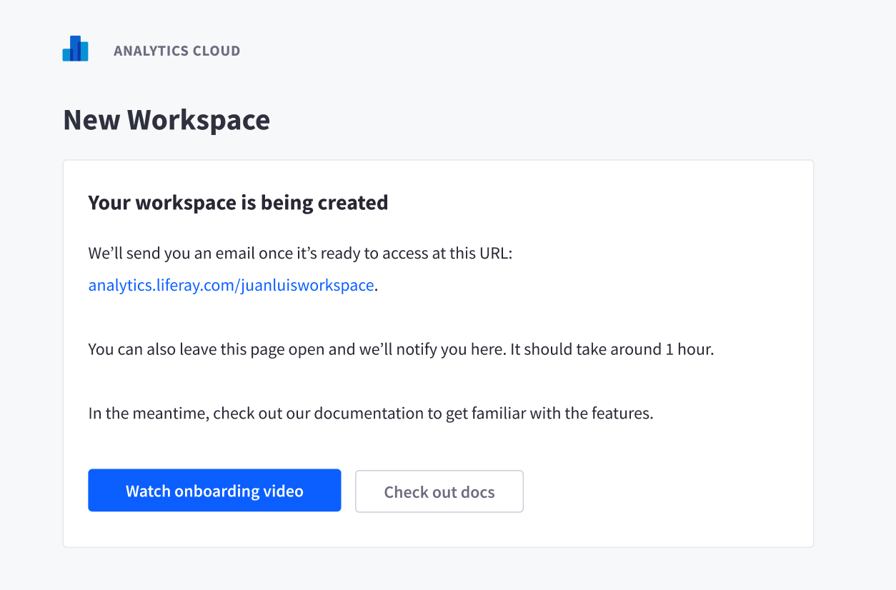

# Signing Up for a New Workspace

To start using Liferay Analytics Cloud, first visit analytics.liferay.com, and sign in using your liferay.com account. If you do not have a liferay.com account, you can also sign up for one from the login page.

Once logged in, you can either sign up for a **free trial** workspace or purchase a **paid tier** workspace by contacting sales. If you already have a workspace, you will also see your workspace listed after login.

## Creating a Free Trial Workspace

Free trial workspaces allow you to test Analytics Cloud for 3 months for free, as long as you have a valid Liferay DXP instance to connect with Analytics Cloud.

Free trials are limited to a single workspace per valid email address registered with <www.liferay.com>. If you are a Liferay partner and wish to have more than one free trial account, please [contact Sales](mailto:sales@liferay.com).

Clicking on the the Start Free Trial button from the home screen will take your to the workspace configuration screen.

**Workspace Name** allows you to create your own analytics workspace name.

**Data Center Location** allows you to select the location of your server, which will store all of your analytics and website visitors data. Currently, Liferay Analytics Cloud offers three data center locations.

* North America - Oregon, USA
* South America - São Paulo, Brazil
* Europe - London, United Kingdom

We are also currently planning a new data center in Frankfurt, Germany.

**Friendly URL** allows you to setup a friendly url for your workspace that you can share to other collaborators with ease.

**Allowable Email Domain** allows other users with the the same email domain to find and access this workspace. For example, if you set @mycompany.com for this configuration, other users with the same email domain will be able to see and request to join this workspace after logging in to Analytics Cloud.

Finally, accept the terms and conditions and privacy policy before finishing.

Once you click the Create Workspace button, Analytics Cloud will take some time to finalize the workspace creation in the background. You will be presented with the following screen:

This process may take from 30 minutes to 1 hour to complete. An email will be sent once your workspace is ready.

See the next section on how to [access your workspace](./accessing-your-workspace.md).

## Buying Analytics Cloud workspace

To purchase a Business or Enterprise tier workspace, click on the Contact Sales button from the home screen.

Fill out the form, and a sales representative will contact you shortly.

Once you've successfully purchased your Analytic Cloud workspace, our team will provision a workspace for your account. Make sure you provide the email of the workspace owner, and your desired data center location to your sales representative to make this process as smooth as possible.

Your workspace owner will receive an invitation email once the workspace is provisioned. The owner can then login to <analytics.liferay.com> and finish configuring the workspace.

See the next section on how to [access your paid workspace](./accessing-your-workspace.md).
