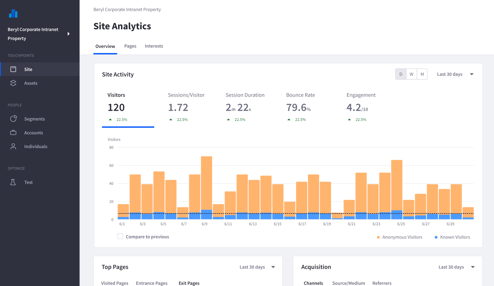

# Viewing the Analytics Dashboard

The home of your workspace is a dashboard of your websites' analytics performance. This dashboard gives you a summary of how your website is doing overall and is the entry point for diving deeper into analysis of your site's Pages, Assets, and People

The Dashboard is also the starting point for a variety of workspace management and configuration tasks.

## Connecting a DXP Site to Analytics Cloud

The first task for a new workspace is to connect it to a Data Source. Analytics Cloud is built to use Liferay DXP Sites as a key data source. See [Connecting Liferay DXP Sites to Analytics Cloud](../connecting-data-sources/connecting-liferay-dxp-to-analytics-cloud.md) to learn more. You can also bring in data from [CSV files](../../individuals-and-segments/individual-profiles/adding-a-csv-data-source.md) and [Salesforce](../../individuals-and-segments/individual-profiles/adding-a-salesforce-data-source.md) to supplement your existing user data.

## Inviting Others to Your Workspace

As a workspace owner or admin, you can invite your colleagues to the workspace. Invited users can be configured to help setup and configure data sources, create segments, or simply view analytics reports.

See [Managing Users](../administration/managing-users.md) to learn more about adding users to your workspace.

## Configure Settings for Your Workspace

Most of the important settings are configured when you created the workspace. However there are other settings worth reviewing for your workspace.

* Data Definitions
* Data Control and Privacy
* APIs
* Workspace Usage Monitoring
* Workspace Settings

To see more about your workspace settings, see [Managing Your Analytics Project](../../administration/managing-projects.md).
