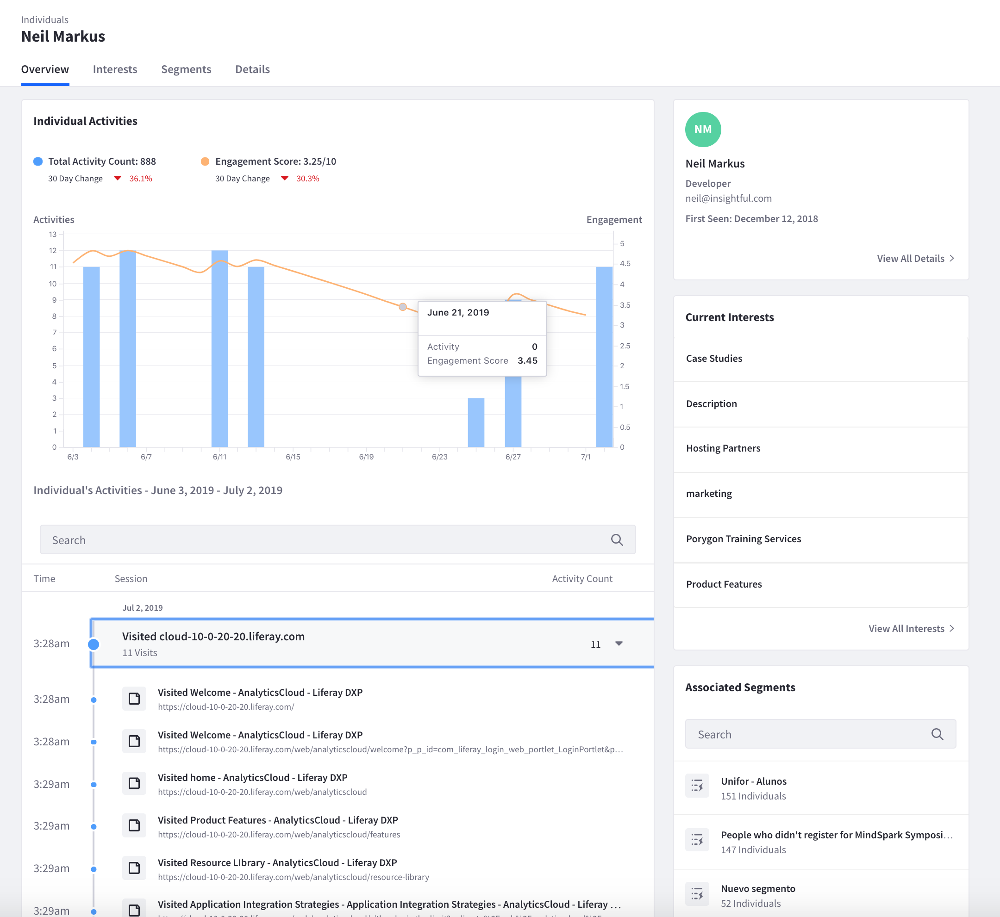
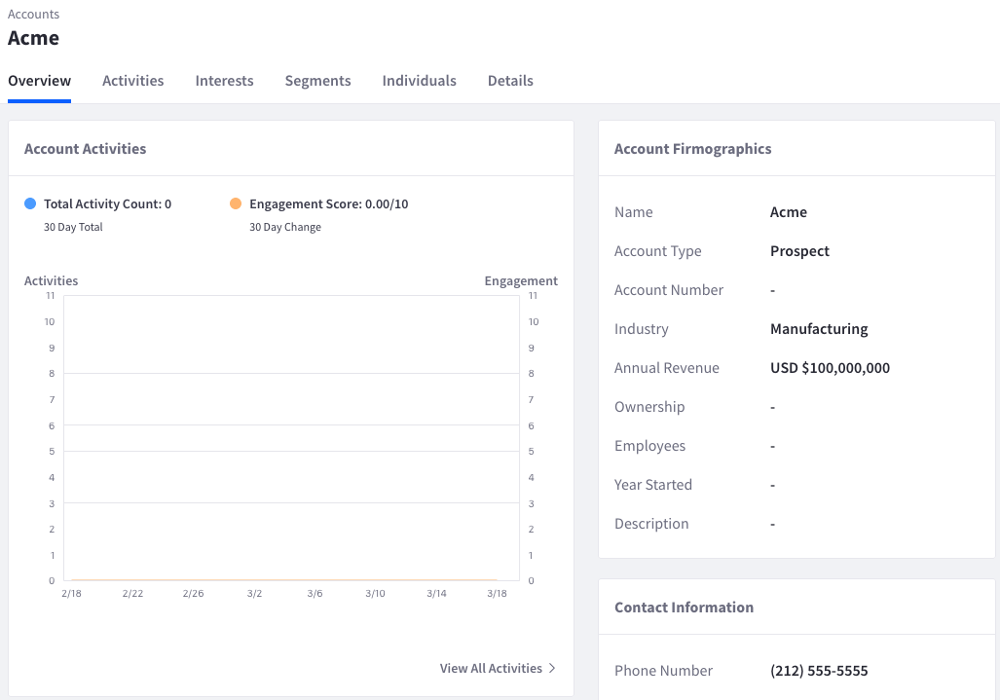
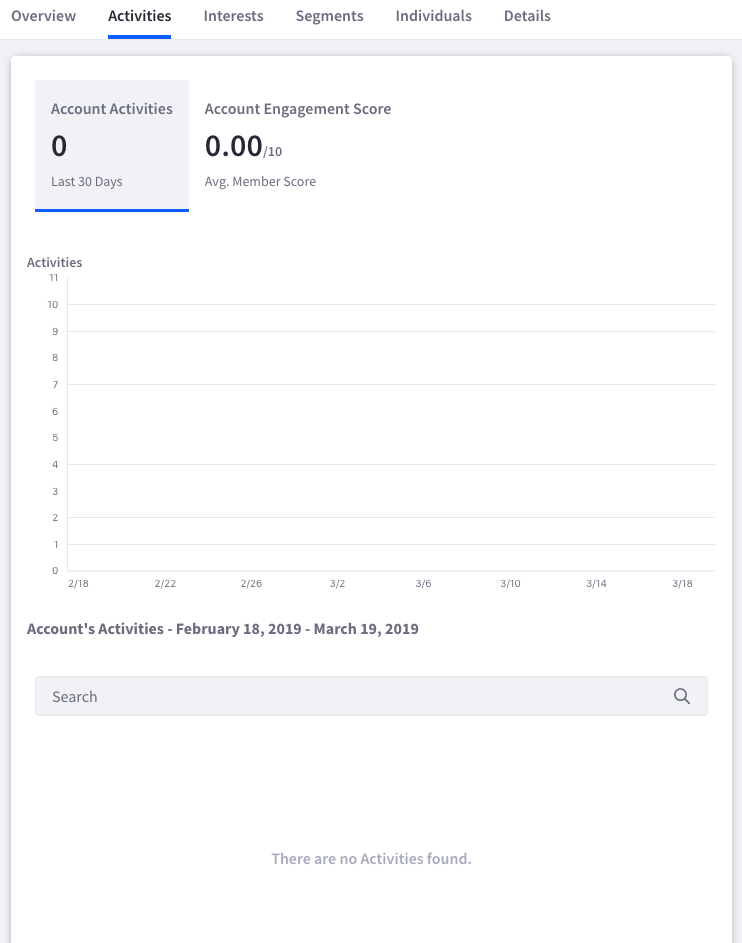

# Accounts

If you have a [Salesforce data source](./individual-profiles/adding-a-salesforce-data-source.md), Analytics Cloud can import and analyze Salesforce account data. By combining Salesforce account data with data from other sources, Analytics Cloud presents a holistic view of the account and those in it.

To view account analytics, select Accounts from the left navigation panel. The accounts are displayed in a searchable table that lists the following data for each account:

* Account Type
* Individuals
* Total Activities
* 30-Day Engagement Score

Click an account to view its information, which is organized into these tabs:

* Overview
* Activities
* Interests
* Segments
* Individuals
* Details

The sections that follow describe each tab.

## Overview

The Overview tab presents summaries of the account’s data. It displays these summaries via these panes:

* Account Activities
* Account Firmographics
* Contact Information
* Account Interest Topics
* Known Individuals
* Associated Segments

If more information is available for each tab, you can access it via its link. For example, a View All Activities link is at the bottom of the Account Activities pane. Clicking this link takes you to the Activities tab, which shows more detailed information about activities.

## Activities

The Activities tab shows the activities of the individuals in the account. A histogram shows the number of activities by date and the average engagement score for the account’s individuals. A searchable table below the histogram shows more detail about the activities.

## Interests

The Interests tab shows the topics of interest for the account’s individuals. Analytics Cloud identifies these topics via the same methodology it uses for individuals. For more information, see [Interests](./interests.md).

## Segments

The Segments tab shows the segments for the account’s individuals. These segments function the same as segments in general. The only difference is that the segments here apply to the individuals in the account. For more information on segments, see the documentation on creating and profiling segments.

## Individuals

The Individuals tab shows information about the individuals in the account. For more information on individuals in Analytics Cloud, see Profiling Individuals.

## Details

The Details tab shows information about the account’s properties. The properties appear in a searchable table that shows each account property in Analytics Cloud and its value. The table also has columns for these values:

* **Source Name:** The corresponding property name in the Salesforce data source. For example, the Analytics Cloud `accountId` property is `id` in Salesforce. Therefore, `id` appears in the Source Name column of the `accountId` row.
* **Data Source:** The data source the property’s value originated from.
* **Last Modified:** The date the property’s value was most recently changed.

