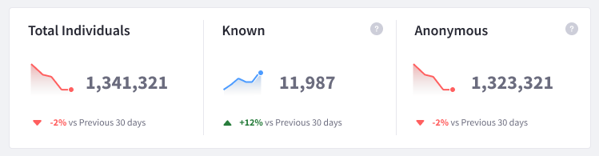

# Individuals Dashboard

The Individuals dashboard provides a broad range of analytics data about the visitors to your site. View valuable information about your audience and how they interact with your site.

To view the dashboard,

1. Click Individuals in the People section of the menu.

1. Click the Overview tab (this tab is selected by default when you click Individuals).

The Individuals dashboard contains the following data:
* [Current Totals](#current-totals)
* [Enriched Profiles](#enriched-profiles)
* [Active Individuals](#active-individuals)
* [Interests](#interests)
* [Breakdown](#breakdown)

## Current Totals

The Current Totals panel presents the total number of individuals, known and anonymous, that have been tracked by Analytics Cloud. 

If Analytics Cloud already has some identifiable attribute of an individual, they are considered known.

The Panel also displays a percentage change in total numbers compared to the previous 30 days.

## Enriched Profiles

The Enriched Profiles panel presents the total number of individuals that 

## Active Individuals

The Active Individuals panel presents information on both known and anonymous visitors who have interacted with your site in the selected period.

Choose to visualize the data based on day, week or month. The data can be filtered by ranges of time: Last 24 hours, Last 7 days, Last 30 days, Last 90 days. Click More Preset Periods to reveal additional time ranges. Click Custom Range to filter by a start date and end date of your choice.

## Interests

The Interests panel presents the top 5 topics that individuals are most interested in.

To view the full list of interest topics, click *View All Interests* in the panel. Alternatively, click the Interests tab at the top of the screen. 

## Breakdown

The Breakdown panel presents up to 10 different distribution information based on selected attributes.

To add a breakdown by attribute, 

1. Click on the plus sign at the top right of the panel. 

1. Use the drop-down menu to select an attribute.

1. Input a breakdown name and click *Save*.

To view more information about each breakdown, click *Explore Breakdown*.

