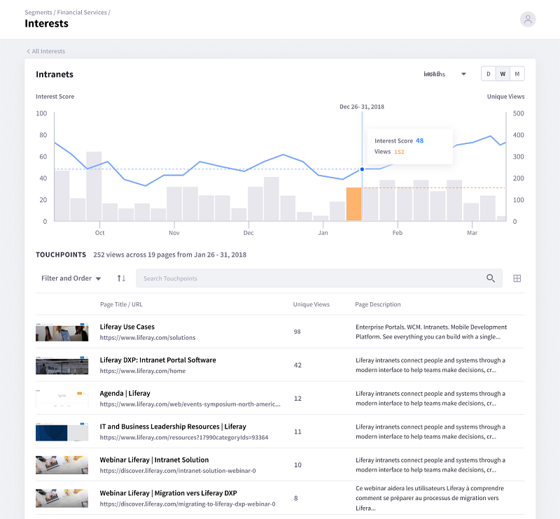

# Interests

Finding out topics people are interested in helps you relate your products and services to them. Analytics Cloud's Interests insight empowers you with rich, easy-to-understand visuals that provide this information.

As an Individual interacts with the pages and assets, Analytics Cloud notes the topics they contain. The more an Individual visits pages and assets that contain a topic, the higher the topic's ranking is for that Individual's Segments.

For example, say your site has pages that mention these topics:

* Clothing
* Sports

If an Individual named Michael frequents these pages, the Interest ranking for the clothing and sports topics is high. Here are a couple of different ways you could use this information:

If you sell sports apparel, you could prepare a campaign for selling sports apparel to Michael.

If you don't sell sports apparel, you could use the Interest data to convince sports apparel vendors to advertise on your site.

Either way, the Interests insight helps generate new business. The Interests insight tells you the most common topics mentioned by the pages and assets customers visit most.
