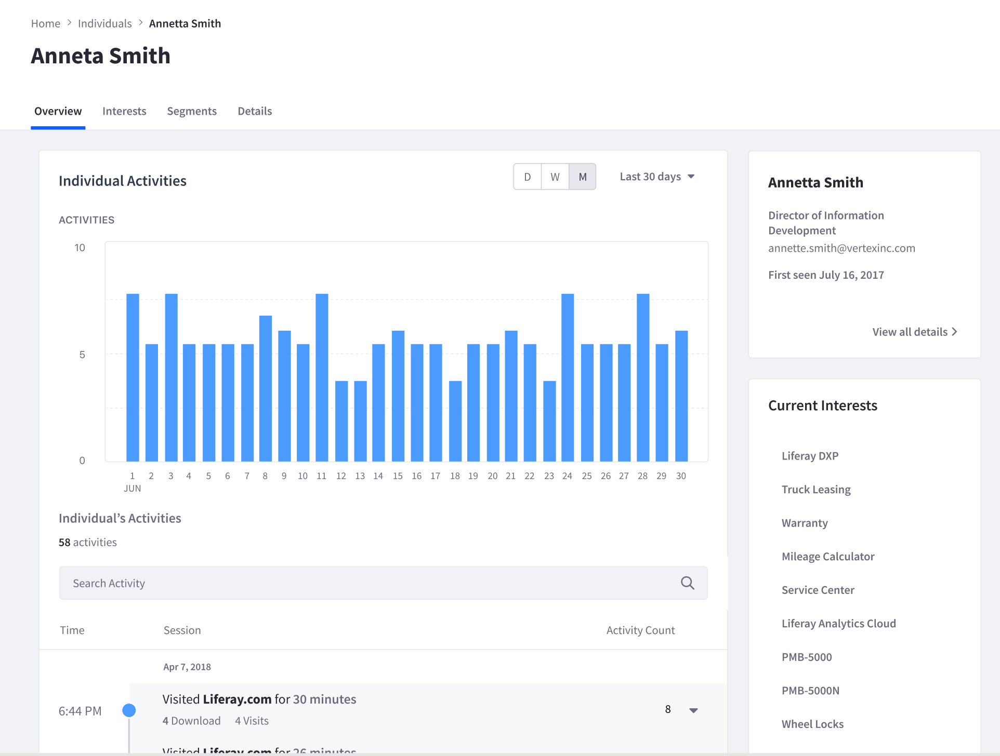
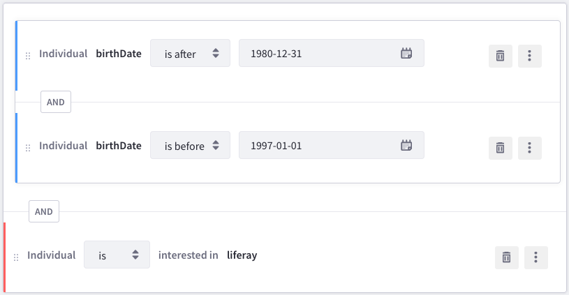

People
======

.. toctree::
   :maxdepth: 1

   people/individuals.rst
   people/accounts.md
   people/segments.rst

Better understanding individual users and users in aggregate is key to offering excellent service. Analytics Cloud provides the tools to better understand both. By building robust `Individual Profiles`_ that draw upon user data in Liferay DXP, a `connected Salesforce account`_, or `additional CSV data`_ you can have extensive detail on who your customers are. As Individual Profiles interact with your site, Analytics Cloud continuously builds upon Individual Profiles and helps you to understand your users' `interests`_ and behaviors. All of this, ultimately helping you to better take action to meet and exceed your users' needs.

.. _`Individual Profiles`: ./people/individuals/individual-profiles.md
.. _`connected Salesforce account`: ./connecting-data-sources/adding-a-salesforce-data-source.md
.. _`additional CSV data`: ./connecting-data-sources/adding-a-csv-data-source.md
.. _`interests`: ./workspace-data/definitions/managing-interest-topics.html#understanding-interests

`Segments`_ allow you to look at your users in aggregate by creating and defining groupings based on common properties and behaviors. You can create Segments that contain users who are interested in a given topic, work in a specific industry, or both. The Segmentation tools in Analytics Cloud integrate directly with the `Personalization options in Liferay DXP`_. This lets you know only understand your users, but tailor your site's experience to your users' needs.

.. _`Segments`: ./people/segments/segments.md
.. _`Personalization options in Liferay DXP`: ./optimization/personalizing-content-with-segments.md

By combining robust Individual Profiles and flexible Segment building, Analytics Cloud enables you to deliver great experiences to your users.

Next Steps
----------

Individuals
^^^^^^^^^^^

-  :doc:`/people/individuals/individuals-dashboard`
-  :doc:`/people/individuals/individual-profiles`

Accounts
^^^^^^^^

- :doc:`people/accounts`

Segments
^^^^^^^^

-  :doc:`/people/segments/segments`
-  :doc:`/people/segments/creating-segments`
