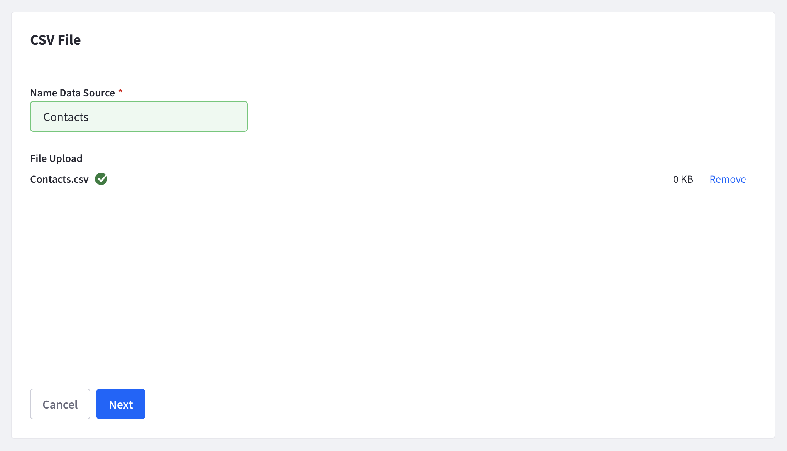

# Adding a CSV Data Source

You can import contact profile data from CSV files to enrich customer profiles with additional data related to a user’s industry, job title, annual income, or whatever metrics are important to your business. If you have customer profile data in databases or collect it through web forms, you can export the data into CSV files.

```important::
   The CSV files must have an email column.
```

Here’s how to integrate contact data from a CSV file:

1. In the *Data Sources* page, click *Add Data Source*. A page appears showing the data source types.

1. Select the *CSV File* icon. The *CSV file* upload page appears.

1. Upload your *CSV file* by dragging it into the upload area or browsing and selecting it from your file system. 

1. Enter a name for your data source and click *Next*.

    

1. Follow the instructions for [Mapping Contact Data](#mapping-contact-data) to map contact data from your CSV file to your Analytics Cloud contact data model. Once you’ve mapped the data, click Next.

The contact profile data starts syncing. The time it takes to sync depends on the number of contacts.

## Mapping Contact Data

Analytics Cloud can map contact profile fields into a unified customer data model. It starts you with a default model. Once you’ve selected the contacts to sync, Analytics Cloud makes a best effort to map contact data fields from the data source to your unified contact data model.

Analytics Cloud provides several contact data mapping options:

* Choose the most appropriate data model field—Analytics Cloud suggests possible matches.
* Add a new custom data model field and map source data to it.
* Map source fields from multiple data sources to the same data model field.

```note::
   If you map source fields from multiple data sources to the same model field, the latest modified value is used.
```

As you map source fields to the data model, you can search for and select from the data model fields, use a suggested field, or create a new custom field.


Here’s how to create custom contact data model fields:

1. Click on the data model field’s selector.

1. Click *New Field*. A dialog appears for you to create the new field.

1. In the dialog, name the new field and select its type.

1. Click *Create*.

Your custom model field is ready to match with source fields.


When you’re done mapping the data, click the Done button.

