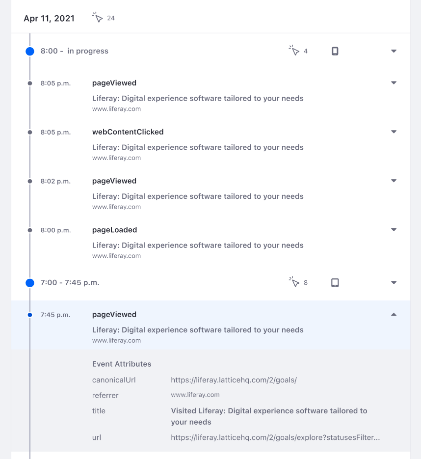

# Individual Profiles

Many individuals visit your sites. Learning who they are and their activities and interests helps you improve business with them. Individual profiles help your Sales, Customer Service, and Customer Relations teams work personally with them. The profiles help you gain more context on what people do on your websites and their interests, so you can communicate with them intelligently according to their needs.

Here's how to view Individual profiles:

1. Select Individuals from the left navigation panel. The Individuals page appears, listing individual contacts, so you can page through, search for, and select them to learn more about them.

1. Select an Individual to view these things about the person:

    * Activities on your sites
    * Identity details and properties
    * Topic interests
    * Segment membership

Each Individual profile has these tabs:

* Overview
* Details
* Interests
* Segments

Let's explore them to learn more about people you do business with.

## Overview

The bar graph presents a summary of the individual's recent activities. Change the view between daily, weekly, and monthly views. Click the time period selector to change the time range. Use the search bar to filter events by key terms.

The activity stream presents past activities that are separated by sessions. Each session is indicated by a blue dot on the left of the time stamp. Click on a session to see session's details (e.g. device and browser information).

Each session lists out [individual events](../../touchpoints/events.md) that are tracked by Analytics Cloud including both [default events](../../workspace-data/definitions/definitions-for-events.md#default-events) and [custom events](../../workspace-data/definitions/definitions-for-events.md#custom-events). Click on any event to see the event's details (e.g. page tile and url).

The Overview tab also gives you a glimpse of a person's profile data, topics of interest, and associated audience segments. Clicking the *View all* ... link for the Details, Interests, or Segments summary opens its respective tab.

Click on the Details tab to explore an Individual's details.

## Details

The Details tab shows all of the person's attributes, the data sources they came from, and when they were last modified.

## Interests

Click on the Interests tab.

Depending on the web pages or assets a user interacts with, Analytics Cloud uses an advanced algorithm to find out what an individual's interests are with your brand. This helps you prepare for conversations with the individual or create campaigns based on the interests. For more information, see [Understanding Interests](../../workspace-data/managing-interest-topics.md#understanding-interests).

## Segments

The Segments tab lists all the Segments the customer belongs to. Read the article on [Segments](../segments/segments.md) to learn more.
