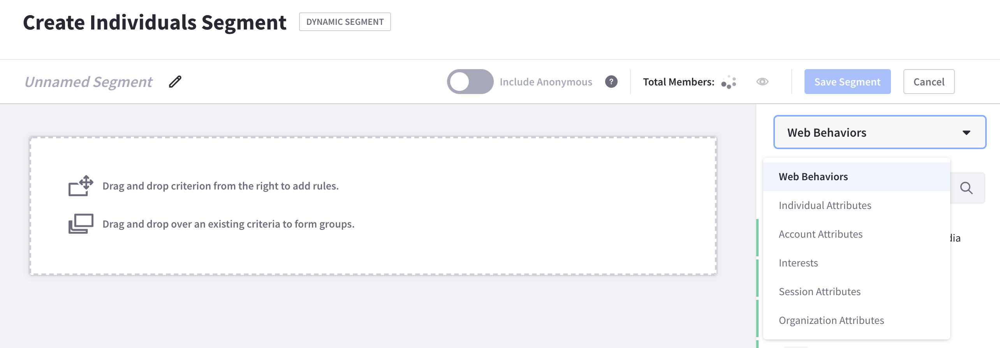
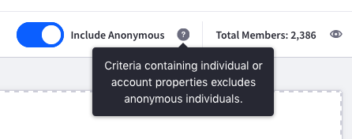
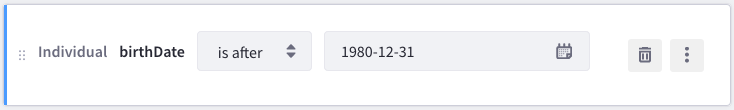
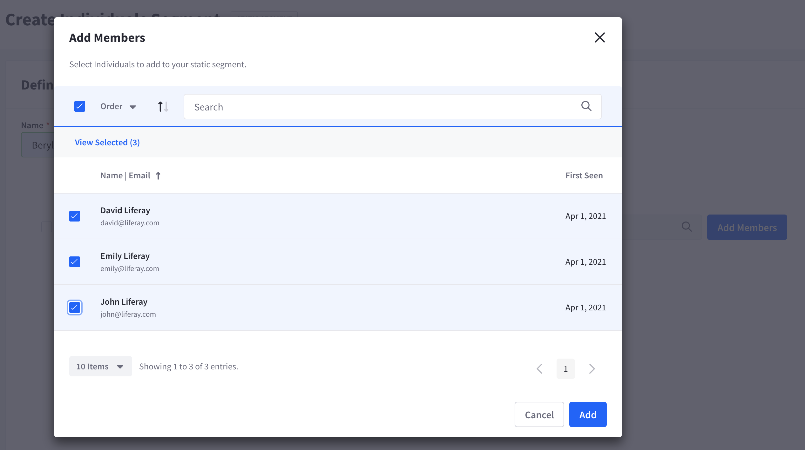

# Creating Segments

## Creating a Dynamic Segment

1. Click *Segments* in the navigation panel. A table with existing Segments appears.

1. Click *Create Segment* &rarr; *Dynamic Segment*. The Create Individuals Segment screen appears for creating a Dynamic Segment.

1. Click the *Edit* icon next to *Unnamed Segment*, and give your segment a name.

    

1. Drag and drop Segment criteria from the panel on the right to the canvas on the center of the screen. The selector menu at the top of the panel shows you the criteria types you can select:

    * **Web Behaviors:** Actions taken by a person (e.g., submitted a form, viewed a blog, etc.).
    * **Individual Attributes:** Attributes that belong to a person (e.g., age, country, industry, etc.). Note that DXP custom fields can also be selected under Individual Attributes. Learn more about [adding custom fields to Users in DXP](https://learn.liferay.com/dxp/latest/en/users-and-permissions/users/adding-custom-fields-to-users.html).
    * **Account Attributes:** Attributes that belong to a Salesforce Account (e.g., account name, industry, website, etc.).
    * **Interests:** Topics and content types that interest the person. For more information on interests in Analytics Cloud, see Customer Insights.
    * **Session Attributes:** Attributes that belong to a person's web session (e.g., browser, geo-location, etc.).
    * **Organization Attributes:** Attributes that belong to an organization (e.g. name, hierarchy, type, etc.).

    

    ```note::
       Anonymous users are excluded from Segments by default. To include them, enable the Include Anonymous toggle. Note, however, that criteria with individual and/or account attributes excludes anonymous users regardless of your setting here. Such attributes only apply to known users.
       
    ```

### Creating Criteria

The criteria creation canvas is flexible. Once added to the canvas, you can move, delete, or duplicate any criterion:

* **To move:** Click and drag the criterion using the vertical dots  on its left.
* **To delete:** Click the criterion's trash icon . Alternatively, you can click the criterion's *Actions* icon  and select *Delete*.
* **To duplicate:** Click the criterion's *Actions* icon  and select *Duplicate*.

Each criterion that you add contains fields for customization. The first field is typically a selector menu where you specify a condition for any remaining fields. The condition's values depend on the data type for the remaining fields. Here are some common condition values:

* Contains (text)
* Equals
* Greater than (number)
* Is known
* Less than (number)
* Does not contain (text)
* Does not equal
* Is not known
* Greater than or equals (number)
* Less than or equals (number)
* Is
* Is not
* Is before (date)
* Is after (date)
* Has (behavior)
* Has not (behavior)

For example, the `birthDate` criterion's first field is a selector menu containing the options _is before_, _is_, and _is after_. The second field is a date field. You can, therefore, specify a criterion in which only Individuals with a birthday after 31 December 1980 are part of the Segment.



You can also control the way adjacent criteria interact with each other. For example, if you place criteria next to each other, a small box appears between them with the text `AND`. This means that the two criteria are joined by a logical *And*. Clicking the box changes it to `OR`, which represents a logical *Or*. Selecting *And* narrows the Segment's selection of Individuals; *Or* broadens it.

For example, joining two `birthDate` criteria with the following conditions creates a Segment targeting the Millennial generation (born 1981 - 1996):

* Is after 31 December 1980
* AND
* Is before 01 January 1997

You can also form subgroups of criteria by dragging and dropping criteria onto each other. An AND/OR box then appears between the subgroup and any adjacent criteria. Together, these tools help you build complex criteria for your Segment.


When you are finished configuring the segment, click *Save Segment*.

## Creating Static Segments

1. Click *Segments* in the navigation panel. A table with existing Segments appears.

1. Click *Create Segment* &rarr; *Static Segment*. The Create Individuals Segment screen appears for creating a Static Segment.

1. Name the Segment.

1. Click *Add Members* to bring up the Add Members screen, which contains a searchable list of all Individuals.

    

1. Select the *Individuals* to add to the Segment, then click *Add*.

1. To change or undo your selections, click the *View Added Members* link and click *Undo* for each Individual you want to remove. Alternatively, select each Individual and click the *Undo Changes* button that appears. To remove all Individuals, click *Undo All*.

1. Click *Create* when you're finished.
