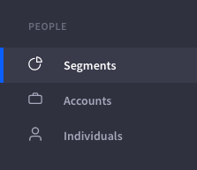
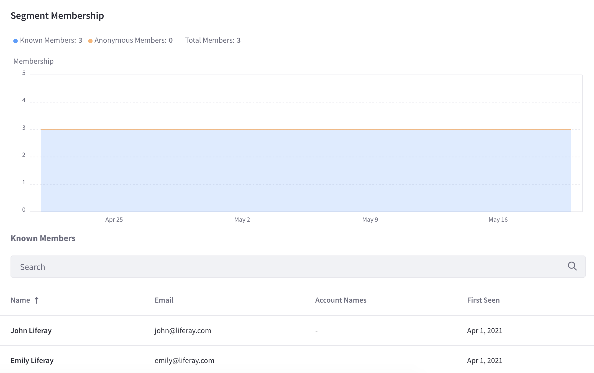
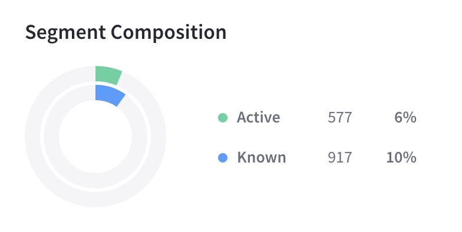
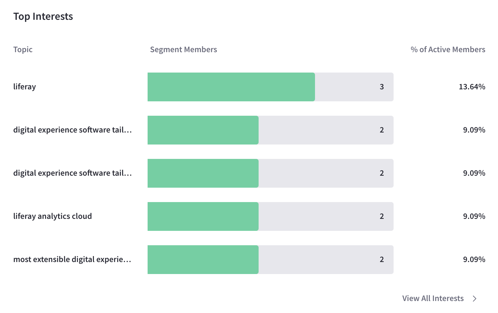
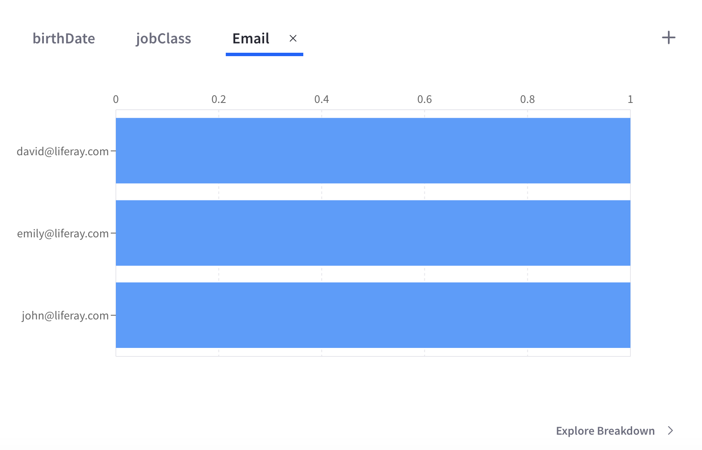
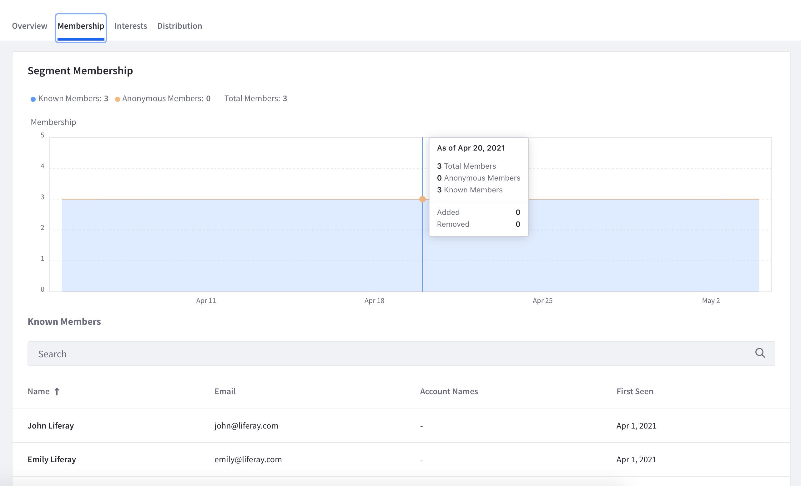

# Segments

Segments aggregate Individuals based on common attributes and behavior. For example, you can create a Segment that contains users interested in a given topic, work in a specific industry, or both. Analytics Cloud analyzes and profiles Segments. You can then integrate your Analytics Cloud Segments with personalization in Liferay DXP, so you can deliver content of interest to each Segment via Liferay DXP.

There are two types of Segments:

**Dynamic Segments:** Individuals aggregated automatically based on criteria that you specify. Criteria can be based on Individuals' attributes and interaction with your Liferay DXP Site pages and assets. For example, you can use an industry attribute as criteria. Analytics on industry Segments show industries that engage with you the most and what content they're interested in.

**Static Segments:** Individuals you aggregate manually. 

## Segment Profiles

Here's how to view Segment profiles:

1. Select Segments from the navigation panel. The Segments page appears, listing individual Segments. You can page through, search for, and select Segments to learn more about them.

1. Select a Segment to learn these things about it:

    * Membership: Population fluctuation over time.
    * Topics of interest: Topics mentioned in the pages and assets the Segment visits most.
    * Distribution: Based on Individual attributes.
    * The Segment's profile appears, showing its Overview panel.

## Overview Tab

The Overview tab's main area shows membership growth. As a marketer, you might want to generate more customer prospects in a specific industry. If you create a Dynamic Segment with that industry as criterion, you can view its membership histogram to monitor customer growth in that industry.

The Overview tab also gives you a glimpse of the Segment's criteria, interests, and distribution. Each one links to more details, or you can click on their respective tabs.

### Segment Membership Panel

The Segment Membership panel displays the breakdown of the segment for known and anonymous individuals. It shows data for the previous 30 days. Place your mouse over the graph to see the breakdown at specific dates in the 30 days. 

To see a list of known individuals of the segment click the *View Members* link at the bottom of the panel. Alternatively, click the *Membership* tab at the top of the page.

### Segment Composition Panel

The Segment Composition panel shows the breakdown of active and known members versus the total individuals in the segment. For example, if the segment was created for interest in a specific topic, this panel would show the active percent of the segment for the past 30 days and what percent of the segment was known.

Note, this panel only appears for dynamic segments.

### Segment Criteria Panel

The Segment Criteria panel displays the criteria used to configure the segment. For example, a segment might be a dynamic segment of visitors who viewed a particular blog on your Site.

To learn more about different segment criteria, see [Creating Segments](./creating-segments.md).

### Top Interests Panel

The Top Interests panel shows a list of the most popular topics of interest in the segment. This is based on the pages and assets that get the most visits. 

To see the full list of interest topics, click on the *View All Interests* link at the bottom of the panel. Alternatively, click the *Interests* tab at the top of the page.

### Breakdown Panel

The Breakdown panel displays distribution information based on selected attributes of segment members.

Up to 10 different attributes are shown on this panel. To see the fill list of breakdowns, click on the *Explore Breakdown* link at the bottom of the panel. Alternatively, click the *Distribution* tab at the top of the page.

## Membership Tab

The Membership tab displays the same chart as the Segment Membership panel. It also presents a list of all known individuals in the segment.

The name, email address, account name, and first seen date is given for known individuals. Use the search bar to search for specific individuals. 

## Interests Tab

As a Segment's members interact with your pages and assets, Analytics Cloud's Interests algorithm determines the level of interest the Segment has with your site's topics. Knowing these topics helps you communicate with the Segment members to create content that interests them.

See Customer Insights for details on the Interests insight.

## Distribution Tab

The Distribution tab breaks down the Segment by an individual attribute.

For example, select a attribute such as Job Title to dissect your Segment further. A bar chart appears, showing a distribution of the Segment member population by Job Title. As a marketer, you could use this information to identify a subset of the Segment to focus a marketing campaign on.

You've completed touring Segment profiles. Creating Segments and analyzing their profiles is key to learning more about your customers.

## Related Information

[Personalizing Content with Segments](../../optimization/personalizing-content-with-segments.md)
