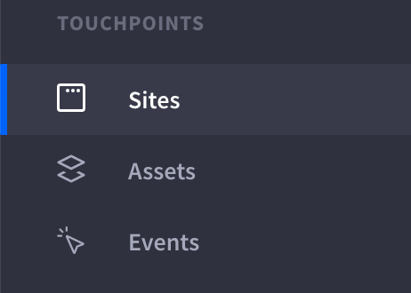
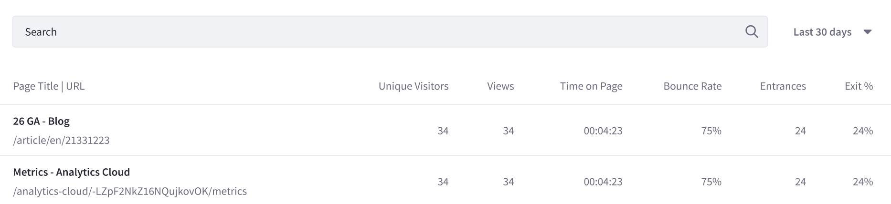
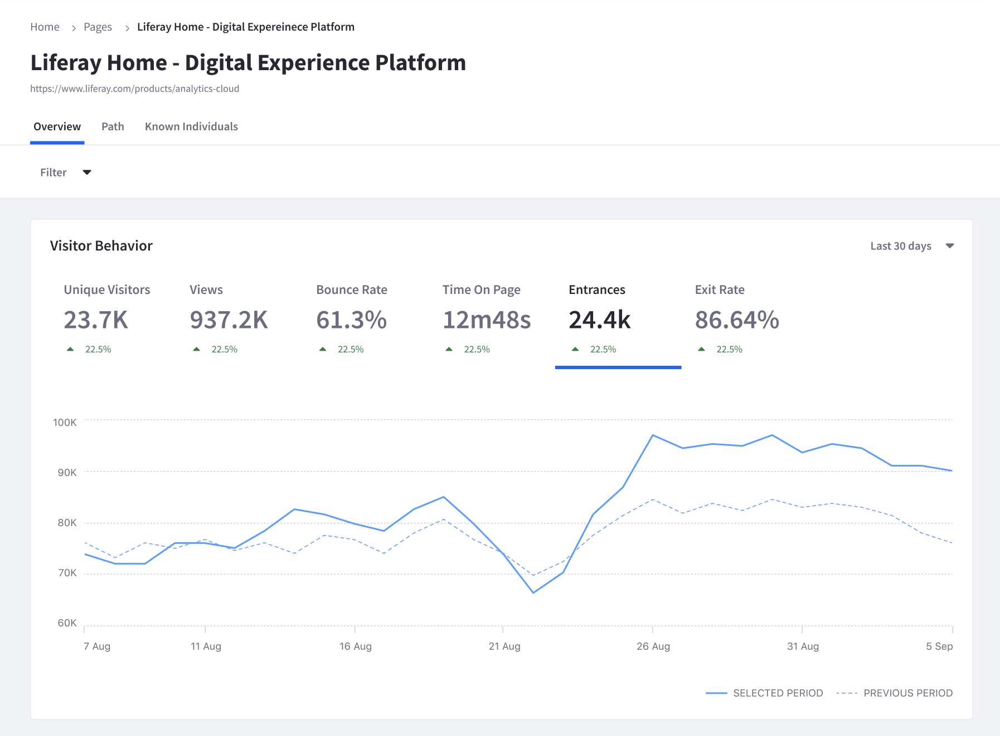
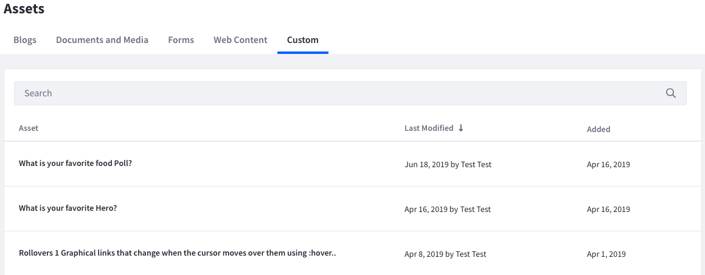
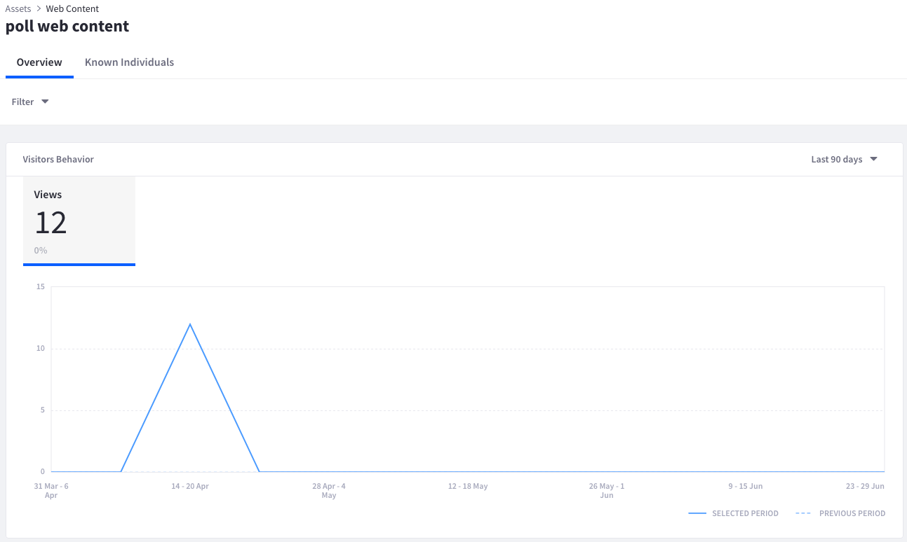

Touchpoints
===========

.. toctree::
   :maxdepth: 1

   touchpoints/sites-dashboard.md
   touchpoints/pages.rst
   touchpoints/assets.rst

Touchpoints reflect the many different ways your users and customers interact with your brand. Analytics Cloud presents a broad range of analytics data that combines traditional page analytics like page views, with comprehensive site, path, and asset-specific analytics data.

Analytics Cloud presents a `site-wide reporting dashboard`_ that provides a comprehensive report of your entire site. This helps you understand how many unique visitors your site has over time, which pages these visitors access, what their interests are, and more. Analytics for `individual pages`_ can be easily viewed as well. This includes views, visitors, and bounce rate. `Path analytics`_ show how visitors arrive at your pages. This includes information on which pages they visit prior to yours, and their location and device type. Finally, you can also track the performance of many Liferay DXP Assets to drill deeper than the page level to determine how you can improve your site's performance.

.. _`site-wide reporting dashboard`: ./touchpoints/sites-dashboard.html
.. _`individual pages`: ./touchpoints/pages/pages.html
.. _`Path analytics`: ./touchpoints/pages/paths.html

Navigating to Touchpoints begins with the `Sites Dashboard`_. In Touchpoints, you can also find additional page and asset analytics.

.. _`Sites Dashboard`: ./touchpoints/sites-dashboard.html

Viewing Page Data
-----------------

To view the list of Pages with summary data,

#. From the Touchpoints section, click Sites.

#. Click the Pages tab.

Order Pages in ascending or descending order based on any one of the following metrics,

* Total Visitors
* Total Views
* Average Time on Page
* Average Bounce Rate
* Entrances
* Exit Rate

The metrics for ordering the Page list are calculated based on the time period selected in the time period menu (at the top-right of the table). The following time periods are available:

* Last 24 hours
* Last 7 days
* Last 30 days (default)
* Last 90 days
* More Preset Periods (Yesterday, Last 28 days, Last 180 days, Last Year)
* Custom Range

.. note::
   Page data is based on canonical URL. Learn more about `canonicalization`_ or `how to set a custom canonical URL in DXP`_.

.. _`canonicalization`: https://moz.com/learn/seo/canonicalization
.. _`how to set a custom canonical URL in DXP`: https://learn.liferay.com/dxp/latest/en/site-building/creating-pages/page-settings/configuring-individual-pages.html#seo

To view detailed metrics for a single page, click that page in the table. See `Page Analytics`_ for more information.

.. _`Page Analytics`: ./touchpoints/pages/pages.html

Finding Asset Data
------------------

To view analytics data on your assets,

#. From the Touchpoints section, click Assets.

#. Choose an Asset type: Blogs, Documents and Media, Forms, Web Content, or Custom.

To order Assets in ascending or descending order based on any one of the Asset's metrics, click the metric's heading in the table. The metrics differ between Assets. See each Asset's documentation for more information. In addition, you can calculate the metrics over a selected time period by selecting one of the following values from the time period menu (at the top-right of the table):

* Last 24 hours
* Yesterday
* Last 7 days
* Last 28 days
* Last 30 days (default)
* Last 90 days

Click an Asset in the list to see more granular detail.

Remember that there are separate lists for different Asset types. More details on each Asset type's metrics are covered in the subsequent articles.

Next Steps
----------

-  :doc:`/touchpoints/sites-dashboard`

Pages
^^^^^

-  :doc:`/touchpoints/pages/pages`
-  :doc:`/touchpoints/pages/paths`

Assets
^^^^^^

-  :doc:`/touchpoints/assets/assets`
-  :doc:`/touchpoints/assets/web-content`
-  :doc:`/touchpoints/assets/blogs`
-  :doc:`/touchpoints/assets/forms`
-  :doc:`/touchpoints/assets/documents-and-media`
-  :doc:`/touchpoints/assets/tracking-custom-assets`
