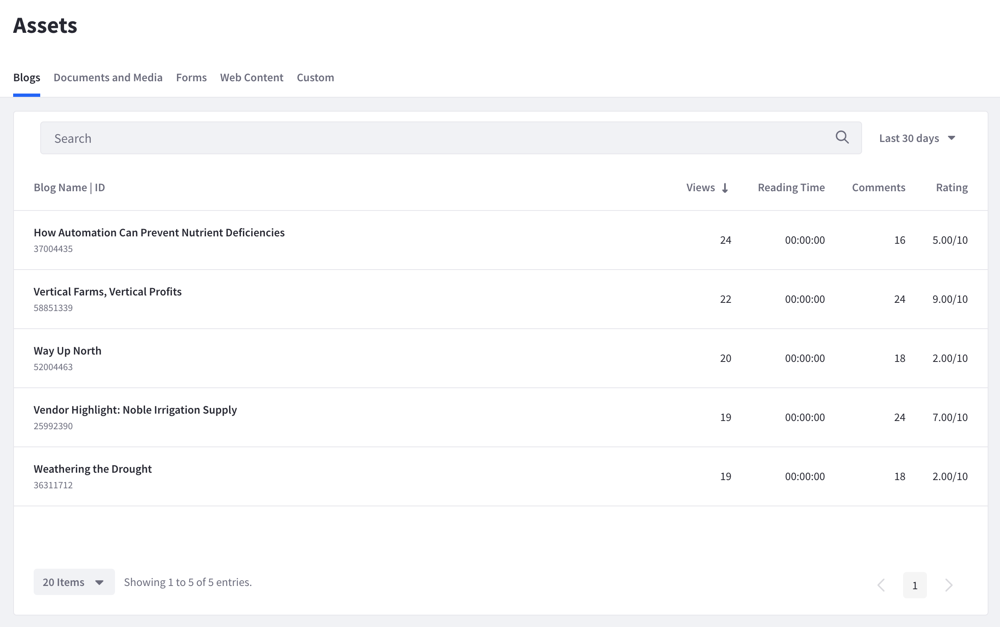

# Assets

Assets are individual pieces of content that exist on Site Pages in your Liferay Analytics Cloud data sources. In summary, Assets are

* Content residing on a Page.
* Registered, tracked, and reported on by Analytics Cloud the first time an interaction is detected by the Analytics Cloud client.
* Queried and reported on at regular intervals.
* Reported on in Analytics Cloud with the data reports shown in this tutorial.

Metrics for these Assets are currently reported in Analytics Cloud:

* [Forms](./forms.md)
* [Blogs](./blogs.md)
* [Documents and Media](./documents-and-media.md)
* [Web Content](./tracking-custom-assets.md)

[Custom assets](./tracking-custom-assets.md) can also be defined and tracked by Analytics Cloud.
