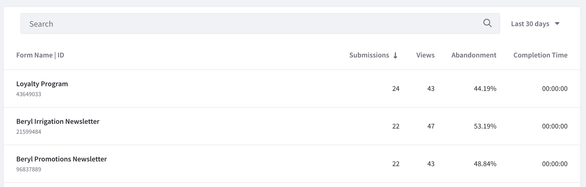
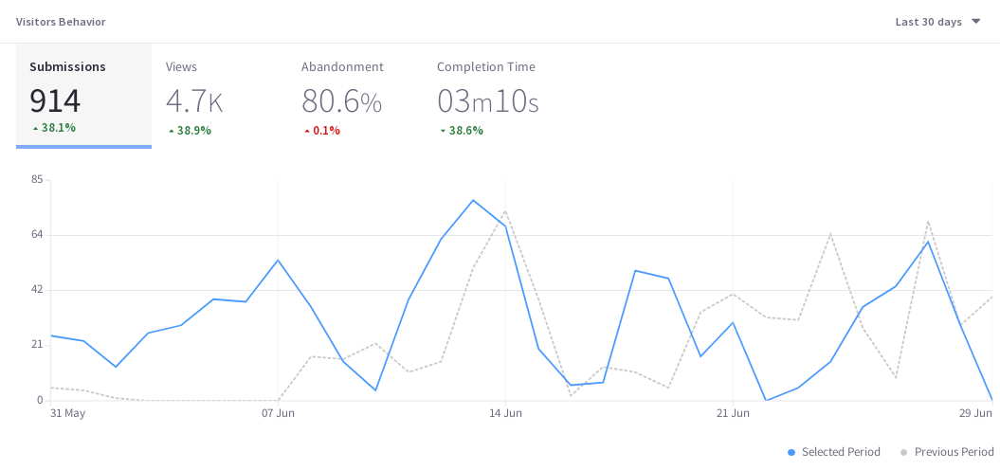
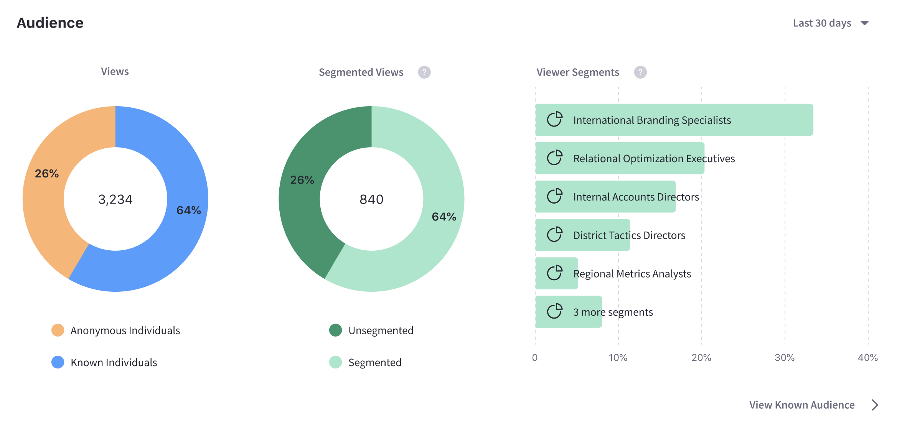
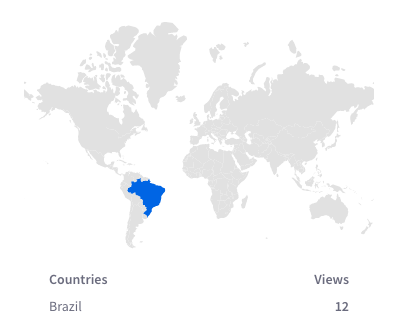
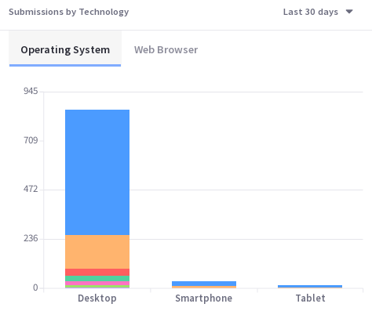
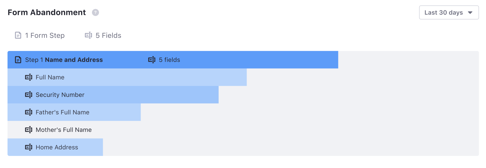
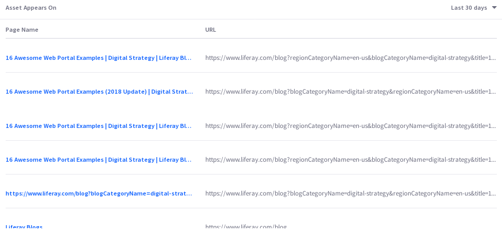

# Forms

[Forms](https://learn.liferay.com/dxp/7.x/en/process-automation/forms/user-guide/introduction-to-forms.html) are important direct data gathering tools for enterprises. Are your web forms providing you invaluable information or turning users away? Analytics Cloud gives you important insights.

In Analytics Cloud, find the Touchpoints section of the menu and click Assets. There are four tabs, each displaying a paginated list of the Asset Type indicated by the tab title. Click Forms.

View the summary metrics for an Asset directly in the list, and click on an Asset to view its detail page.

## Visitor Behavior

As with all Asset types, the Visitors Behavior chart is at the top of its page and provides a line graph with several trend lines. Choose from four important metrics:

* Total Submissions
* Total Views
* Abandonment rate
* Average Completion Time

### Submissions

Submissions counts the number of times the Submit button was clicked on a Form. It's the gold standard metric for a form, because that's why the form was created in the first place: to collect data entered into the form. If the Submit button isn't clicked, you don't get the data you wanted.

The Submissions trend line shows the number of times the Submit button was clicked each day (or hour, if Yesterday or Last 24 Hours are selected) over the selected time period.

### Views

Views is a common metric among all Assets (and Pages).

Useful with the time period filter, Views is the number of views for a Form in a given period of time. It's not the same as the number of visitors, because it doesn't try to count only unique IP addresses. So over the last 30 days, one visitor (IP address) could come back to the Page 100 times. That means there are 100 Page Views, but only one visitor (assuming the same device was used to access the Page each time). However, a unique view isn't logged for a single user unless at least 30 minutes of inactivity on the Page passes before the user interacts with the Page again.

### Abandonment

Abandonment is the daily (or hourly if Yesterday or Last 24 Hours is selected) percentage of users that interacted with the form but stopped short of submitting an entry over the selected time period.

### Completion Time

Completion time is a daily average (or hourly if Yesterday or Last 24 Hours is selected) of the time it took for form users to go from their first interaction with the form until they hit the Submit button.

The time series metrics displayed in the Visitors Behavior chart are paramount to understanding Asset performance over time. But there's more to Asset Analytics.

## Audience

The Audience report uses charts to present information about the audience interaction with the asset. It answers these questions:

* How many users are interacting with my content?
* Of these users, how many are known or anonymous?
* Of the known users who interacted with my content, how many belong to Analytics Cloud Segments?
* Of the users in Segments, what are the top 15 segments?

Here are the charts in the Audience report:

**Unique Visitors:** A donut chart that presents the percentage of total unique visitors who are known or anonymous. The center of the chart shows the total number of unique visitors. Tooltips on each chart section show the number of users for that section (e.g, the number of known or anonymous users).

**Known Individuals:** A donut chart that presents the percentage of known individuals who belong or do not belong to one or more Analytics Cloud Segment. The center of the chart shows the total number of known individuals. Tooltips on each chart section show the number of users for that section (e.g, the number of users belonging to one or more Segments). Click the chart title (Known Individuals) to view a list of all the known individuals who comprise the chart's data.

**Known Individuals Segments:** A bar chart that shows the percentage of known individuals that comprise each Segment. The chart shows a bar for each of the top five Segments, and then aggregates the remaining Segments into the last bar. A tooltip on the last bar shows the values for each of the remaining Segments.

## Submissions by Location

The map in this panel shows the number of submissions by country in the selected time period.

## Submissions by Technology

View a stacked bar graph of the Page's submissions by operating system (grouped by device type) in the default tab.

Click Web Browser to see a donut chart displaying up to the top eight web browsers over the selected time period. If applicable, remaining web browsers are aggregated in the ninth donut segment.

## Field Analysis

The Field Analysis chart is unique to Forms.

Field analysis appears as a bar graph. The height of the first bar shows the total number of people (Views) who have interacted with the form in any way, even just scrolling past it on the page. The rest of the bars show the percentage of those people that interacted with a specific field by clicking into it. The gross numbers on the right y-axis are the number of people who interacted with the field by clicking into it.

Field Analysis gives you these metrics on each form field:

* Number of clicks into the field
* Percentage of Users who abandoned the form at this field.
* The time spent interacting with the field (includes abandonments)
* The refill percent for the field. Out of the total number that filled out the field, this answers the question, "What percentage had to edit or enter new information into the field after moving on in the form?"

Field Analysis helps you get down to the field level in diagnosing potential issues with your forms. For example, in your Newsletter Sign-Up form, if you included a required field that asked for users to provide their first child's full name, you may see a lot of form abandonment on that field, not only because some form users don't have children. If you make that field not required, you'll get less abandonment on that field, and if you remove that field from the form entirely, you'll eliminate all abandonment from offended parents.

## Asset Appears On

The Asset Appears On table includes a Page Name and URL. Like any Page data in Analytics Cloud, only Pages that were interacted with in some way by site visitors are tracked and reported. It's important to note that the link doesn't take you to the actual Page with the Asset on it. Instead, it leads to the Page Analytics view of the Page. From there you can click the URL to the actual Page.

