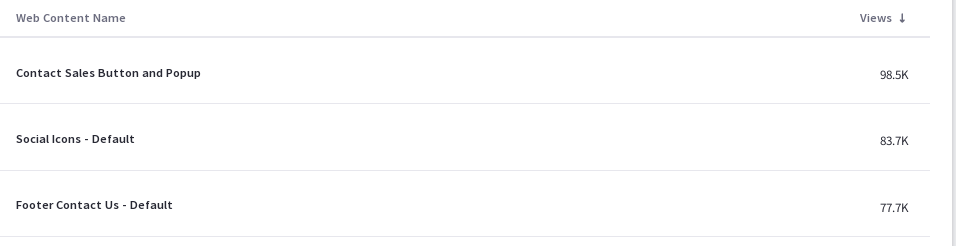
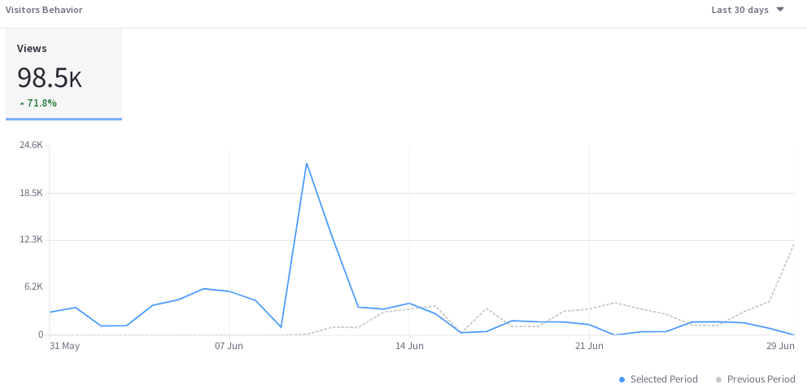
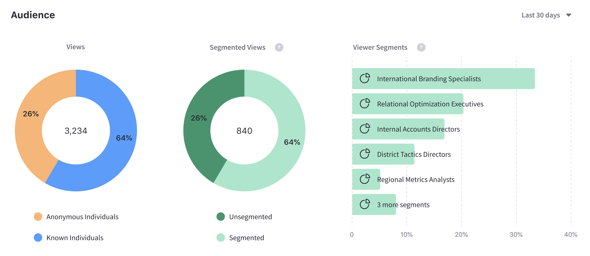
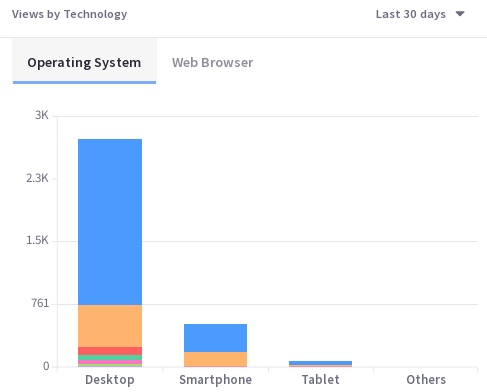
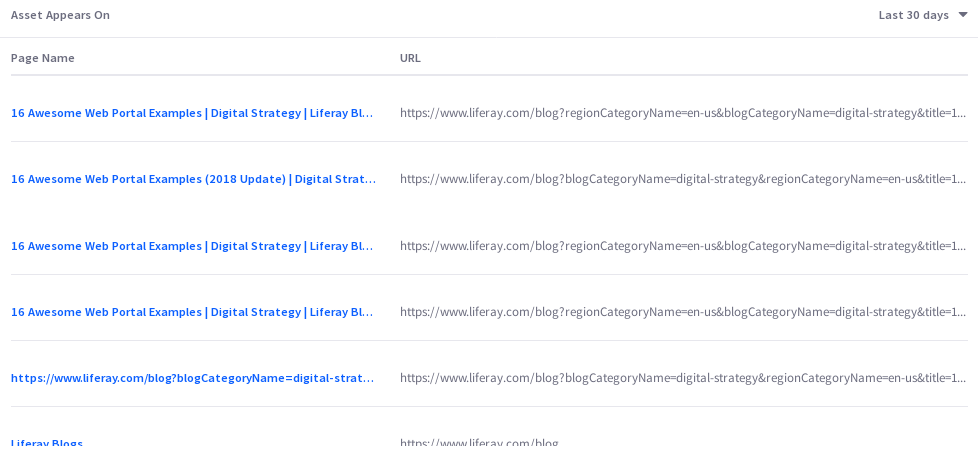

# Web Content

[Web Content Articles](https://learn.liferay.com/dxp/7.x/en/content-authoring-and-management/web-content/user-guide/web-content-articles/adding-a-basic-web-content-article.html) are important assets for presenting site visitors with information. Analytics Cloud gives you important insights into how site users are engaging with your content.

## Visitor Behavior

The Overview tab of an Asset's detail presents several data presentations. The first chart, called Visitor Behavior, contains one important metric: total Views.

The number of views per day (or hour, if Yesterday or Last 24 Hours are selected) is plotted over the selected time period to establish a View trend line. Use this to evaluate how well the content engages visitors over time.

## Audience

The Audience report uses charts to present information about the audience interaction with the asset. It answers these questions:

* How many users are interacting with my content?
* Of these users, how many are known or anonymous?
* Of the known users who interacted with my content, how many belong to Analytics Cloud Segments?
* Of the users in Segments, what are the top 15 segments?

Here are the charts in the Audience report:

**Unique Visitors:** A donut chart that presents the percentage of total unique visitors who are known or anonymous. The center of the chart shows the total number of unique visitors. Tooltips on each chart section show the number of users for that section (e.g, the number of known or anonymous users).

**Known Individuals:** A donut chart that presents the percentage of known individuals who belong or do not belong to one or more Analytics Cloud Segment. The center of the chart shows the total number of known individuals. Tooltips on each chart section show the number of users for that section (e.g, the number of users belonging to one or more Segments). Click the chart title (Known Individuals) to view a list of all the known individuals who comprise the chart's data.

**Known Individuals Segments:** A bar chart that shows the percentage of known individuals that comprise each Segment. The chart shows a bar for each of the top five Segments, and then aggregates the remaining Segments into the last bar. A tooltip on the last bar shows the values for each of the remaining Segments.

## Views by Location

The map in the Views by Location panel shows the number of views by country in the selected time period.

## Views by Technology

View a stacked bar graph of the Page's views by operating system (grouped by device type) in the default tab.

Click Web Browser to see a donut chart displaying up to the top eight web browsers over the selected time period. If applicable, remaining web browsers are aggregated in the ninth donut segment.

## Asset Appears On

The Asset Appears On table includes a Page Name and URL. Like any Page data in Analytics Cloud, only Pages that were interacted with in some way by site visitors are tracked and reported. It's important to note that the link doesn't take you to the actual Page with the Asset on it. Instead, it leads to the Page Analytics view of the Page. From there you can click the URL to the actual Page.

