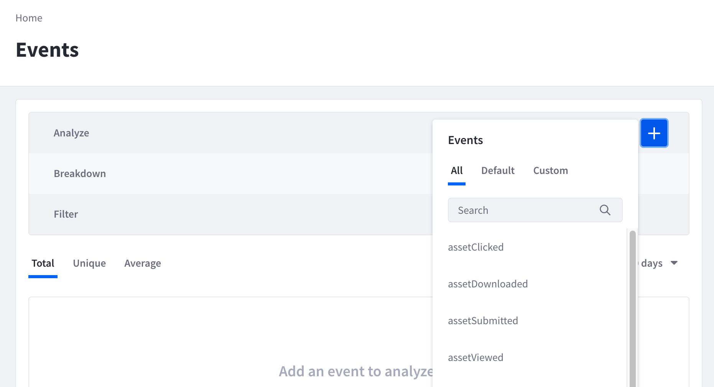
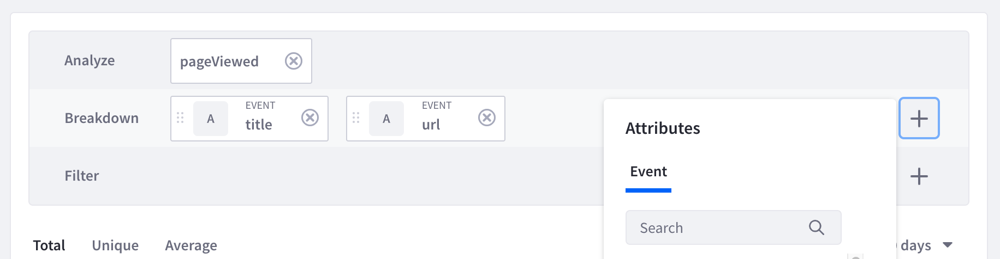

# Event Analysis

As individuals visit and interact with your site, Analytics Cloud tracks these events. Many of these events that take place on your Liferay DXP instance are set up to be tracked out-of-the-box. You can also define and track custom events by adding code snippets to your site. You can analyze and filter events based on different attributes. To analyze an event, 

1. Navigate to *Touchpoints* &rarr; *Events*. 

2. In the Analyze row, click the add icon () and select an event to analyze. 

    

    The Default events are events that are already tracked by Analytics Cloud by default. The Custom events are events that you have defined and set up in your Liferay DXP instance.

3. In the Breakdown row, click the add icon () and select breakdown attributes. 

    

    Up to three attributes can be selected in the Breakdown row. Note that each type of event is made up of different attributes. To see the attributes for each event type, navigate to event definitions in settings.

4. In the Filter row, click the add icon () and select attributes to further filter the event.