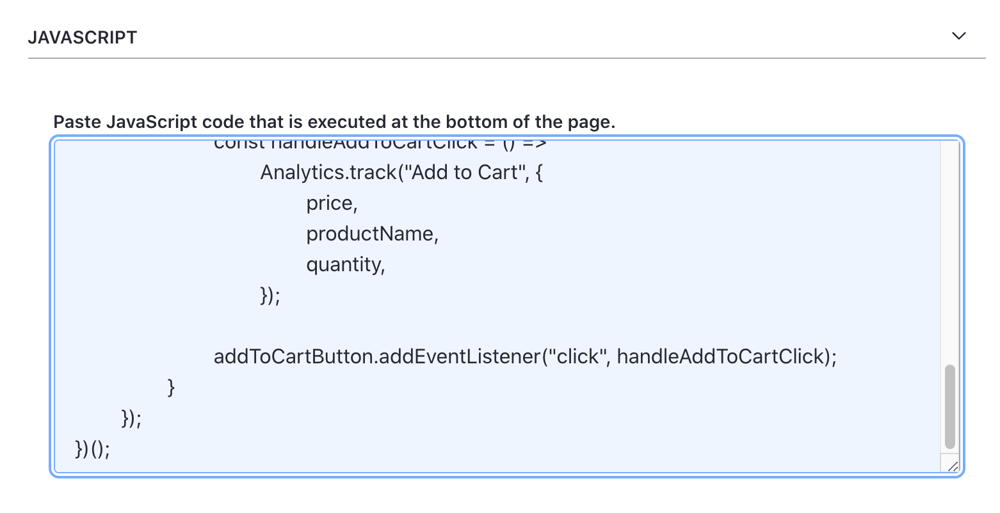
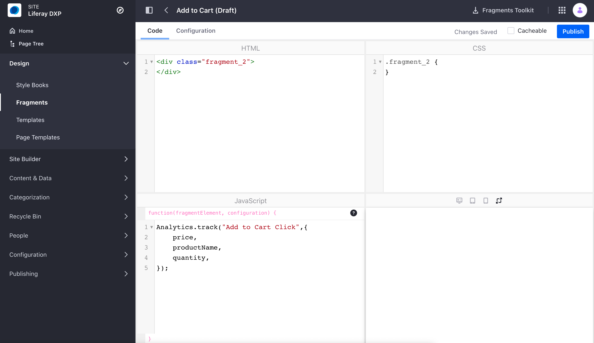

# Tracking Events

You can track events for analysis by adding JavaScript code to your Liferay DXP site pages. The code you add interacts with Analytic Cloud's APIs to capture what users are doing on your website. Then these events can be analyzed with the [Events Analysis](./events-analsis.md) tool. 

To do this, use `Analytics.track` in your JavaScript code and define your event name and attributes.

| Field | Description |
| ----- | ----------- |
| `event` | The name of your event. We recommend using a human-readable name that can be easily understood for when doing events analysis (e.g. "Add to Cart Click") |
| `attributes` | The different attributes of the event you wish to track (e.g. price, product name, quantity, etc.) |


For example, you could track how users are adding items to their shopping cart. Add JavaScript code to the product page of your website to track these events. Select attributes such as price, product name, and quantity to track with the event. Here's a simple example:

```javascript

// Add some event listener logic for when a user clicks the Add to Cart button

Analytics.track("Add to Cart Click",{
    price: productPrice(),
    productName: productName(),
    quantity: productQuantity(),
});
```

The following data typecasts can be sent for attributes: Boolean, Date, Duration, Number, and String. Analytics Cloud automatically tries to detect and cast the datatype based on the first data collected for that attribute. Make changes to the typecast if necessary in [Definitions for Event Attributes](../../workspace-data/definitions/definitions-for-event-attributes.md) found in the settings page of Analytics Cloud.

Note, in addition to the attributes you specify, there are [global attributes](../../workspace-data/definitions/definitions-for-event-attributes.md) that are automatically associated with all events.

## Adding JavaScript Code 

There a few different ways you can add JavaScript code to enable tracking events. Modifying an individual page, adding a page fragment, or using a custom implementation.

### Modify An Individual Page

The simplest way to add the JavaScript code is to modify an individual page. Note, make sure to use Widget Pages that have the ability to add JavaScript code to a page.

1. Click the Product Menu  and navigate to *Site Builder* &rarr; *Pages*. 

1. Click the *Actions* icon  of the individual page and click *Configure*

1. Paste the JavaScript code in the text box area under *JavaScript*. This is located under the Advanced tab.

    

2. Click *Save* and now your page is ready to track events.

To learn more, see [Configuring Individual Pages](../../../../../dxp/latest/en/site-building/creating-pages/page-settings/configuring-individual-pages.md).

### Add A Page Fragment

Another way to add the Javascript code is to create a page fragment that can be added to a Content Page. You get more scalability by being able to quickly add the fragment to any page on your website.

1. Click the Product Menu  and navigate to *Design* &rarr; *Fragments*. 

1. Click the *Plus* icon  under Collections to create a new fragment collection.

1. Click the *Add* icon  to create a new fragment.

1. Click on the *Code* tab and Paste the JavaScript code into the JavaScript field.

    

2. Click *Save* and now the page fragment is ready to use.

3. Navigate to the content page you wish to add the fragment to. Click the *Edit* icon  to open the page editor. Locate the fragment you just created and drag it to your page. Click *Publish*.

To learn more, see [Developing Fragments](../../../../../dxp/latest/en/site-building/developer-guide/developing-page-fragments/developing-fragments-intro.md).

### Use A Custom Implementation

Finally, you can choose to use your own development tools and approach to implement your JavaScript code on your website. 