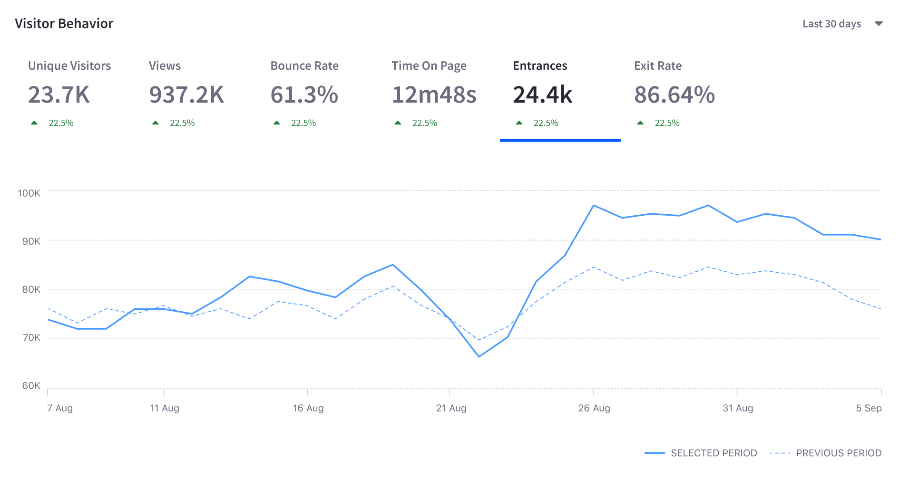
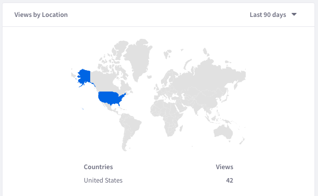
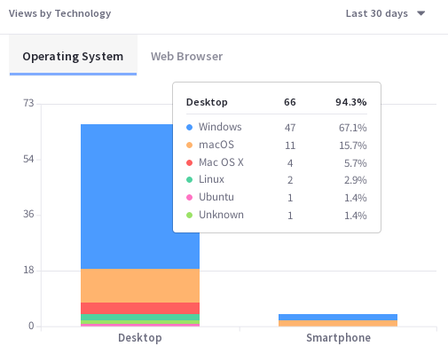
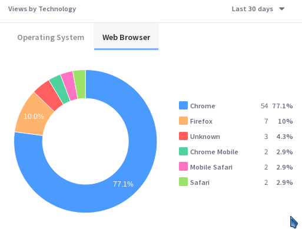
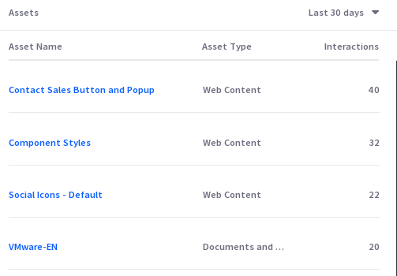

# Pages

Analytics Cloud does the following for pages:

* Registers and tracks pages for analysis the first time the Analytics Cloud client detects a Page interaction.
* Queries pages on a schedule for up-to-date data.
* Reports on pages with the metrics described here.

## Data Time Periods

All Page data in Analytics Cloud appears for a specified time period. The time period selector recalculates the metrics for the selected time period. You must specify a time period to view the metrics. The default is 30 days, but this is configurable. The following time periods are available:

**Last 24 hours:** Displays data generated over the last 24 hours.

**Last 7 days:** Displays data generated for the previous seven full days (the current day is excluded), in daily increments.

**Last 30 days (default):** Displays data generated for the previous 30 full days (the current day is excluded), in weekly increments.

**Last 90 days:** Displays data generated for the previous 90 full days (the current day is excluded), in 15 day increments.

**More Preset Periods:** Shows additional time periods: Yesterday, Last 28 days, Last 180 days, Last Year.

**Custom Range:** Select a start date and end date of your choice.

## Visitor Behavior

The Overview tab of a Page's metrics has several data presentations. The first chart, called Visitor Behavior, contains these metrics:

* Unique Visitors
* Total Views
* Bounce Rate
* Average Time on Page
* Entrances
* Exit Rate

Select the time period for the data displayed. There are always two trend lines displayed: Selected Period and Previous Period. This facilitates comparisons between time periods.



So what are these metrics in the Visitor Behavior chart?

### Unique Visitors

Useful with the time period filter, Page Visitors is the number of visitors that accessed a Page in a given period of time.

A unique visitor has a unique IP address in Analytics Cloud. Therefore, if the same person views the Page from a different device, it's logged as two unique visitors.

### Page Views

Useful with the time period filter, Page View is the number of views for a Page Page in a given period of time. It's not the same as the number of visitors, because it doesn't try to count only unique IP addresses. Over the last 30 days, one visitor (IP address) could come back to the Page 100 times. That means there are 100 Page Views, but only one visitor (assuming she used the same machine to access the Page each time. However, a unique view isn't logged for a single user unless at least 30 minutes of inactivity on the Page passes before the user interacts with the Page again.

### Page Bounce Rate

Bounce Rate is the percentage of visitors to the Page that navigated away from the site without any page interaction (including scrolling on the page) after the initial page load. It's calculated as a daily rate (percentage per day), and the daily rate trend line is displayed over the selected time period.

### Time on Page

Time on Page calculates the average time spent on a Page for all the Views each day. It's displayed for the selected time period.

This metric is calculated like this for each 24 hour period:

```
(view-1-time + view-2-time + ...) / total-number-views
```

### Entrances

_Entrances_ is the number visitors who arrived at your Site from the page (as opposed to those who started on a different page and clicked through to the page).

### Exit Rate

Exit Rate is the percentage of visitors who interacted with the page (such as scrolling or clicking) and then left the site.

## Audience

The Audience report uses charts to present information about the audience interaction with the Page. It answers these questions:

* How many users are interacting with my content?
* Of these users, how many are known or anonymous?
* Of the known users who interacted with my content, how many belong to Analytics Cloud Segments?
* Of the users in Segments, what are the top 15 segments?
* Here are the charts in the Audience report:

**Unique Visitors:** A donut chart that presents the percentage of total unique visitors who are known or anonymous. The center of the chart shows the total number of unique visitors. Tooltips on each chart section show the number of users for that section (e.g, the number of known or anonymous users).

**Known Individuals:** A donut chart that presents the percentage of known individuals who belong or do not belong to one or more Analytics Cloud Segment. The center of the chart shows the total number of known individuals. Tooltips on each chart section show the number of users for that section (e.g, the number of users belonging to one or more Segments). Click the chart title (Known Individuals) to view a list of all the known individuals who comprise the chart's data.

**Known Individuals Segments:** A bar chart that shows the percentage of known individuals that comprise each Segment. The chart shows a bar for each of the top five Segments, and then aggregates the remaining Segments into the last bar. A tooltip on the last bar shows the values for each of the remaining Segments.


## Views by Location

The map in the Views by Location panel shows the number of views by country in the selected time period.



## Views by Technology

View a stacked bar graph of the Page's views by operating system (grouped by device type) in the default tab. Hover over each bar to see the detailed breakdown of data.



Click Web Browser to see a donut chart displaying up to the top eight web browsers over the selected time period. If applicable, remaining web browsers are aggregated in the ninth donut segment.



## Assets

View a list of the Assets on the Page by their number of Interactions over the selected time period.

Depending on the Asset being viewed, a different Interaction metric is reported:

* Blogs reports Views
* Documents and Media reports Downloads
* Forms reports Submissions
* Web Content reports Views



After all those fundamental metrics, you're really getting to know your Pages. But there's some interesting Page data you haven't seen. Discover how people came to the Page in the first place. Learn about Path Analytics next.
