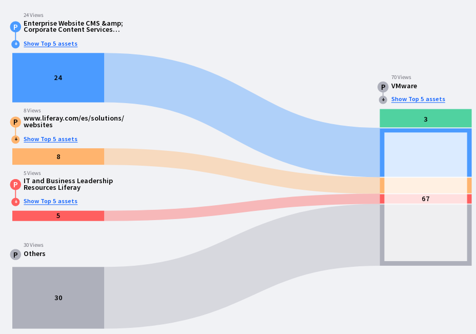
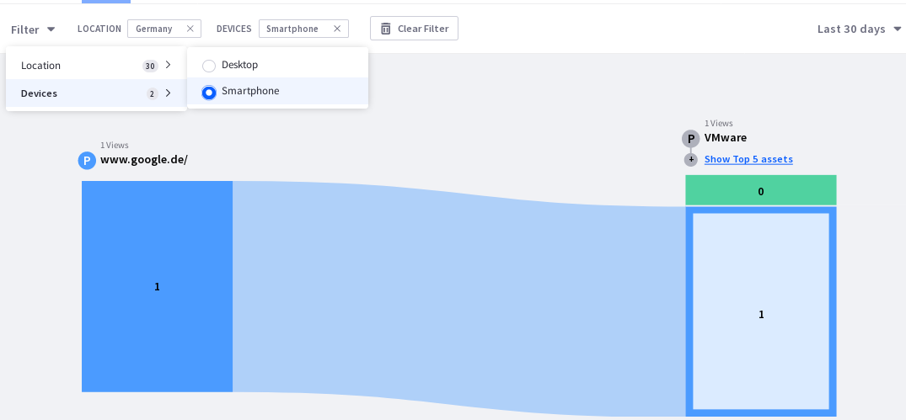
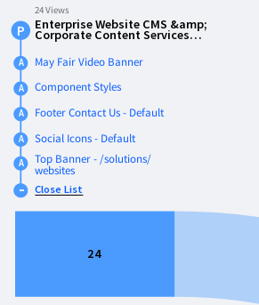

# Paths

Path Analytics identify where visitors to your site most commonly originate. Knowing how your users are coming to your site's pages and assets can empower you to better tailor your site's content to meeting your users' needs.

## Viewing Page Path Analytics

A Page’s Path Analytics are reported in the Path tab of a Page’s screen. The diagram reports the most common pages from which visitors accessed this Page.

After the top three paths to the Page, the remaining paths are aggregated to show how many views came from Other pages.

If a Page in one of your Liferay DXP sites is also a Path to the current Page, clicking the path URL brings you to its Overview screen. If it’s not a page that’s loaded from the data source, nothing happens.

## Location and Device Type

Path Analytics can be filtered by Location and Device Type. Knowing the Location and Device Type visitors most commonly use to access your site’s Pages helps you determine whether your site and its content are optimized properly.

By default, all views of the Page in the selected time period are represented in the Paths diagram. Filter the Paths being viewed by Location and Device Type. Click the Filter menu and select one Location whose Path diagram you want to see. The Path diagram is updated to represent the top Paths for only the selected Location. The same filtering can be used for Device Type, and the Device Type and Location filters can be combined. For example, view the Path diagram for views coming from smartphones in Germany.

As you select filters, they’re made visible at the top center of the Path screen.

To remove a filter, click the x next to the filter name.

## Assets

Pages have Assets on them. If a Page containing the Analytics Cloud client is reported in the Path diagram, a Show Top 5 Assets link is displayed. Clicking it opens a drop-down list. Up to the top five assets on the Page is displayed, as determined by interaction with the Assets. Each Asset uses the most appropriate interaction metric available:

* Forms uses Submissions
* Blogs uses Views
* Documents and Media uses Downloads
* Web Content uses Views

Clicking an asset brings you to the Asset’s Overview page. See the documentation on Assets for more information on analyzing Asset metrics .
