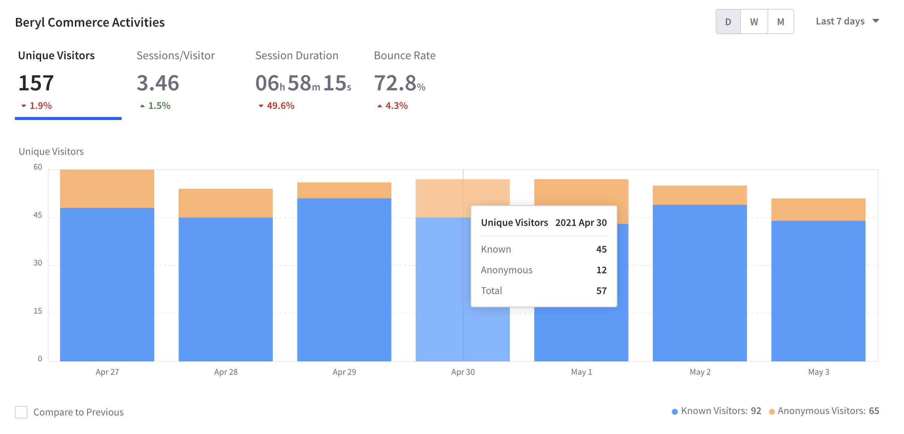
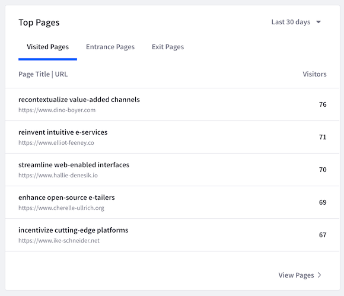
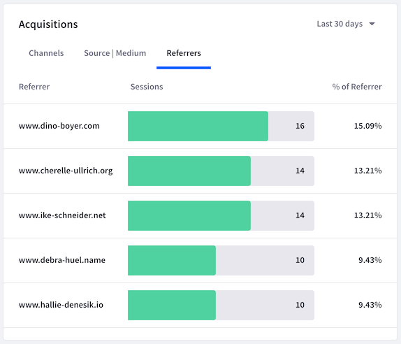
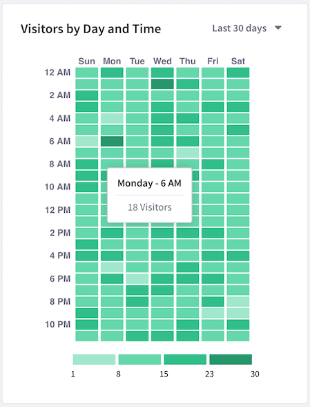
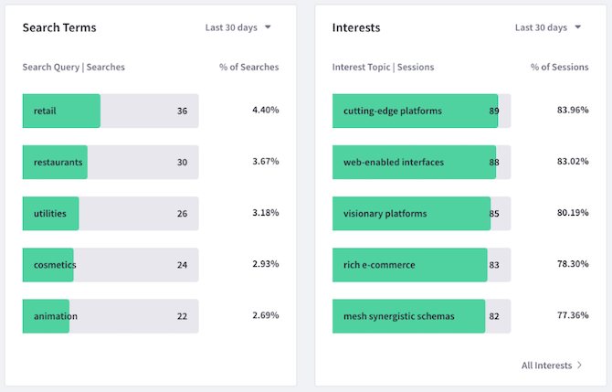
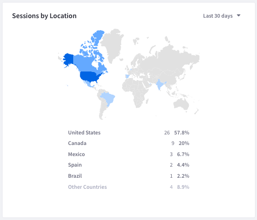
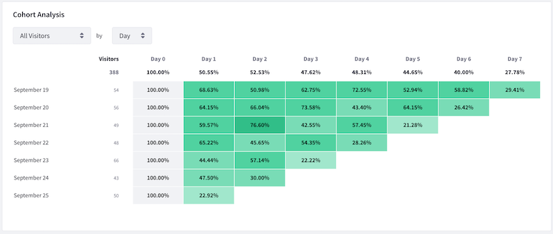

# Sites Dashboard

Liferay Analytics Cloud provides a single Site dashboard for each connected data source. For example, if you connect Analytics Cloud to one DXP instance and configure analytics for two subsites, one Sites dashboard aggregating both subsites is created.

To view the dashboard,

1. Click Sites in the Touchpoints section of the menu.

1. Click the Overview tab (this tab is selected by default when you click Sites). 

The dashboard contains the following data:

* [Site Activities](#site-activities)
* [Top Pages](#top-pages)
* [Acquisitions](#acquisitions)
* [Visitors by Day and Time](#visitors-by-day-and-time)
* [Search Terms and Interests](#search-terms-and-interests)
* [Sessions by Location](#sessions-by-location)
* [Session Technology](#session-technology)
* [Cohort Analysis](#cohort-analysis)

### Site Activities

The Site Activities panel presents a summary of how visitors interact with your Site. This panel contains the following metrics:

**Visitors:** Total unique visitors.

**Sessions per Visitor:** An average of the number of sessions for each unique visitor. A single visitor can open multiple sessions. A session ends after 30 minutes of inactivity, or at midnight.

**Session Duration:** The length of time an average session lasts.

**Bounce Rate:** The percentage of visitors who view your Site's first page, but do nothing else before the session ends.

Clicking each metric changes the visualization in the panel to display the selected metric. The data can be filtered by ranges of time: Last 24 hours, Last 7 days, Last 30 days, Last 90 days. Click *More Preset Periods* to reveal additional time ranges. Click *Custom Range* to filter by a start date and end date of your choice.

### Top Pages

The Top Pages panel shows visited pages, entrance pages, and exit pages:

**Visited Pages:** Your Site's most visited pages and the number of visitors for each.

**Entrance Pages:** The most common pages that visitors view first upon entering your Site and the number of entrances for each.

**Exit Pages:** The most common pages that visitors view when leaving your Site and the exit percentage for each. The exit percentage is the percentage of visitors for which the page is the last page in their session.

The data can be filtered by ranges of time: Last 24 hours, Last 7 days, Last 30 days, Last 90 days. Click *More Preset Periods* to reveal additional time ranges. Click *Custom Range* to filter by a start date and end date of your choice.

To view more detailed page analytics, click *View Pages* in the panel. Alternatively, click the Pages tab at the top of the screen. Both take you to the page analytics discussed in [Viewing Page Data](touchpoints.md#viewing-page-data).

## Acquisitions

The Acquisitions panel shows how visitors arrive at your Site. It shows data for the channels, source/medium, and referrers. 

This report works best if your marketing campaign uses UTM parameters. UTM parameters allow Analytics Cloud to determine where visitors arrive from (e.g., the specific referrer or ad campaign).

The data can be filtered by ranges of time: Last 24 hours, Last 7 days, Last 30 days, Last 90 days. Click *More Preset Periods* to reveal additional time ranges. Click *Custom Range* to filter by a start date and end date of your choice.

### Visitors by Day and Time

The Visitors by Day and Time panel visualizes the days and times when visitors come to your Site. This helps you understand when your Site is most active. You can use this information, for example, to know when to release important information or launch an advertising campaign.

The panel contains a grid with the days of the week on one axis and the time of day on the other axis. Darker cells in the grid indicate heavier Site traffic at the corresponding day and time. Tooltips for each cell show the number of visitors for that day and time.

The data can be filtered by ranges of time: Last 24 hours, Last 7 days, Last 30 days, Last 90 days. Click *More Preset Periods* to reveal additional time ranges. Click *Custom Range* to filter by a start date and end date of your choice. 

### Search Terms and Interests

The Search Terms and Interests panels show your visitors' most common search terms and the topics they're interested in, respectively. Search terms are collected from the search query parameter in your Site's URL. Interest topics are derived from the keyword metadata of the pages that visitors view. 

The data can be filtered by ranges of time: Last 24 hours, Last 7 days, Last 30 days, Last 90 days. Click *More Preset Periods* to reveal additional time ranges. Click *Custom Range* to filter by a start date and end date of your choice.

To view the full list of interest topics, click *All Interests* in the Interests panel. Alternatively, click the Interests tab at the top of the screen.

### Sessions by Location

The Sessions by Location panel shows the countries from which visitors access your Site. Countries with more visitors are shaded darker on the map. The country names appear below the map along with the number and percentage of visitors for each.

The data can be filtered by ranges of time: Last 24 hours, Last 7 days, Last 30 days, Last 90 days. Click *More Preset Periods* to reveal additional time ranges. Click *Custom Range* to filter by a start date and end date of your choice.

### Session Technology

The Session Technology panel shows the devices, operating systems, and browsers visiting your Site. Tooltips for each graph element display more detailed data for that element. On the Devices tab, for example, mouse over each bar on the bar graph to see the operating system data for that device.

The data can be filtered by ranges of time: Last 24 hours, Last 7 days, Last 30 days, Last 90 days. Click *More Preset Periods* to reveal additional time ranges. Click *Custom Range* to filter by a start date and end date of your choice.

### Cohort Analysis

The Cohort Analysis panel shows a [cohort analysis](https://en.wikipedia.org/wiki/Cohort_analysis) based on visitors from a specific acquisition date (the cohort) and whether they return to your Site over a given time period. 

Use the selector menus at the top left of the panel to select the visitor type (All, Anonymous, or Known) and time period (Day, Week, or Month).

For example, if you select All Visitors and Day, the percentage of visitors from a given acquisition date that return to your Site appear in the chart for each following day.