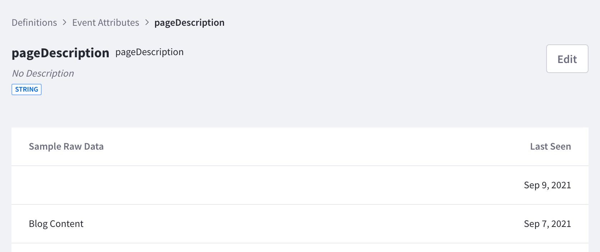
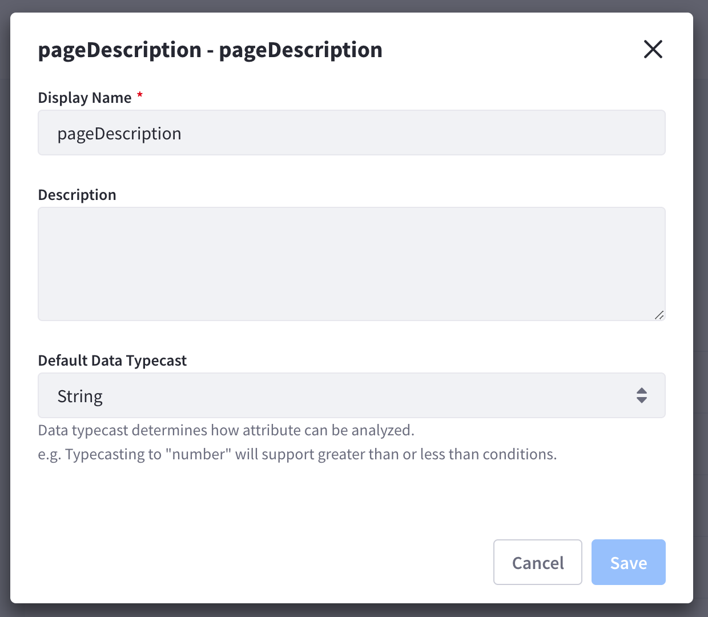

# Definitions for Event Attributes

Event attributes are the metadata that provide context for events. Different attributes are associated with default and custom events. Global attributes are attributes that are associated with all types of events. Other attributes may only be associated with certain types of events. To view and manage event attributes, navigate to *Settings* &rarr; *Workspace Data* &rarr; *Definitions* &rarr; *Event Attributes*.

1. Choose a specific attribute under the Global Attributes tab or the Attributes tab. Use the search bar to find a particular attribute.

    

2. Click an attribute to see more details. The Sample Raw Data column shows recent data of that particular attribute. The Last Seen column shows when the attribute was last seen. 

    

3. Click the *Edit* button to edit the Display Name, Description, or Default Data Typecast of the attribute. 

    

    The following data typecasts are available: Boolean, Date, Duration, Number, and String. Analytics Cloud automatically tries to detect and cast the datatype based on the first data collected for that attribute. Make changes to the typecast if necessary.

## Additional Information

* [Events Analysis](../../touchpoints/events/events-analysis.md)
