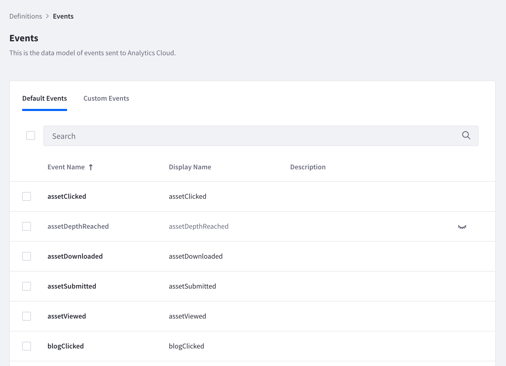
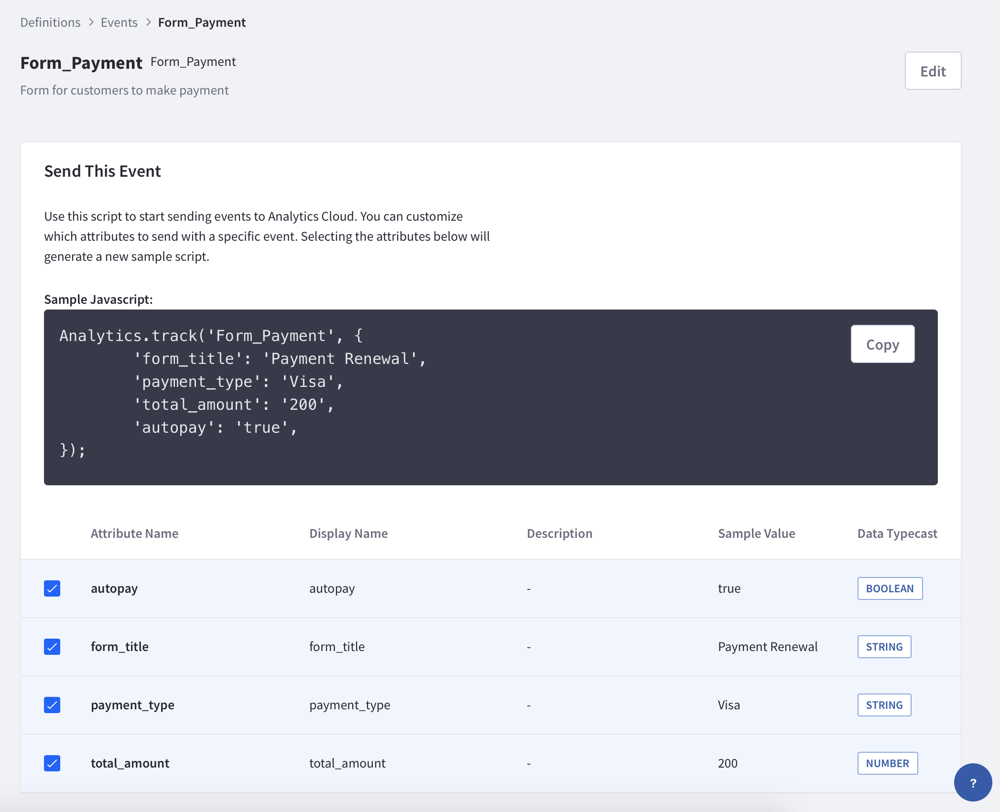
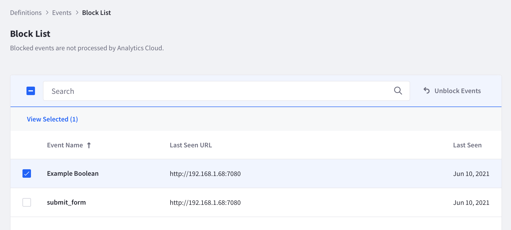
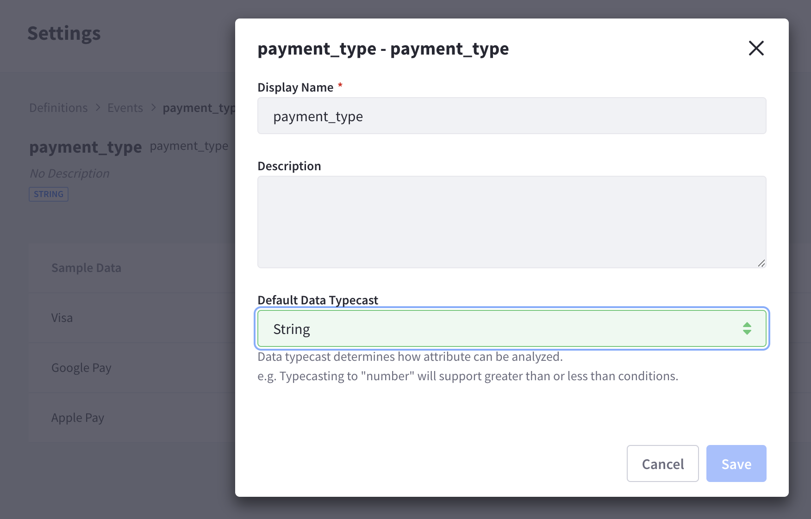

# Definitions for Events

Analytics Cloud tracks default and custom events that occur on your DXP instance. To view and manage how these events and their attributes are defined, navigate to *Settings* &rarr; *Workspace Data* &rarr; *Definitions* &rarr; *Events*.

## Default Events

There are a number of default events that can be analyzed as soon as you have [connected your DXP instance to Analytics Cloud](../../connecting-data-sources/connecting-liferay-dxp-to-analytics-cloud.md). Click on the *Default Events* tab to see all the events that are available out of the box.

Click on a default event to see the specific attributes that are associated with that event.

The attributes are presented in a list with the following properties:

* Attribute Name
* Display Name
* Description
* Sample Value
* Data Typecast

A sample Javascript snippet is also provided to serve as a template for defining custom events. Check or uncheck the attributes you need and click the *Copy* button to copy the code snippet.

## Custom Events

Custom events are a useful way to define and track events that are specific to your business needs. For example, you might track a form on your site that customers use to make payments. Once the specific event is defined and configured on your site, Analytics Cloud will begin collecting data from the form. 

Click on the *Custom Events* tab to see all the events that have been defined and are being tracked. Note that there is a limit of 100 custom events that can be tracked at any given time. 

### Custom Event Definition

Click on a custom event to see the specific attributes that are associated with that event.

The attributes are presented in a list with the following properties:

* Attribute Name
* Display Name
* Description
* Sample Value
* Data Typecast

The image above shows an example of how a custom event might track attributes such as payment type, total amount, and whether autopay was selected.

Click the *Edit* button to edit the Display Name or Description of the custom event. 

### Block List

Any custom event that is in the Block List is an event that is not processed by Analytics Cloud. Note that once the 100 event limit is reached, any new custom event will automatically be added to the block list. To see the list of blocked events, click *Block List*.

To unblock a custom event from the Block List, place a checkmark next to the event and click *Unblock Events*. Or click the unblock icon () to the right of the event name.

To add a custom event to the block list, from the Custom Events tab place a checkmark next to the event and click *Block Events*. Or click the block icon () next to the event name.

## Attributes

Click the *Attributes* tab to see a list of all the attributes that make up default events and custom events.

Clicking an attribute will display sample data of the attribute. Click the *Edit* button to edit the Display Name, Description, or Default Data Typecast of the attribute. 

The following Data Typecast are available: Boolean, Date, Duration, Number, and String. Note that Analytics Cloud automatically detects the data type of the attribute.