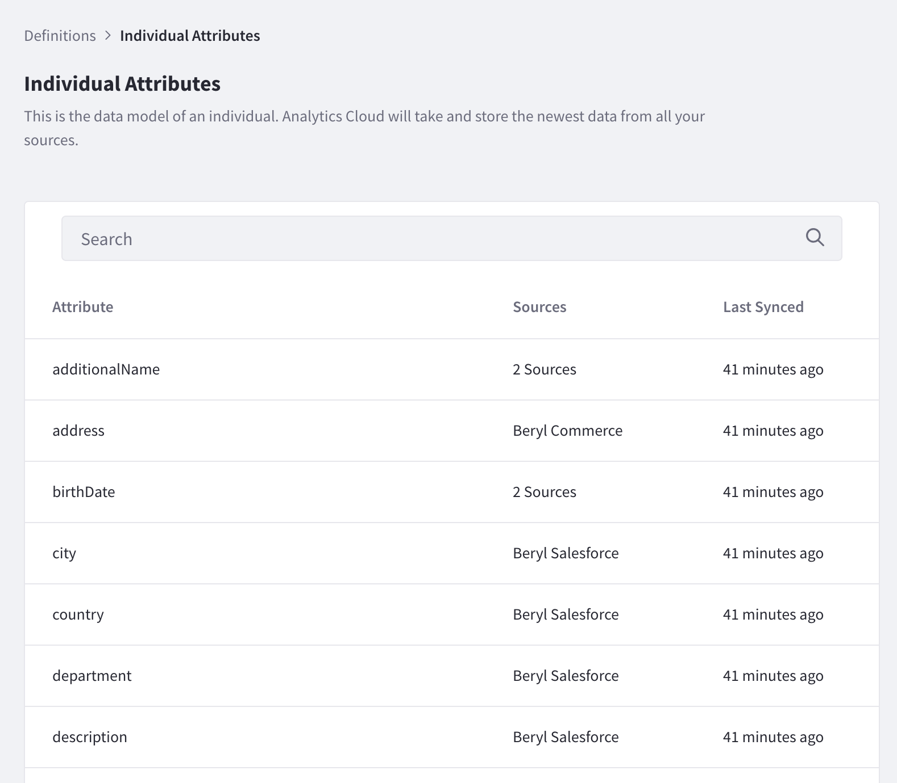

# Definitions for Individuals

The data model for individuals is defined by the various attributes that get mapped when contact data is [synced from DXP](../../connecting-data-sources/syncing-contact-data-from-dxp.md) or other data sources such as [Salesforce](../../connecting-data-sources/adding-a-salesforce-data-source.md) or [CSV](../../connecting-data-sources/adding-a-csv-data-source.md).

To view a list of these attributes, navigate to *Settings* &rarr; *Workspace Data* &rarr; *Definitions* &rarr; *Individuals*.

All the different attributes for individuals are listed. Some attributes may be defined by more than one data source. 

You can choose specific attributes for [creating segments](../../people/segments/creating-segments.md) or [creating a specific breakdown for individuals](../../people/individuals/individuals-dashboard.html#breakdown).
