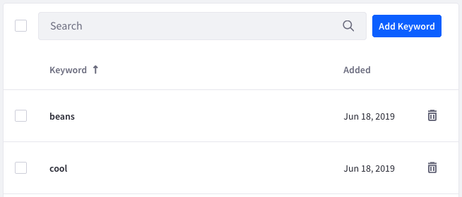

# Managing Interest Topics

Analytics Cloud's [Recommendation API](../../optimization/content-recommendation-api.md) suggests topics of interest based on user interactions with content in Liferay DXP. Administrators can exclude certain keywords from the recommendation API, therefore preventing Analytics Cloud from suggesting content based on those keywords. This is useful for further curating suggested content.

## Understanding Interests

Finding out topics people are interested in helps you relate your products and services to them. Analytics Cloud's Interests insight empowers you with rich, easy-to-understand visuals that provide this information.

As an Individual interacts with the pages and assets, Analytics Cloud notes the topics they contain. The more an Individual visits pages and assets that contain a topic, the higher the topic's ranking is for that Individual's Segments.

For example, say your site has pages that mention these topics:

* Clothing
* Sports

If an Individual named Michael frequents these pages, the Interest ranking for the clothing and sports topics is high. Here are a couple of different ways you could use this information:

If you sell sports apparel, you could prepare a campaign for selling sports apparel to Michael.

If you don't sell sports apparel, you could use the Interest data to convince sports apparel vendors to advertise on your site.

Either way, the Interests insight helps generate new business. The Interests insight tells you the most common topics mentioned by the pages and assets customers visit most.

## Adding Keywords to the Block List

Follow these steps to add a keyword to the block list:

1. In Analytics Cloud, select Settings → Interest Topics. A table lists any existing keywords in the block list.

1. Click Add Keyword and enter one or more keywords in a comma-delimited list.

1. Click Send when you're finished. Your keywords then appear in the table.

To delete a keyword from the block list, click that keyword's trash icon (). To delete multiple keywords at once, select the checkbox for each and click the trash icon that appears at the top of the table. You can select all keywords via the checkbox at the top of the table.

