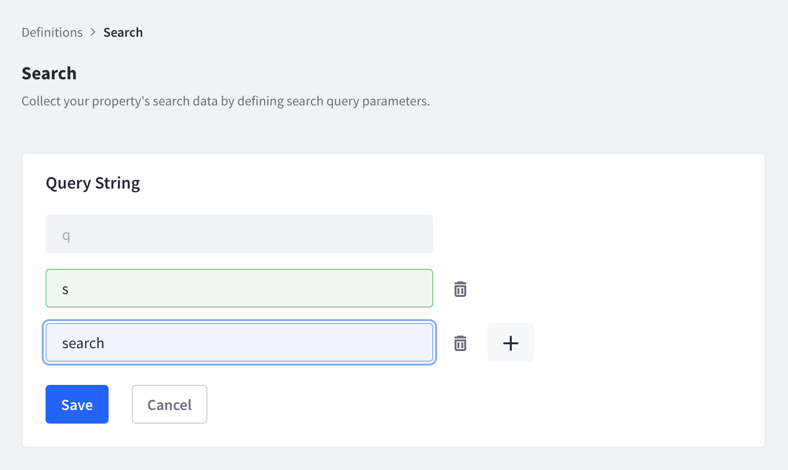

# Setting a Search Query

The search query parameter can vary from site to site. For example, a URL might look like `www.example.com/?s=test` where `s` is the parameter, or `www.example.com/?search=test` where `search` is the parameter. You can define up to five search query parameters in settings.

Navigate to *Settings* &rarr; *Workspace Data* &rarr; *Definitions* &rarr; *Search*. Enter the parameter into the text field. Click *+* if you need to add additional parameters. Click the trash icon () to delete a parameter.

