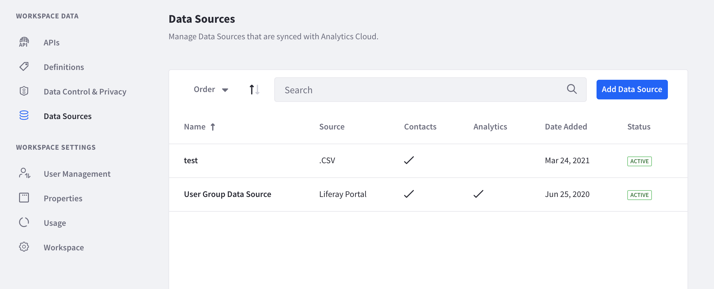
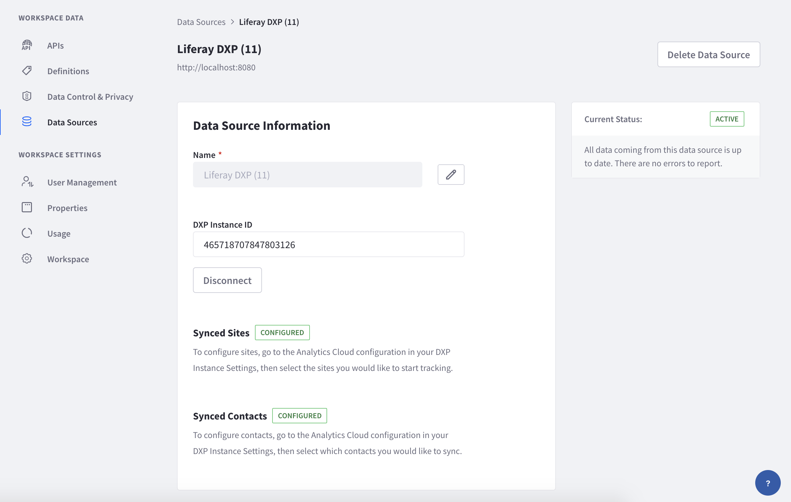

# Managing Data Sources

After [connecting data sources](../connecting_data_sources.html) to your workspace, you can view and make changes to them from the settings page. Navigate to *Settings* &rarr; *Workspace Data* &rarr; *Data Sources*. 

If you haven't already connected a Liferay DXP instance, see [connecting Liferay DXP to Analytics Cloud](../connecting-data-sources/connecting-liferay-dxp-to-analytics-cloud.md).

Other data sources such as Salesforce data or CSV data can also be added. See [adding a Salesforce data source](../connecting-data-sources/adding-a-salesforce-data-source.md) or [adding a CSV data source](../connecting-data-sources/adding-a-csv-data-source.md).

To view or make changes to your Liferay DXP data source, click the name of the connected data source.

The Current Status panel on the right shows the data source's status: **Active** for a connected and syncing data source; **Connected** for a connected data source that does not have Sites and Contacts configured; **Disconnected** for a no longer connected data source. 

**Name:** The data source's name. To rename, click the edit icon () and input a new name. Click the checkmark to save.

**DXP Instance ID:** Displays the unique ID of your DXP instance. 

If you choose to disconnect the DXP instance from the workspace, click the *Disconnect* button. You're asked to confirm. Note, disconnecting the data source stops all syncing of analytics data.

**Synced Sites:** Shows your DXP Sites' sync status with Analytics Cloud. To configure, see [syncing sites to a property](../connecting-data-sources/scoping-sites-and-individuals-using-properties.html#syncing-sites-to-a-property).

**Synced Contacts:** Shows your DXP contacts sync status with Analytics Cloud. To configure, see [syncing contacts to a property](../connecting-data-sources/scoping-sites-and-individuals-using-properties.html#syncing-contacts-to-a-property)

Note that this manage page looks different for a Salesforce data source or a CSV data source.

## Deleting a Data Source

To delete the data source, click the *Delete Data Source* button at the top right of the page. You're asked to confirm. Note, deleting the data source removes the connection and deletes all synced data.
