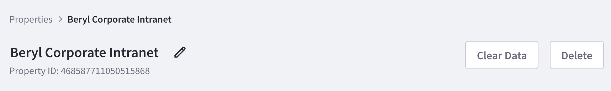
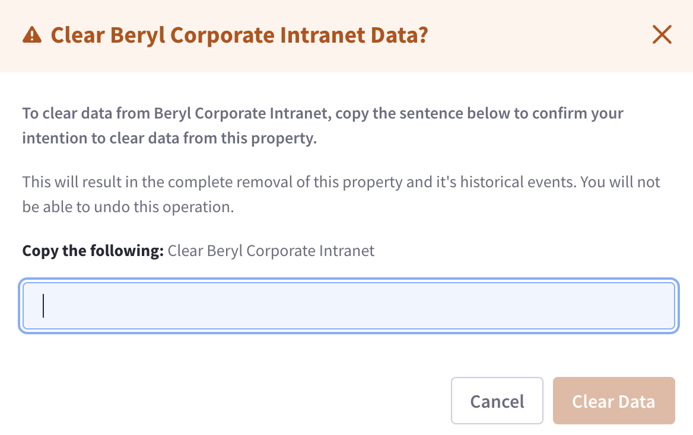
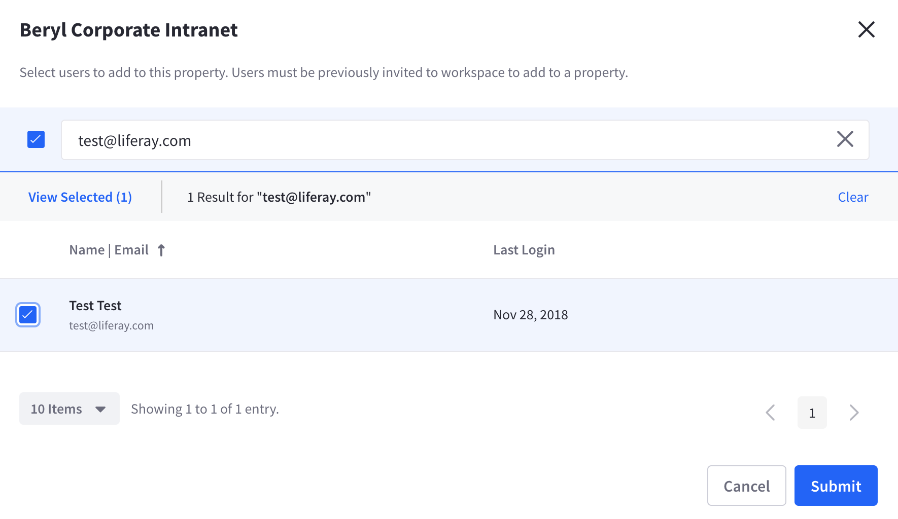
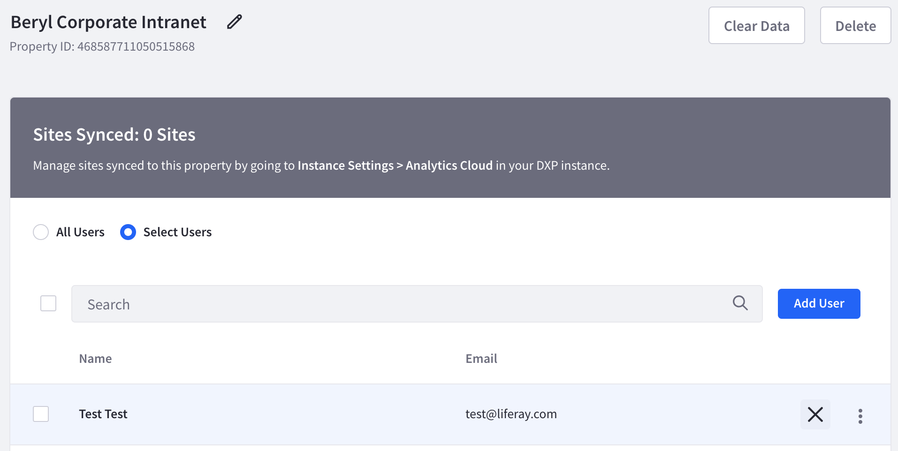

# Managing Properties

After [Creating a Property](../connecting-data-sources/scoping-sites-and-individuals-using-properties.md#creating-a-property) it can be managed and modified from the Workspace Settings section of Analytics Cloud. Navigate to *Settings* &rarr; *Workspace Settings* &rarr; *Properties*.


To make changes to a Property,

1. Locate the Property by scrolling or using the search bar.

1. Click the Property name. 

## Renaming a Property

To change the name of the Property click the edit icon () and input the changes. Clicking outside the text box commits the changes.



## Clearing Property Data

To clear Property data, click the *Clear Data* button. A new form appears to confirm your action. Copy and paste the verification sentence into the text box. This enables the *Clear Data* button. Click the button and the data is cleared.



```warning::
   This results in the complete removal of this property's historical events. You cannot undo this operation.
```

## Deleting a Property

To delete the Property click the *Delete* button. A new form appears to confirm your action. Copy and paste the verification sentence into the text box. This enables the *Delete* button. Click the button and the Property is deleted.

```warning::
   This results in the complete removal of this property and it's historical events. You cannot undo this operation.
```

## Adding and Removing Users to a Property

By default all Workspace users have access to the different Properties of a Workspace. To give only selected users access to the property, change the *All Users* selection to *Select Users*. A new form appears to confirm your action. Click the *Okay* button.

### Add a User

To add a to the Property click the *Add User* button. A new form appears with a list of all the users of the Workspace. Place a checkmark next to the user you wish to add and click the *Submit* button. The User is now added to the list of select users.



### Remove a User

To remove a user click the "X" icon to the right of the user's email. A new form appears to confirm your action. Click the *Remove* button and the User is removed from the list of select users.


