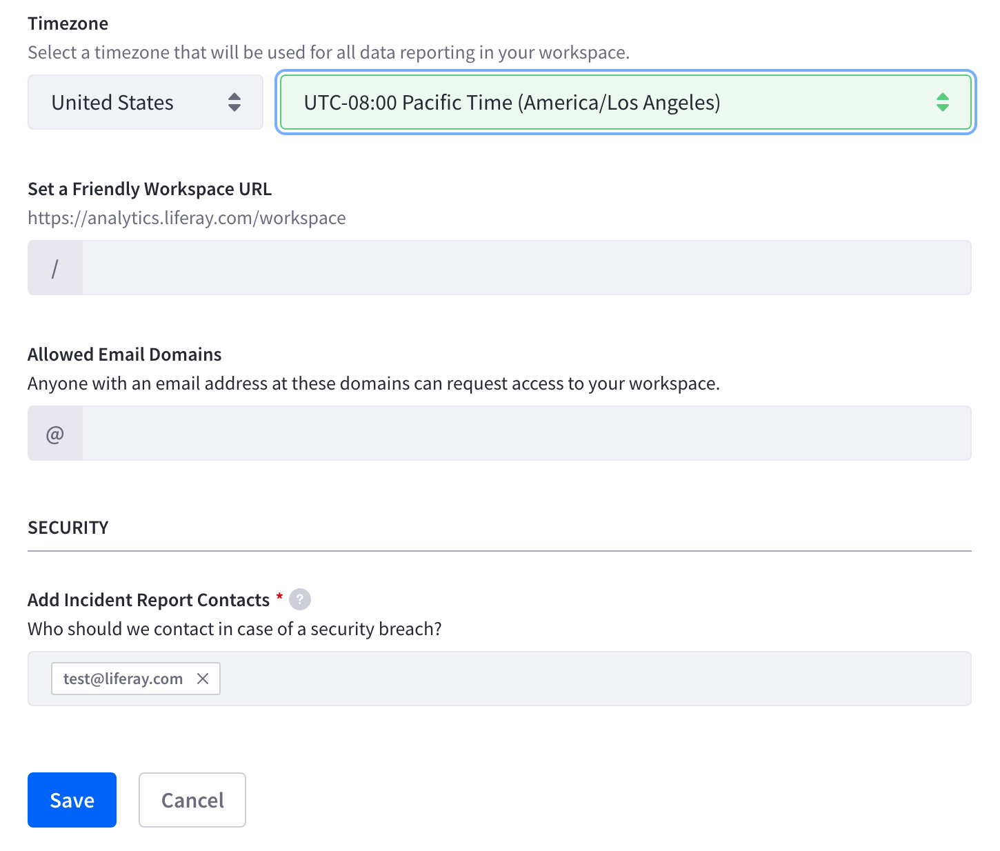

# Managing Workspaces

After [signing up for a new workspace](../getting-started/signing-up-for-a-new-workspace.md), you can view and change your workspace settings from the settings page. Navigate to *Settings* &rarr; *Workspace Settings* &rarr; *Workspace*.

**Workspace Name:** The name of your analytics workspace. To change your workspace name, enter a new name and click *Save*.

**Workspace Owner Email:** The email address that the workspace is registered with. This cannot be changed.

**Data Center Location:** The server location that stores your analytics data. This cannot be changed.

**Timezone:** Analytics reporting is based on the specified timezone. To change the timezone, select your country and appropriate timezone and click *Save*.

Note, please allow 1-2 days for the data reporting to adjust to the new timezone.

**Friendly URL:** Set a friendly URL to share your workspace with others.

**Allowable Email Domains:** Specify a domain here to allow users with the same email domain to see and request to join the workspace.

**Add Incident Report Contacts:** Add additional email addresses to be contacted in case of interruptions or incidents. Enter additional email addresses and click *Save*.
