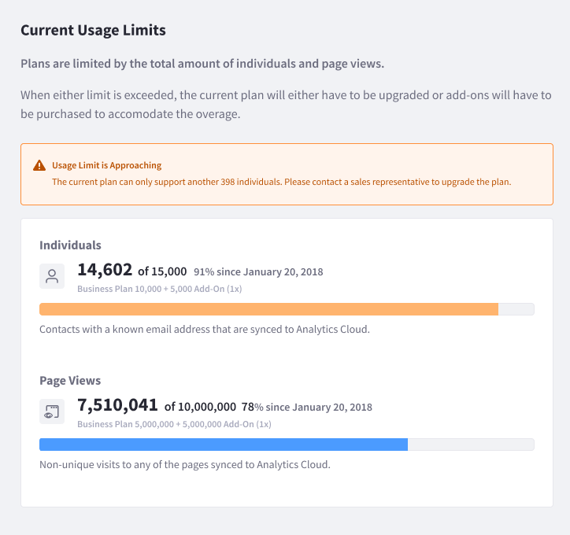

# Tracking Usage

Analytics Cloud plans are limited by the total amount of [Individuals](../individuals-and-segments/individual-profiles/individual-profiles.md) and [Page Views](../touchpoints/pages/pages.md) synced from data sources. When either limit is exceeded, Analytics Cloud users are prompted to upgrade your plan or purchase add-ons to accommodate the additional usage.

## Plans

The Plans section describes each plan’s limits and cost. Higher tier plans offer additional flexibility through higher limits and less expensive add-ons. Your current plan is highlighted. You can upgrade from lower tier to higher tier plans.

## Add-ons

Add-ons increase limits on Individuals or Page Views, without requiring you to upgrade to a new plan. Purchasing add-ons gives you commitment-free analytics capacity increases.

Contact your sales representative for further guidance on getting a plan that fits your organization's needs.
