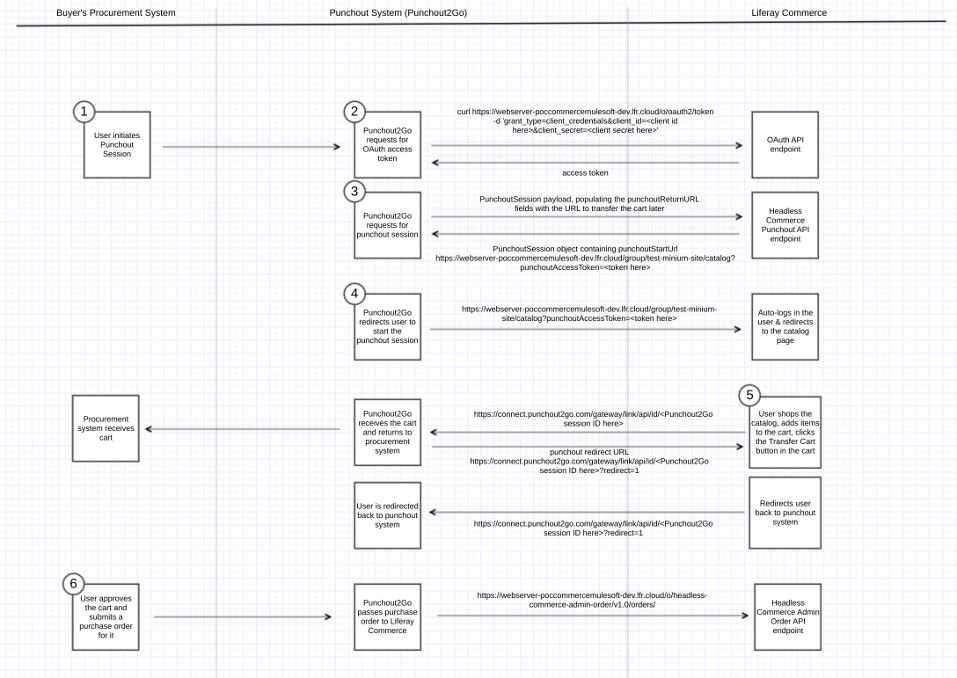

# Punch Out Reference Guide

> Subscribers

## Glossary

* Punch out session: the set of actions between when the user is successfully logged into the Liferay Commerce platform and the cart is transferred back to the Punch Out system
* Liferay session: the existing session storage built into Liferay that is used to store data related to the punch out session
* Punch out start URL: the URL for the user to start the punch out session and go to the Liferay Commerce system’s catalog page for the specified channel (step 3 in the diagram)
* Punch out return URL: the URL for the user to return back to the punch out system (e.g. transfer cart URL) in step 5 of the diagram
* Punch out cart: the cart created in step 4 of the diagram
* Purchase order: the “final approved draft” of the order submitted in step 7 of the diagram
* Cart: used interchangeably with order in Liferay Commerce
* Punch out access token: a single-use token used to auto-login the punch out user
* Punch out vendor: the third-party vendor that connects punch out catalogs with buyer procurement systems (e.g. PunchOut2Go)

## Additional Information

* [Punch Out](./punch-out.md)
