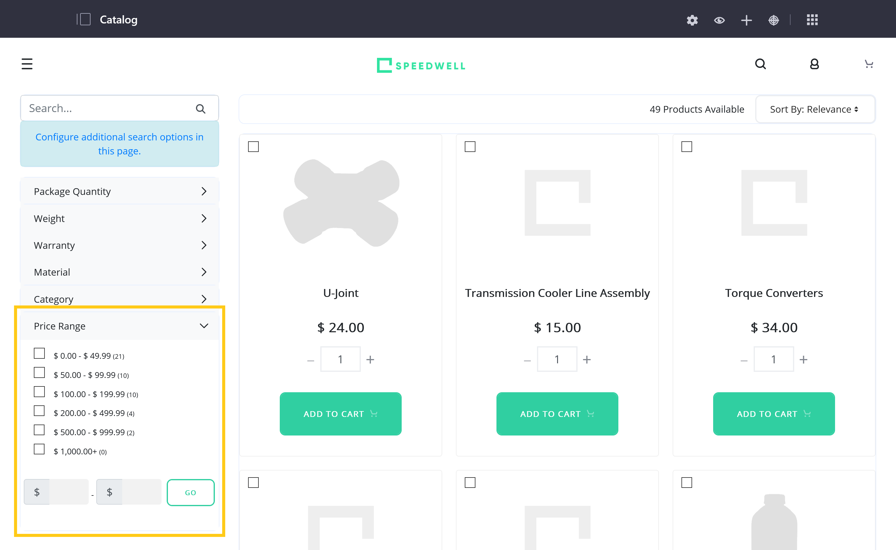
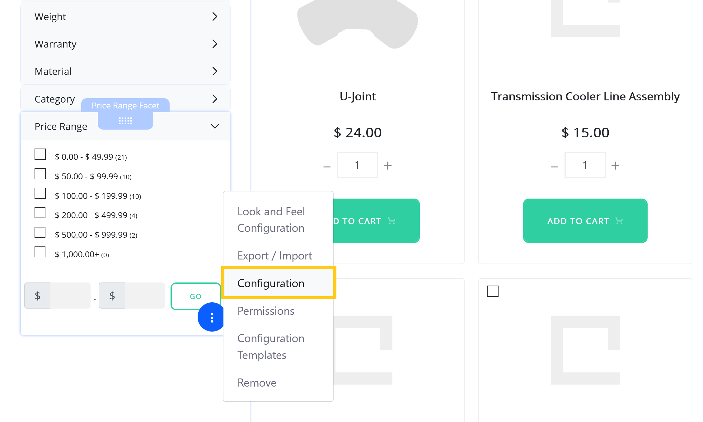

# Using the Price Range Facet Widget

Liferay Commerce includes the *Price Range Facet* widget for quickly filtering Channel Products by price. With it, customers can filter Products displayed in the Commerce Search Results widget based on each Product's lowest price. To use this widget, first ensure the Commerce Search Results widget is deployed to the same page. <!--This is true once BPR-58520 is merged to 7.3.x; until then, the following admonition is also true of 7.3.x-->

```note::
   For Commerce 2.1.2 and lower, the Price Range Facet widget uses the Product's base price and only works with Products that have a single SKU. Products with multiple SKUs are not displayed when the facet is active.
```



Once you've added the Price Range Facet widget to a page, you can configure its fields:

1. Hover over the widget, click on the *Actions* button (), and select *Configuration*.

   

1. In the *Setup* tab, configure the following fields:

   **Show Input Range**: Determine whether the widget allows customers to enter a custom price range.

   **Ranges JSON Array**: Set predefined price ranges for the widget.

   

1. Click on *Save*.

See [Widget Reference](../widget-reference.md) to learn about other Commerce widgets.
