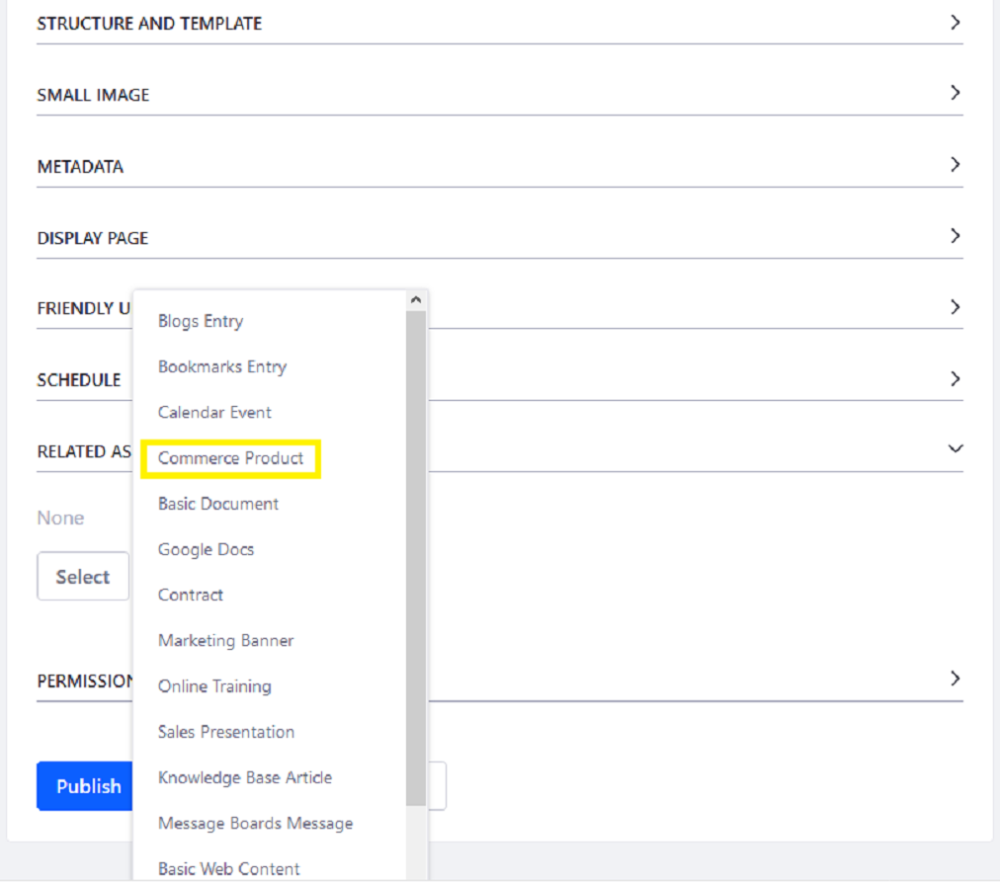

# Selecting Commerce Products as Related Assets

Users can link to Commerce Products when creating Web Content articles. However, before Liferay Commerce Products are listed as [Related Assets](https://help.liferay.com/hc/articles/360028820532-Defining-Content-Relationships) in a [Web Content article](https://learn.liferay.com/dxp/7.x/en/content-authoring-and-management/web-content/user-guide/web-content-articles/adding-a-basic-web-content-article.html), users have configure the Liferay DXP Instance then execute a reindex.

## Configure the DXP Instance

1. Navigate to `[Liferay Home]\osgi\modules\`.
1. Using an archive manager, open the `com.liferay.asset.browser.web.jar`.
1. Using a text editor, open the `portlet.properties` file.
1. Set `search.with.database=true` and update the jar.
1. Restart the application server.

## Execute a Reindex

Execute a reindex to ensure that the Related Assets are populated in the filter.

1. Navigate to the _Control Panel_ &rarr; _Configuration_ &rarr; _Search_.
1. Click _Execute_ next to Reindex all search indexes.

## Verify the Availability of Commerce Products

Because Commerce Products are stored globally (that is, available on all Liferay DXP sites), users must change the Filter to _Global_.

1. Click on _Site Administration_ &rarr; _Content_ &rarr; _Web Content_.
1. Click the () icon then _Basic Web Content_.
1. Scroll down to the _Related Assets_ section.
1. Click _Select_.
1. Click _Commerce Product_.

     

1. Click _Filter and Order_ then _Global_.

     

1. Click the product.

Commerce Products are now available as Related Assets.

## Additional Information

* [Defining Content Relationships](https://help.liferay.com/hc/articles/360028820532-Defining-Content-Relationships)
* [Adding a Basic Web Content Article](https://learn.liferay.com/dxp/7.x/en/content-authoring-and-management/web-content/user-guide/web-content-articles/adding-a-basic-web-content-article.html)
