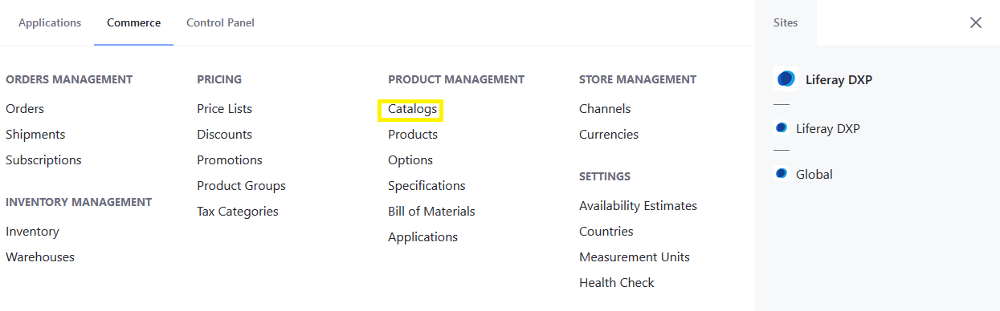
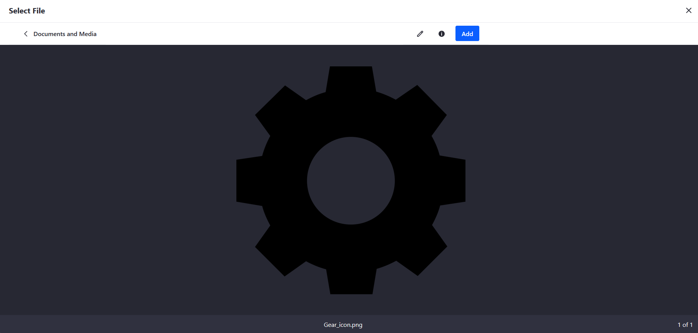
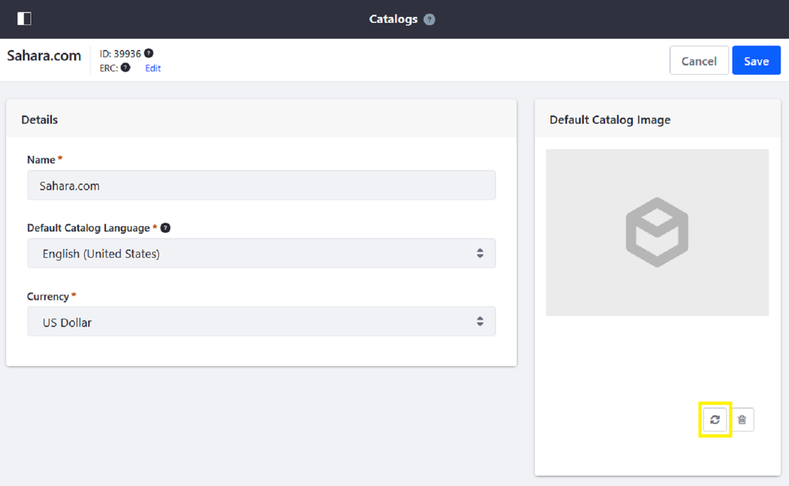
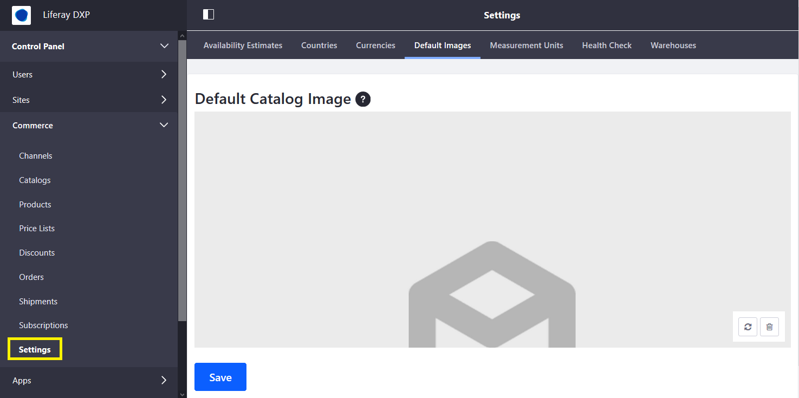

# Configuring a Product Placeholder Image

Products in a catalog that do not have an associated [product image](../creating-and-managing-products/products/product-images.md) use a placeholder image until one is configured. The default placeholder image is defined for each catalog.

To set a catalog's placeholder image:

1. Click the _Open Menu_ button then _Commerce_.
1. Click _Catalogs_.

    

1. Click the desired catalog.
1. Drag and drop a new file or click _Select File_ to add a new image.
1. Click _Add_ to upload the image.

    

1. Click _Save_ when finished.

If there is an existing placeholder image and you want to change it, follow the steps below:

1. Click on the desired catalog.
1. Click the Refresh (). This opens the _Select File_ window.
1. Drag & Drop to Upload a new placeholder image (or click _Select File_ and browse).

    

1. Click _Add_ to upload the new image.
1. Click _Save_ when finished.

The placeholder image has been replaced.

## Liferay Commerce 2.1

You can set a new placeholder image when creating a new catalog or replace an existing one. To replace an existing placeholder image:

1. Navigate to the _Control Panel_ &rarr; _Commerce_ &rarr; _Catalogs_.
1. Click on the catalog (for example, _Sahara.com_).
1. Click the Refresh () icon. This opens the _Select File_ window.
1. Drag & Drop to Upload a new placeholder image (or click _Select File_ and browse).
1. Click _Add_ to upload the image.

     

1. Click _Save_ when finished.

The placeholder image is now replaced for this catalog and is used for all products in the catalog without an image.

## Liferay Commerce 2.0 and Below

```tip::
   On Liferay Commerce 2.0 and below, the same placeholder image is used globally across catalogs created on a Liferay Commerce instance.
```

To replace the existing placeholder image:

1. Navigate to the _Control Panel_ &rarr; _Commerce_ &rarr; _Settings_.

    

1. Click the _Default Image_ tab.
1. Click the Refresh icon.
1. Drag and drop a new file or click _Select File_ to add a new image.
1. Click _Save_ when finished.

The new image has been applied to the entire instance.

## Additional Information

* [Creating a New Catalog](./creating-a-new-catalog.md)
