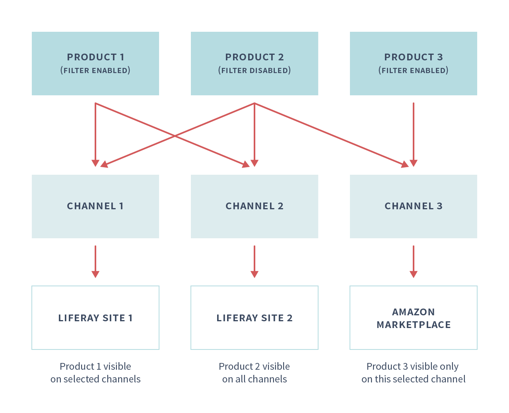
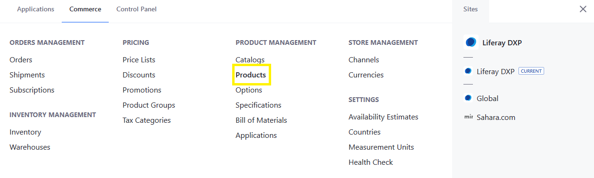
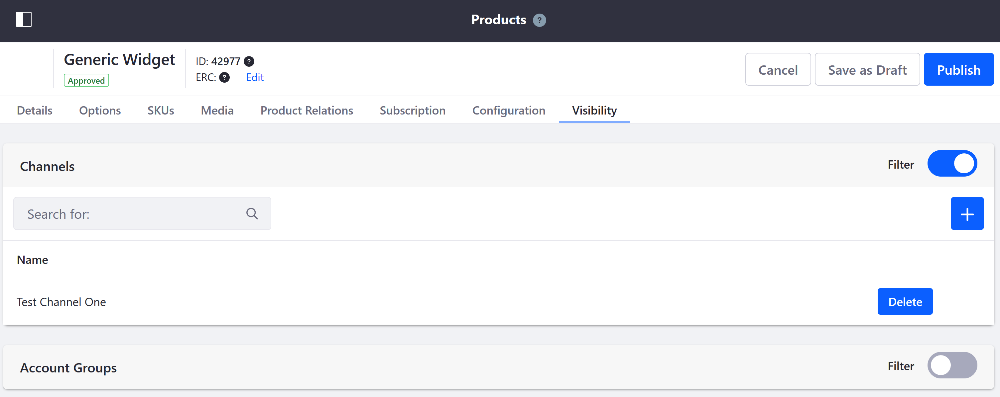

# Configuring Product Visibility Using Channels

By default, Products are visible across all channels, but visibility can be limited to specific channels.

For the purpose of this example, we will consider a multi-brand scenario where the same products are shared across multiple brands. Here, each site has a different brand experience.

To learn more about the using Channels in Liferay Commerce, see: [Introduction to Channels](./introduction-to-channels.md).

## Prerequisites

1. One or more sites have been created.
1. Each site has an associated channel.
1. Products have been added to a catalog.

## Configuring Product Filter Channels

1. Click _Global Applications_ &rarr; _Commerce_ & _Products_.

    

1. Click on a product.
1. Click on the _Visibility_ tab.

    

1. Click the Add button.
1. Click on the desired channel (for example, _Test Channel One_).
1. Click _Add_.

The channel is now associated with the product.

### Commerce 2.1

To configure a product to be available in a specific channel, follow these steps:

1. Navigate to the _Control Panel_ → _Commerce_ → _Products_.
1. Click on a product.
1. Click on the _Visibility_ tab.

    

1. Click the Add button.
1. Click on the desired channel (for example, _Test Channel One_).
1. Click _Add_.

The channel is now associated with the product.

### Commerce 2.0 and Below

To configure a product to be available in a specific channel, follow these steps:

1. Navigate to the _Control Panel_ → _Commerce_ → _Products_.
1. Click a product (_Torque Converters_ in this example).
1. Click the _Configuration_ sub-tab.
1. Click the _Channels_ sidebar option.
1. Switch the _Enable filter channels_ toggle to _Yes_.
1. Check the boxes for each Channel (in this case, the _NA Minium Store_) where the product should be visible.

    

1. Click _Save_.

The product will be visible only in the selected Channels.

## Additional Information

* [Introduction to Channels](./introduction-to-channels.md)
* [Managing Channels](./managing-channels.md)
