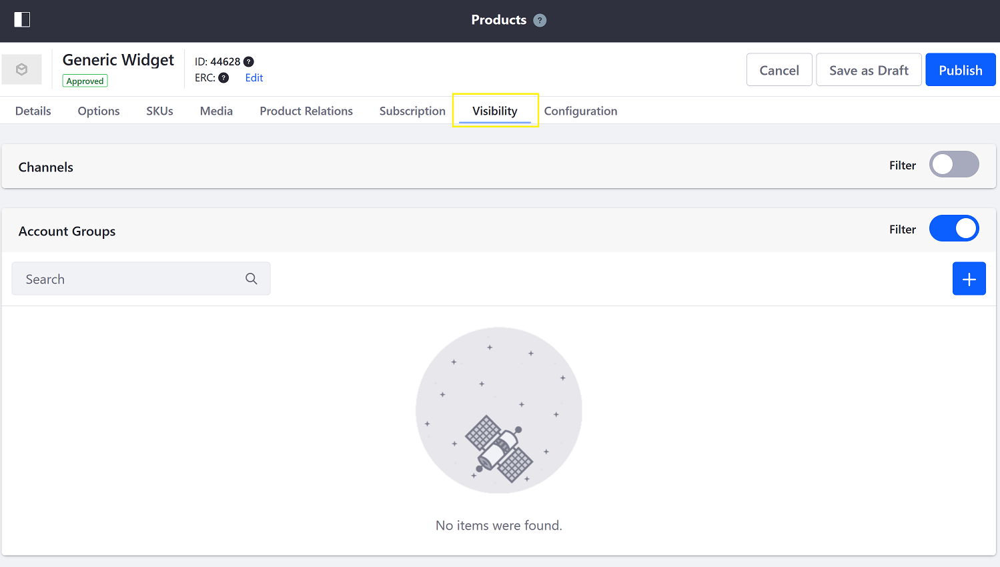
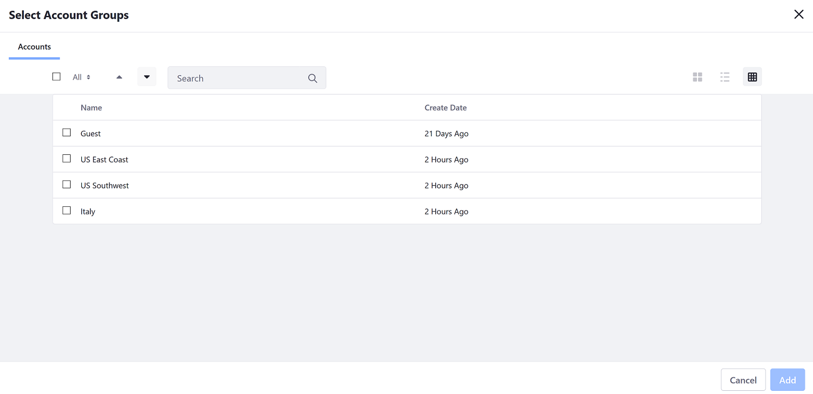
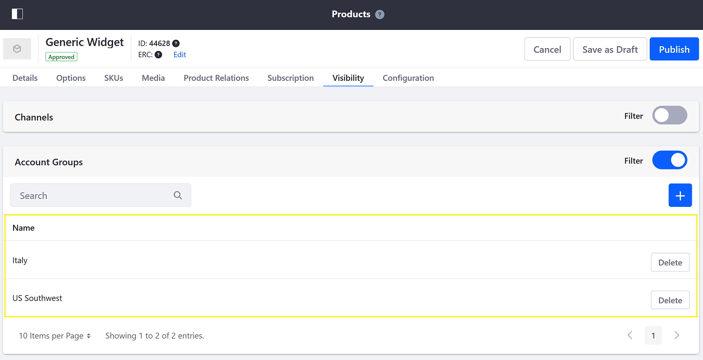
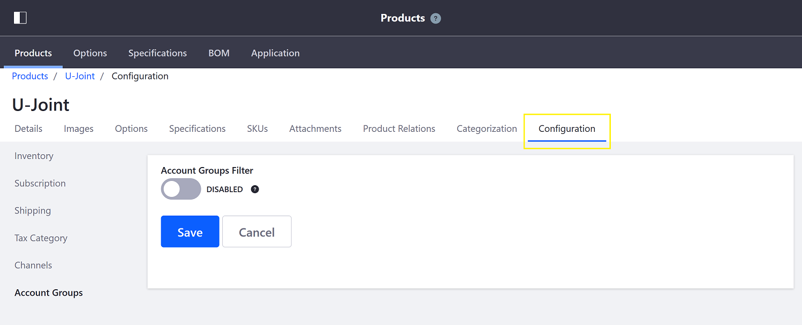
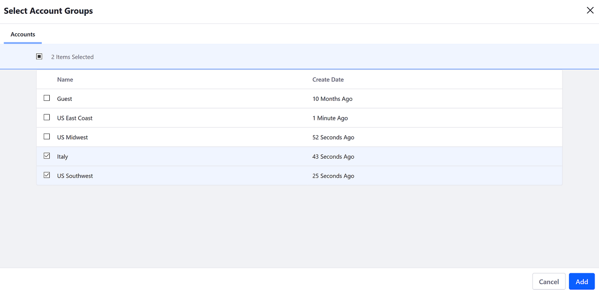

# Configuring Product Visibility Using Account Groups

By default, all products are visible in the Catalog. However, users can limit a product's visibility based on Account Groups.

## Prerequisites

1. One or more [Account](../../../account-management/introduction-to-accounts.md) has been created.
1. One or more [Account Group](../../../account-management/creating-a-new-account-group.md) has been created.
1. Products have been added to a catalog.

## Configuring a Product's Filter

To configure a product to be visible for a specific Account Group, follow these steps:

1. Navigate to the _Control Panel_ → _Commerce_ → _Products_.
1. Click on a product.
1. Click on the _Visibility_ tab.
1. Slide the _Account Group_ Filter to active.

    

1. Click the () icon.
1. Check the boxes for the desired Account Groups.

    

1. Click _Add_.
1. Click _Publish_ when finished.

This product is now visible to only the accounts that are customer accounts of these account groups.

## Removing Account Groups

To remove an Account Group:

1. Click _Delete_ next to the desired Account Group.
1. Click _Publish_ when finished.

## Commerce 2.0 and Below

To filter products by Account Groups:

1. Navigate to the _Control Panel_ → _Commerce_ → _Products_.
1. Click on a product.
1. Click the _Configuration_ tab.
1. Click on _Account Groups_ in the left menu.

    

1. Slide the _Account Group_ Filter to active.
1. Click the () icon.

    

1. Check the boxes for the desired Account Groups.
1. Click _Add_.
1. Click _Save_ when finished.

This product is now visible to only the accounts that are customer accounts of these account groups.

## Additional Information

* [Configuring Product Visibility Using Channels](../channels/configuring-product-visibility-using-channels.md)
* [Creating a New Account Group](../../../account-management/creating-a-new-account-group.md)
