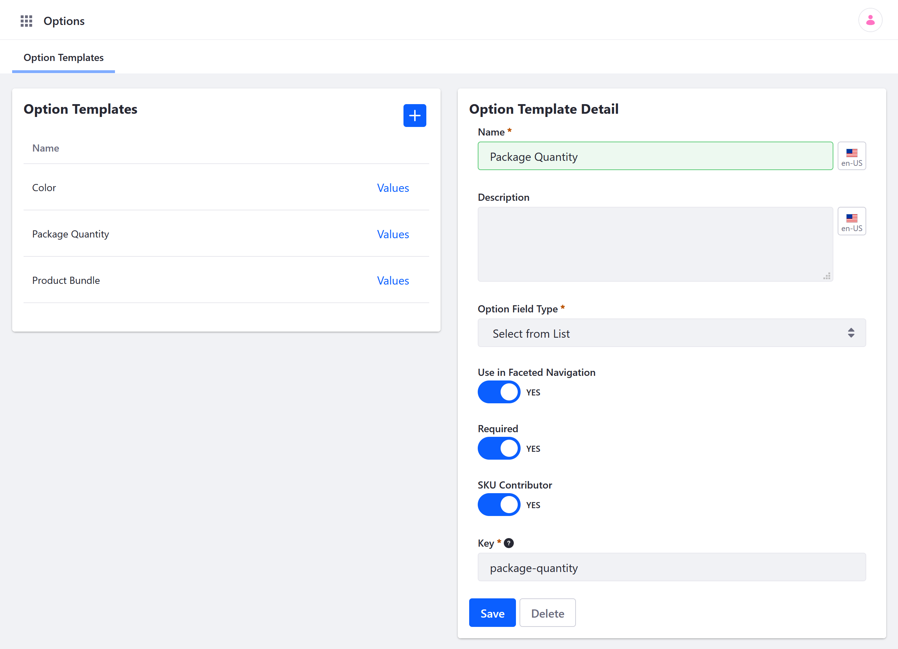
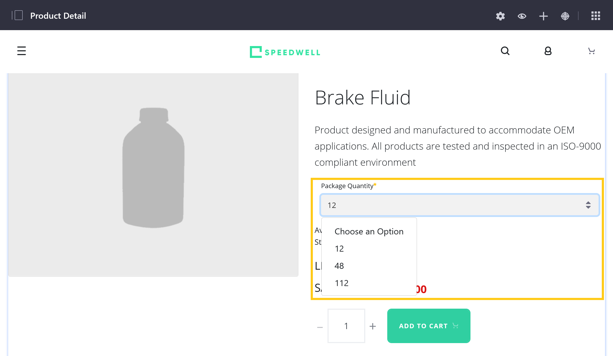
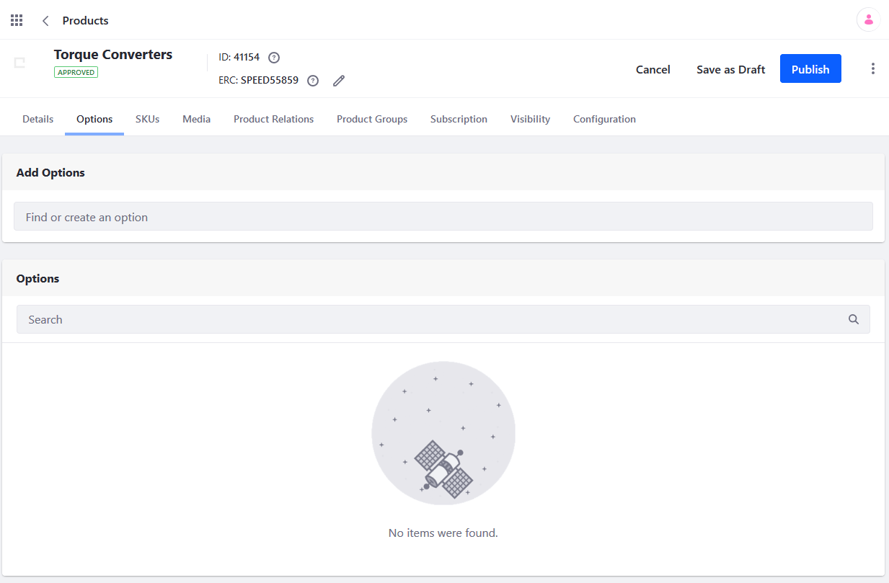
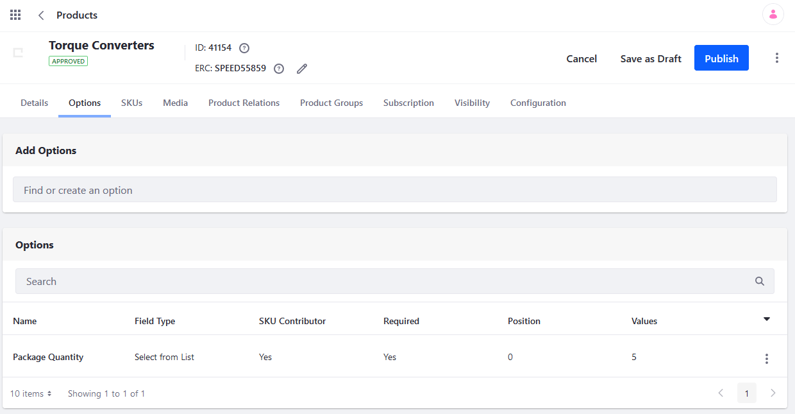

# Customizing Your Products with Product Options

Liferay Commerce's *Product Options* provides a convenient and flexible way to customize your products. With this product feature, you can create generic Templates that define custom fields that can be applied to any catalog product. Can then add unique values to the template or at the individual product level. Can customize the option's settings and values at a product level without affecting the template. Then add them to a product to ..., ..., or .... Options are applied to a product without affecting any of its details. Use Product Options to define product variants based on attributes (e.g., size, quantity, color, material), create bundles, and more.  <!--FINISH. REFINE. GIVE EXAMPLE.-->


## Creating an Option Template

Follow these steps to create an Option Template:

1. Open the *Global Menu* (), click on the *Commerce* tab, and go to *Product Management* &rarr; *Options*.

1. Click the *Add* button ().

1. Enter a template *Name* and *Description* (optional). A *Key* is automatically generated to match the entered name, though you can set them independently if desired.

1. Select template's *Field Type*. This determines the type of field displayed on ...

   * **Text**: adds a blank field for entering text.
   * **Select from List**: adds a drop-down list for the option's values.
   * **Single Selection**: adds a radio button list for the option's values.
   * **Multiple Selection**: adds a check-box list for the option's values and allows buyers to select multiple values.
   * **Date**: adds a field for entering the date.
   * **Numeric**: adds a blank field for entering integers.
   * **Boolean Question**: adds a checkbox for the option.

1. Determine whether the option is included in store search results (*Use in Faceted Navigation*). <!--CORRECT THIS: cf. Gives users the ability to filter search results based on the specified option. -->

1. Determine whether the option field is *Required*. When required, users must ___. <!--FINISH-->

1. Determine ___ *SKU Contributor*. <!--CLARIFY MEANING A SKU contributor can be assigned a unique price and other attributes for each variant via [SKUs](./adding-skus-to-your-products.md). If enabled, the option must have a SKU in order to be sold.-->

   ```warning::
      The *SKU Contributor* setting cannot be enabled with the *Boolean Question* field type.
   ```

1. Click on *Save* when finished.

   

Once created, you can [apply the Option](#applying-an-option-template-to-a-product) to individual products.

## Adding Option Values

If an Option uses the *Select from List*, *Single Selection*, or *Multiple Selection* field types, you'll have to add values to it. You can create generic values via the Options page, or create particular, product scoped values via the product's page. <!--FINISH-->

### Adding Generic Values to Option Templates

Follow these steps to add generic values to an Option Template:

1. Open the *Global Menu* (), click on the *Commerce* tab, and go to *Product Management* &rarr; *Options*.

1. Click on *Values* for the desired template.

1. Click the *Add* button ().

1. Enter a *Name* for the value. A *Key* is automatically generated to match the entered name, though you can set them independently if desired

1. Set the value's *Priority* to determine the order in which its listed, beginning with the lowest value.<!--REFINE-->

1. Click on *Save* to add the value to the Option Template.

   

You can repeat this process to add as many generic values to the option as desired. When the template is applied to a product, all values are included, though you can add, remove, or edit values for each product without affecting template values.

### Adding Product Specific Values

Follow these steps to add and configure product specific values to an Option:

1. Open the *Global Menu* (), click on the *Commerce* tab, and go to *Product Management* &rarr; *Products*.

1. Click on the Desired Product.

## Applying an Option Template to a Product

Once you apply a template to a product, you can make any changes to the product's option. These changes will not affect the option template or any other product. You can apply multiple Option Templates to the same product, each with its own priority to determine the order in which they're displayed.

To apply an option template to a product:

1. Go to the _Global Menu_ () → _Commerce_ → _Products_.
1. Click on any product listed there. For example, if the Minium accelerator was used to create the site, one sample product is the _Torque Converters_.

    

1. Click _Torque Converters_.
1. Click the _Options_ tab.

    

1. Click the (+) button to add an Option.
1. Check the box for _Package Quantity_.
1. Enter **1.0** in the _Priority_ field.

    

1. Click _Save_.

The Option Template is now applied; when the product is displayed on the catalog page, buyers may now select different quantities for Torque Converters.

## Adding Multiple Option Templates

Note that you can apply more than one option template per product and each option has its own unique display priority. In addition to _Package Quantity_, there is the _Color_ Option created in the Options Template section above. You may also change the Option Values on this screen without having to change the template itself.

1. Click the _Values_ link next to _Package Quantity_.
2. Click the () button to add a new value.
3. Enter the following:
    * **Name:** 60
    * **Priority:** 5.0
    * **Key:** (autogenerated)
4. Click _Save_.

    

The new option has been added to the possible quantities a buyer can choose from.

## Using Option Fields as SKU Contributors

A SKU contributor can be assigned a unique price and other attributes for each variant via [SKUs](./adding-skus-to-your-products.md). If enabled, the option must have a SKU in order to be sold.

The following Field types can be used as SKU contributors:

* Select From List
* Single Selection
* Multiple Selection

Otherwise if selecting one of the others, the following warning message appears: `SKU Contributor cannot be set as true for the selected Field Type.`

## Commerce 2.1 and Below

### Creating an Option Template

To create an option template:

1. Navigate to the _Control Panel_ → _Commerce_ → _Product_.
1. Click on the _Options_ tab. This displays a list of existing templates on the left of the page and the _Option Template Detail_ form on the right.
1. Click the (+) to add an Option Template.
1. Enter the following:
    * **Title**: Color
    * **Description**: Choice of colors
    * **Field Type**: Select from List
    * **Use in Faceted Navigation**: Yes
    * **Required**: Yes
    * **SKU Contributor:** No
    * **Key**: (automatically generated)

        

1. Click _Save_.

The Option Template has been added and can be applied to all products.

When _Use in Faceted Navigation_ is switched to _Active_, users have the ability to filter search results based on the specified option.

A SKU contributor can be assigned a unique price and other attributes for each variant via [SKUs](./adding-skus-to-your-products.md). If enabled, the option must have a SKU in order to be sold.

```warning::
   You cannot use a Boolean option as a SKU contributor. Attempting to use a Boolean option as a SKU contributor shows the following warning message: ``SKU Contributor cannot be set as true for the selected Field Type.``
```

### Adding Option Values

Depending on the Field Type used in the template, you may need to create values for that option. In this example, _Select from List_ requires Option Values, such as the different product colors.

To add multiple Option Values:

1. Click the _Values_ link next to _Color_.
1. Click the () to add an Option Template.
1. Enter the following:
    * **Name:** Black
    * **Priority:** 1.0
    * **Key:** (autogenerated from the _Name_ field)

        

1. Click _Save_.

_Black_ is now added to the Color options. To add more colors, repeat the steps and increment the priority. For example, you can add _White_ and priority set as 2.0 followed by _Blue_ with priority 3.0, and so forth. Remember the priority field determines the order in which the options are displayed with the lowest values being displayed first.

### Applying an Option Template to a Product

Once you apply a template to a product, you can make any changes to the product's option. These changes will not affect the option template or any other product.

To apply an option template to a product:

1. Go to the _Global Applications_ → _Commerce_ → _Products_.
1. Click on any product listed there. For example, if the Minium accelerator was used to create the site, one sample product is the _Torque Converters_.

    

1. Click _Torque Converters_.
1. Click the _Options_ tab.

    

1. Search for an Option (for example _Quantity_).
1. Click _Select_ next to _Package Quantity_.

The Option Template is now applied; when the product is displayed on the catalog page, buyers may now select different quantities for Torque Converters.



## Additional Information

Note that you can apply more than one option template per product and each option has its own unique display priority. In addition to _Package Quantity_ (created by default in the Minium accelerator), there is the _Color_ Option created in the Options Template section above. You may also change the Option Values on this screen without having to change the template itself.

1. Click the _Values_ link next to _Package Quantity_.
2. Click the () button to add a new value.
3. Enter the following:
    * **Name:** 60
    * **Priority:** 5.0
    * **Key:** (autogenerated)
4. Click _Save_.

    

The new option has been added to the possible quantities a buyer can choose from.
