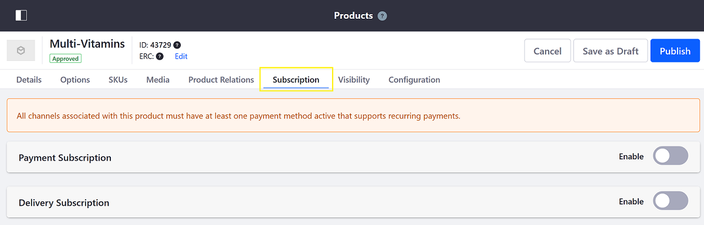

# Enabling Subscriptions for a Product

With Liferay Commerce, you can create and manage subscriptions for [Simple](../product-types/creating-a-simple-product.md), [Grouped](../product-types/creating-a-grouped-product.md), and [Virtual](../product-types/creating-a-virtual-product.md) Products. Examples of subscriptions include magazines, renewable service contracts, and automatic ordering for regularly consumed items. Commerce provides *Payment* and *Delivery* subscriptions out of the box.

## Prerequisites

In order to enable subscriptions for a Product, store administrators must activate a payment method that supports recurring payments. By default, Liferay Commerce supports [Paypal](../../../store-administration/configuring-payment-methods/paypal.md) as a recurring payment method.

## Enabling Product Subscriptions
<!--TASK: Explain the difference between Payment and Delivery Subscriptions-->
Follow these steps to enable subscriptions for a Product:

1. Open the *Global Menu* (), click on the *Commerce* tab, and go to *Product Management* &rarr; *Products*.

1. Click on the *Subscription* tab.

    

1. Use the toggle switch to enable *Payment Subscription* and/or *Delivery Subscription*.

1. Use the *Subscription Type* field to select the subscription's time unit:

   * Day
   * Week
   * Month
   * Year

   If you select Week, Month, or Year, you'll also have to determine the day on which each unit begins.

1. Use the *Subscription Length* field to determine the length of a subscription period.

1. Use the toggle switch to determine whether the subscription automatically ends.

    

1. Click on *Publish* when finished.

The subscription is now enabled for the selected Product.

```tip::
   Other payment methods can be implemented to support recurring payments. See `Implementing a New Payment Method <../../../developer-guide/implementing-a-new-payment-method.md>`_ to learn more.
```

## Viewing Subscriptions in Product Details

Subscription details are displayed in a Product's display page via the Product Details widget.


## Additional Information

* [Managing Subscriptions](../../../orders-and-fulfillment/subscriptions/managing-subscriptions.md)
* [Subscription Administration Reference Guide](../../../orders-and-fulfillment/subscriptions/subscription-administration-reference-guide.md)
