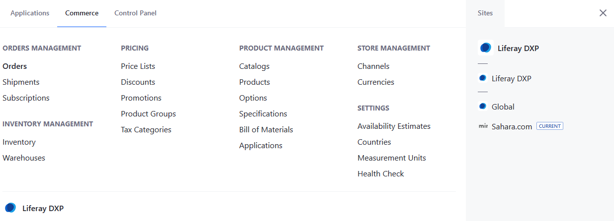
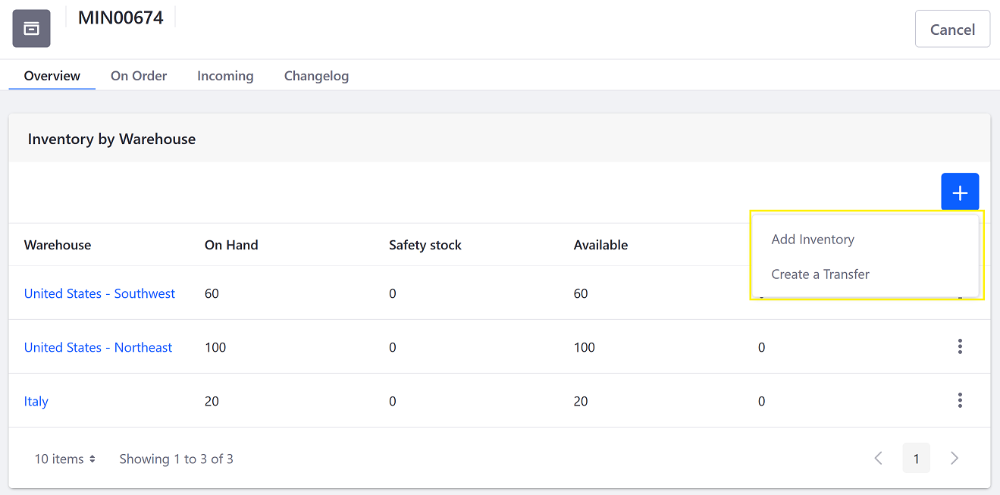

# Inventory Management Reference Guide

> Commerce 2.1+

Liferay Commerce's Inventory Management is used to manage product stock levels. This article introduces the functionality in the _Inventory_ menu.

To access the Inventory Management, navigate to the _Global Applications_ &rarr; _Commerce_ &rarr; _Inventory_.

The first screen displays product variants identified by their SKU code (instead of Product code) with availability details.

| Field | Description |
| --- | --- |
| SKU | The main identifier inside the inventory system. |
| On Hand | Represents the total number of items for a given SKU by aggregating all the quantities available from the different warehouses. |
| Available | Represents the quantity of items for a given SKU that are available to the storefront. Commerce uses this calculation: [Quantity Available] = [Quantity on Hand] - [Quantity on Order] - [Safety Stock Quantity]. |
| On Order | The quantity of inventory allocated to open sales orders. These quantities are consumed when an order is shipped. |
| Incoming | Represents the quantity that has been shipped by outside vendors (in the form of a replenishment) but not yet received. Values are informative data and not based on any calculations. Can be used by administrators to keep track of future quantities. |

## SKU

When viewing an individual SKU, there are four tabs: Overview, On Order, Incoming, and a Changelog.

### Overview

The _Overview_ tab displays a short summary of the inventory of a given SKU by warehouse.

| Field | Description |
| --- | --- |
| Warehouse | List of warehouses where a particular SKU is located. |
| On Hand | Count of physical inventory in possession at a warehouse. |
| Safety Stock | Represents a quantity of items reserved for in-store sale at a particular site. Example: if there are 100 units in a warehouse, 20 units can be designated as Safety Stock. |
| Available | The actual quantity used for calculating the end-user stock availability. |
| Incoming | This represents quantities that will soon be available in that warehouse. |

Click Add () to update inventory or to transfer inventory between warehouses.

### On Order

The _On Order_ tab displays a list of Accounts that have placed an order for this SKU. The tab also displays the Order ID, the quantities ordered, and the expiration date.

### Incoming

You can input a quantity that will be delivered to a particular warehouse at a future date.

Click Add () to enter your values.

|Field | Description |
| --- | --- |
| Quantity | This is the number of items to be added. |
| Destination | This represents the warehouse where the items will be arriving in. |
| Expected Delivery Date | This is the scheduled date of delivery. |

### Changelog

The Changelog tracks the following events:

* When an order is placed, the quantities are "booked" (allocated) to fulfill the order.
* When a shipment is created, the previously "booked" quantity is committed; the inventory is updated by removing the amount previously booked.
* When a quantity is added to the inventory
* When a quantity is moved between warehouses.
* When a shipment is cancelled, the previously allocated quantities need to be returned.
* Any update action to an inventory item.

## Commerce 2.1

Inventory Management is located in the _Control Panel_. To access Inventory Management, navigate to the _Control Panel_ &rarr; _Commerce_ &rarr; _Inventory_.

The fields remain the same.

## Additional Information

* [Adding SKUs to Your Products](../creating-and-managing-products/products/adding-skus-to-your-products.md)
* [Low Stock Action](./low-stock-action.md)
* [Adding a New Warehouse](./adding-a-new-warehouse.md)
* [Warehouse Reference Guide](./warehouse-reference-guide.md)
