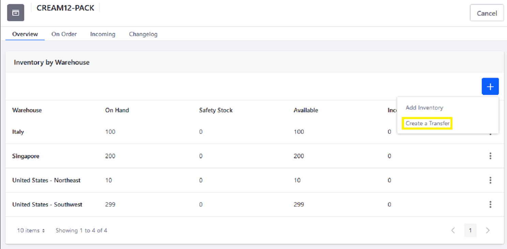

# Setting Inventory by Warehouse

Stores with multiple warehouses can manage product inventory on a per warehouse basis. The _Inventory_ menu is where users manage the number of products available for sale in each warehouse. If the [Minium Accelerator](../../starting-a-store/using-the-minium-accelerator-to-jump-start-your-b2b-store.md) was used to create the store, there are three warehouses already created.

To set inventory by warehouse:

1. Go to  _Global Applications_ → _Commerce_ → _Products_.
1. Click on a product (for example _U-Joint_).
1. Click the _SKUs_ sub-tab.
1. Click on the SKU ID (_MIN-55861_).
1. Click _Inventory_ on the left menu.
1. Enter a quantity for the corresponding warehouse(s).

    

1. Click _Save_ for each warehouse.
1. Repeat these steps for all the other product variants (SKUs) associated for a product.

Each warehouse now has the correct quantity available for sale.

## Transferring Stock Between Warehouses

If a store has more than one [warehouse](./adding-a-new-warehouse.md), users can transfer stock from one warehouse to another. Inventory is tracked at the SKU level and reflected in _Inventory_ administration.

To transfer stock between warehouses:

1. Go to the _Global Applications_ menu &rarr; _Commerce_ &rarr; _Inventory_.
1. Click on a SKU (CREAM-12PACK).
1. Click the () then _Create Transfer_.

    

1. Enter the following:

    * **Quantity**: 40
    * **Source**: United States - Southwest
    * **Destination**: United States - Northwest

    

1. Click _Submit_.

Inventory counts for each warehouse are now updated.

## Commerce 2.1 and Below

Managing a product and its sub-menus are done in the _Control Panel_.

To set inventory by warehouse:

1. Navigate to the _Control Panel_ → _Commerce_ → _Products_.
1. Click on a product (for example _U-Joint_).
1. Click the _SKUs_ sub-tab.
1. Click on the SKU ID (_MIN-55861_).
1. Click _Inventory_ on the left menu.
1. Enter a quantity for the corresponding warehouse(s).

    

1. Click _Save_ for each warehouse.
1. Repeat these steps for all the other product variants (SKUs) associated for a product.

Each warehouse now has the correct quantity available for sale.

### Transferring Stock Between Warehouses

If a store has more than one [warehouse](./adding-a-new-warehouse.md), users can transfer stock from one warehouse to another. Inventory is tracked at the SKU level and reflected in _Inventory_ administration.

To transfer stock between warehouses:

1. Navigate to the _Control Panel_ &rarr; _Commerce_ &rarr; _Inventory_.
1. Click on a SKU (CREAM-12PACK).
1. Click the () then _Create Transfer_.

    

1. Enter the following:

    * **Quantity**: 40
    * **Source**: United States - Southwest
    * **Destination**: United States - Northwest

    

1. Click _Submit_.

Inventory counts for each warehouse are now updated.

## Additional Information

* [Adding A New Warehouse](./adding-a-new-warehouse.md)
* [Inventory Management Reference Guide](./inventory-management-reference-guide.md)
