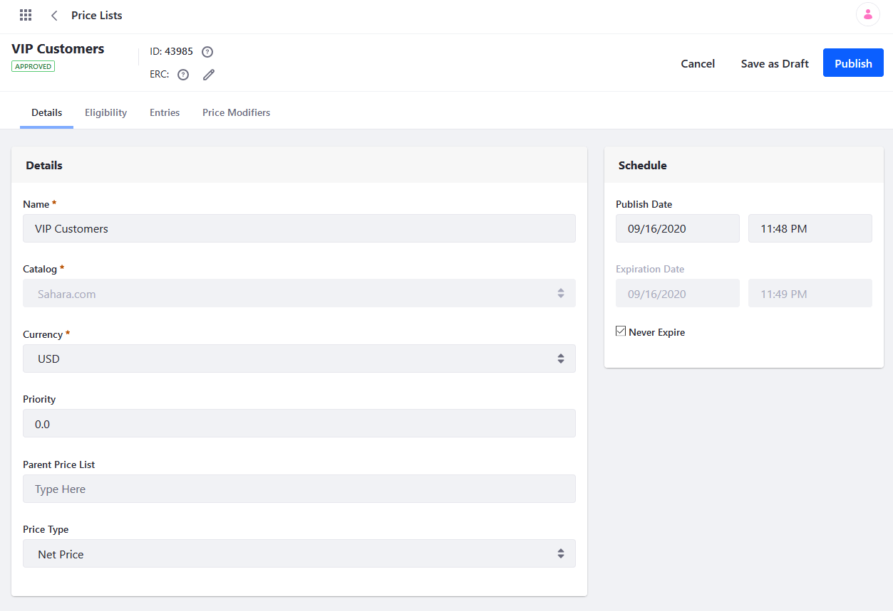
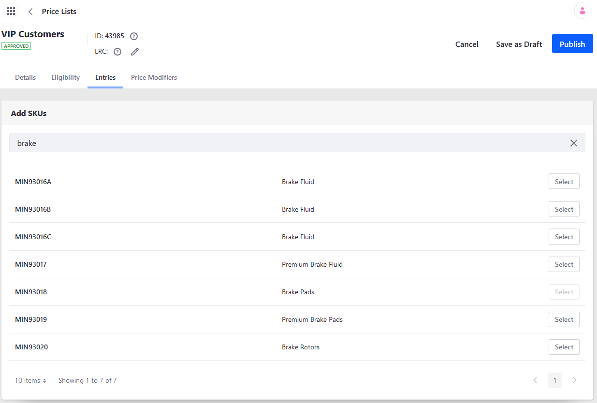
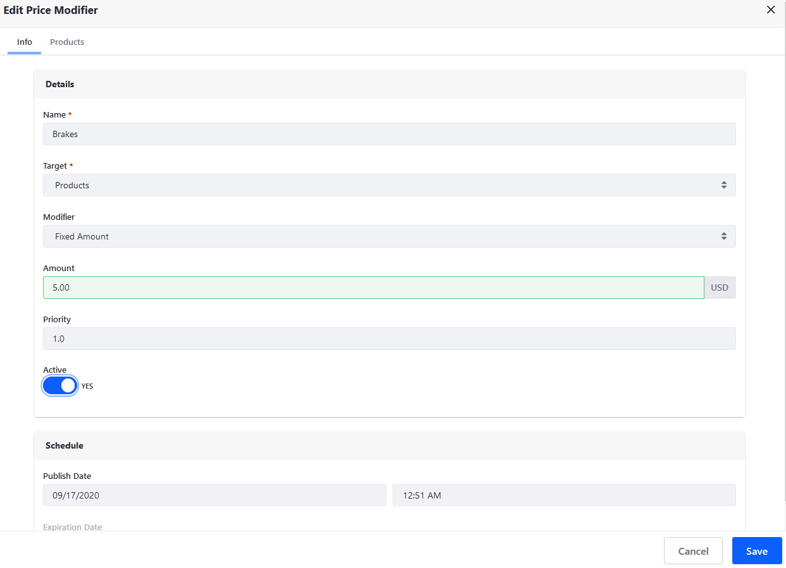
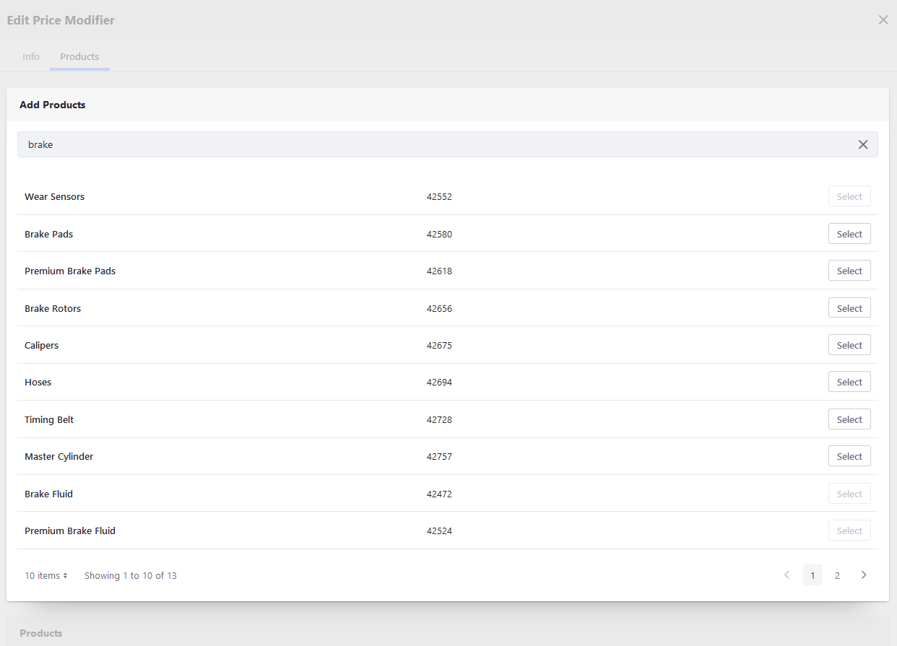
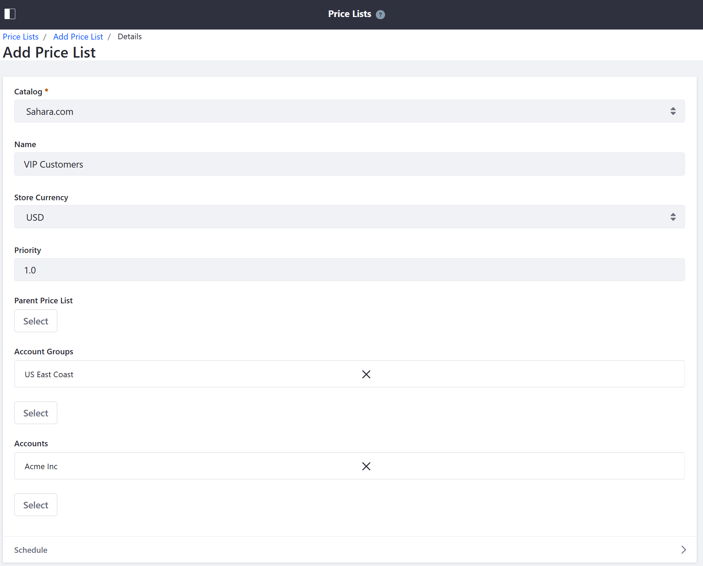

# Creating a Price List

Price Lists are an easy way to set alternate prices (higher or lower than the base price) for a given product or allow use of a currency other than the store’s default for selected Accounts and Account Groups.

To create a new price list:

1. Go to the _Global Applications_ menu &rarr; _Commerce_ &rarr; _Price Lists_.
1. Click the () button.
1. Enter the following:

    * **Name**: VIP Customers
    * **Catalog**: Sahara.com
    * **Currency**: USD

1. Click _Submit_ when finished.

The new price list has been created. Once the price list has been created, determine the price list's eligibility, populate the items, and set the Price Modifiers.

## Determining the Price List's Eligibility

You can determine which accounts and account groups this price list is made available to.

1. Click on the newly created price list.
1. Click on the _Eligibility_ tab.
1. Click the [Select Account Groups](../account-management/creating-a-new-account-group.md) radio button.
1. In the _Add Account Groups_ search bar, search for the desired account groups; in this example, _US Accounts East_.
1. Click _Select_ to add the account group.
1. Click _Publish_ when finished.

This price list will be available for these account groups.

You can also determine which channels this price list is made available to.

While on the _Eligibility_ tab,

1. Click the _Specific Channels_ radio button.
1. In the _Add Channels_ search bar, search for the desired channels.
1. Click _Select_ to add the channel.
1. Click _Publish_ when finished.

This price list is now available to these channels.

## Populating the Price List's Entries

Enter the products that are to be sold in this price list.

1. Click the _Entries_ tab inside the new price list.
1. In the _Add SKUs_ search bar, search for the items that are to be included in this list. You do not have to use the SKU if you do not know the SKU's ID. Using a keyword or phrase will return all the applicable products by SKU.

    

1. Click _Select_ next to the applicable products.
1. Click _Publish_ when finished.

The price list is now populated.

## Adding Price Modifiers

To add a new price modifier:

1. Click the _Price Modifiers_ tab.
1. Click the () button.
1. Enter the following:

    * **Name**: Brakes
    * **Target**: Products
    * **Modifier**: Fixed Amount

1. Click _Submit_ when finished.

You can finish configuring the Price Modifier.

1. Click the newly created Price Modifier.
1. On the _Info_ tab, enter the following:

    * **Amount**: 5.00 USD
    * **Priority**: 1.0

1. Slide the _Active_ toggle to _YES_.

    

1. Click Save when finished.

Next, add the products subject to this price modifier.

1. Click the newly created price modifier.
1. Click the _Products_ tab.
1. In the _Add Products_ search bar, search for all the products in this price modifier. These products can be different from in the main list (see _Populating the Price List's Entries_) above.

    

1. Close the _Price Modifier_ window to return to the main menu.
1. Click the _Info_ tab then _Save_ when finished.

## Commerce 2.1 and Below

To add a price list:

1. Navigate to the _Control Panel_ → _Commerce_ → _Price Lists_.
1. Click the () button.
1. Enter the following fields (example values shown below):
    * **Catalog**: Sahara.com
    * **Name**: VIP Customers
    * **Store Currency**: USD
    * **Priority**: 1.0
1. Under _Account Groups_, click _Select_.
1. Choose one or more Account Groups to have access to this price list (example account groups shown below):
    * _General_
    * _Auto Repair Shops_
1. Click _Add_.
1. Under _Accounts_, click _Select_.
1. Choose one or more Accounts to have access to this price list (example accounts shown below):
    * Mike’s Car Repair
    * Fountain Valley Car Wash
1. Click _Add_.
1. Choose a Schedule for the price list. (Leave the _Never Expire_ checkbox checked in this example. Alternatively, you can set a date range for when the price list is active.)

    

1. Click _Publish_.

The price list (_VIP Customers_ in this example) has been created and applied to the chosen Account Groups and Accounts. Repeat the steps to create other price lists as necessary.

## Additional Information

* [Creating a New Account Group](../../account-management/creating-a-new-account-group.md)
* [Creating a New Account](../../account-management/creating-a-new-account.md)
* [Adding Products to a Price List](./adding-products-to-a-price-list.md)
* [Adding Tiered Pricing](./adding-tiered-pricing.md)
