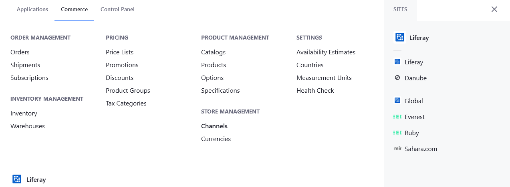
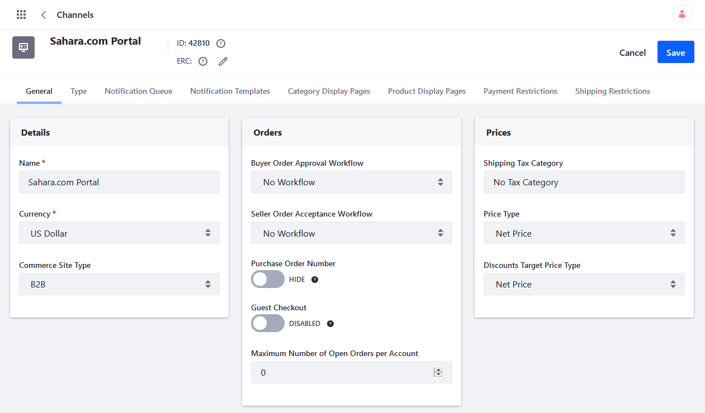

# Gross and Net Price Calculations

Liferay Commerce allows users use either the gross price or the net price as the basis to calculate promotions and [discounts](../../promoting-products/introduction-to-discounts.md). Configuring Gross or Net Price Type is done at the [Price List](../creating-a-price-list.md) level.  

## Calculations

## Discounts

 If discount amount is gross, then the net amount is calculated and applied to the net price of the product.

If discount amount is gross:
Discount is a fixed amount: the taxes are removed from the discount amount before applying the discount calculation algorithm
Discount is a percentage: the net percentage is recalculated before applying the discount. N = L - T(100-L) with T in %

Taxes are calculated on the final price

## Setting the Price Type

To set the Price List's Price Type:

1. Click the _Global_ () menu icon &rarr; _Commerce_ &rarr; _Price Lists_.
1. Click on the desired Price List (for example, _Danube Base Price List_).
1. Select the Price Type.

    

1. Click _Publish_ when finished.

## Channel Settings

You can also set Gross or Net Price Type in each Channel.

To set Price Types in a Channel:

1. Click the _Global_ () menu icon &rarr; _Commerce_ &rarr; _Channels_.

    

1. Click on the desired channel (Sahara.com Portal).
1. In the _Prices_ section, select the desired Price Type from the _Price Type_ menu.
1. Select Gross or Net Price from the _Discounts Target Price Type_ menu.

    

1. Click _Save_ when finished.

## Additional Information

* [Introduction to Discounts](../../promoting-products/introduction-to-discounts.md)
* [Creating a Price List](../creating-a-price-list.md)
* [Managing Channels](../../starting-a-store/channels/managing-channels.md)
